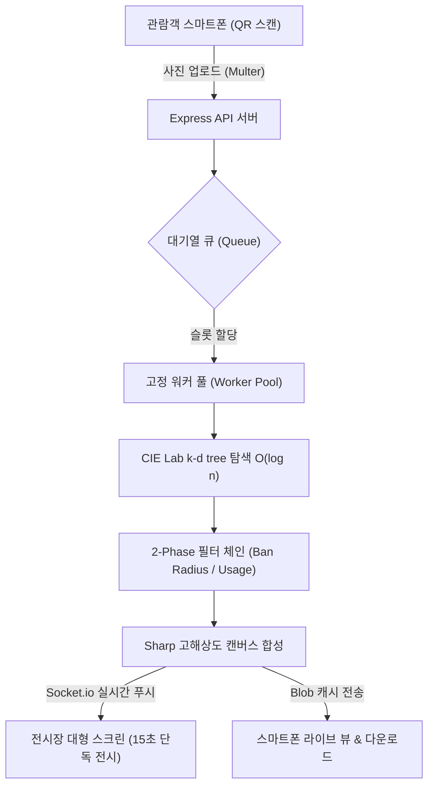

# 🌌 Reverse Cosmos Mosaic (V7.0 Ultimate)
> **로비 스크린 및 미디어아트 전시를 위한 인터랙티브 실시간 포토모자이크 시스템**
> *(Interactive Photo Mosaic System for Lobby Screens & Exhibitions)*


**최종 업데이트**: 2026-08-15  
**개요**: 관람객이 스마트폰으로 대형 스크린의 QR 코드를 스캔하여 자신의 사진을 업로드하면, 사전에 인덱싱된 수천 장의 타일(우주 사진, 자연 풍경, 전시 소장품 등)을 조합하여 관람객의 사진을 **실시간 초고화질 포토모자이크**로 렌더링하고, **대형 스크린에 마블 시네마틱 결합 연출과 함께 15초간 단독 전시**하는 고성능 무인 인터랙티브 미디어아트 엔진입니다.

---

## 📑 목차 (Table of Contents)
1. [🌟 주요 기능 및 특징 (Key Features)](#1-주요-기능-및-특징-key-features)
2. [🛠️ 기술 스택 (Tech Stack)](#2-기술-스택-tech-stack)
3. [🧠 핵심 알고리즘 및 시스템 아키텍처](#3-핵심-알고리즘-및-시스템-아키텍처)
4. [🚀 설치 및 운영 가이드](#4-설치-및-운영-가이드)
5. [🗂️ 프로젝트 디렉토리 구조](#5-프로젝트-디렉토리-구조)
6. [🎛️ 관리자 패널 (Admin Dashboard) 핵심 가이드](#6-관리자-패널-admin-dashboard-핵심-가이드)
7. [📜 릴리즈 노트 & 개발 역사 (Patch Notes)](#7-릴리즈-노트--개발-역사-patch-notes)

---

## 1. 🌟 주요 기능 및 특징 (Key Features)

### 🎨 완벽한 전시장 인터랙티브 경험 (V7.0 Display Overhaul)
- **단색 OLED 순수 블랙 (`#000000`) 고대비 테마**: 전시장 대형 스크린에서 관람객의 시각적 피로를 방지하고 모자이크와 QR의 가독성 및 선명도를 극대화합니다.
- **직관적 3열 전시장 동선 (`STEP 1 · 2 · 3`)**:
  - **`[우측 1열] STEP 1` (참여 시작)**: 초대형 참여 QR 코드 및 3단계 직관적 이용 가이드 상시 노출.
  - **`[중앙 2열] STEP 2` (셀카 촬영)**: 방해 요소를 100% 제거한 깨끗한 인물 셀카 스튜디오 백드롭.
  - **`[좌측 3열] STEP 3` (결과 감상)**: 1,024조각 마블 시네마틱 지수 가속 결합 연출 및 15초 단독 전시 뷰어.
- **초상권 및 개인정보 100% 안심 보호 시스템**:
  - **유휴(Idle) 시**: 관람객 사진을 일절 롤링하지 않고, 사전에 준비된 안전한 데모 모자이크(`public/output_guides/`)만 부드러운 페이드로 순환.
  - **제출 시**: 15초간 카운트다운 단독 전시 후 즉시 화면에서 소멸되고 데모 모드로 복귀.
  - **동시 다발 제출 시**: FIFO `showcaseQueue`에 안전하게 적재되어 모든 참여자에게 15초의 단독 전시 시간을 공평하게 보장.
  - **서버 재부팅 시**: `public/outputs/` 내 모든 임시 결과물 이미지 및 오래된 로그 자동 파기.

### 📱 모바일 웹 60fps 렌더링 & UX 극대화 (V8.1)
- **초경량 모바일 파티클 조립 애니메이션**: 모바일 환경에서 14,000px급 초고해상도 렌더링 시 브라우저 크래시를 방지하기 위해, 오프스크린 캔버스 저해상도 소스로 1,024개 조각 비행 애니메이션을 부드럽게 재생한 뒤 원본 고해상도 이미지를 페이드인하는 최적화 기법 적용.
- **이미지 사전 적재(Pre-load) 동기화**: 연산 완료 후 기기 다운로드 중 발생하는 어색한 검은 화면을 차단하고 100% 적재 완료 시점에 전환.
- **스마트폰 다이렉트 다운로드 & 카카오톡 인앱 브라우저 호환**: iOS Safari Blob 다운로드 Fallback 및 카카오톡 롱프레스(Long-press) 저장 오버레이 완벽 지원.

### ⚙️ 극한의 최적화 및 안정적인 멀티스레드 코어
- **3차원 k-d tree 기반 초고속 타일 매칭**: O(n) 브루트포스 탐색을 CIE Lab 색공간 k-d tree 인덱스 조회로 교체하여 O(log n) 수준으로 렌더링 지연 최소화.
- **터보 모드 (Turbo Mode)**: 대규모 인파 몰림 시 0.1초 만에 렌더링을 끝내는 O(1) 랜덤 매칭 모드 지원 (관리자 패널 실시간 토글).
- **고정 워커 풀 (Worker Pool) + EMA 대기열**: CPU 코어 기반 고정 워커 풀을 상시 유지하고, 지수이동평균(EMA) 공식으로 정확한 예상 대기시간을 관람객 폰에 실시간 안내.
- **멀티 테마 스위칭 (Multi-Theme)**: 우주(NASA), 자연 풍경, 박물관 소장품 등 테마별 독립 빌드 및 원클릭 무중단 핫리로드 지원.
- **Windows 안전 원자적 쓰기 (Atomic Write)**: `write-file-atomic`을 적용하여 멀티스레드 환경에서 설정 파일(`config.json`)의 파손을 원천 방지.
- **100% 로컬 & 원클릭 무설치 구동**: 외부 클라우드 비용 없이 로컬 노드 서버 기반으로 동작하며, `start.bat` 하나로 자동 환경 구성 및 실행.

---

## 2. 🛠️ 기술 스택 (Tech Stack)

### 2-1. Backend & Pipeline
| 기술 (Tech) | 버전 / 용도 | 링크 (Link) |
|---|---|---|
| **Node.js** | v20.15.1 LTS 기반 비동기 I/O 및 Worker Threads | [Node.js](https://nodejs.org) |
| **Express.js** | v5.x 고성능 REST API 웹 서버 | [Express](https://github.com/expressjs/express) |
| **Socket.io** | v4.x 실시간 양방향 통신 (모바일 ↔ 서버 ↔ 전시장 스크린) | [Socket.io](https://github.com/socketio/socket.io) |
| **Sharp** | C++ libvips 기반 서버사이드 초고속 이미지 리사이즈 및 합성 | [Sharp](https://github.com/lovell/sharp) |
| **Multer** | 안정적인 Multipart 모바일 사진 업로드 처리 | [Multer](https://github.com/expressjs/multer) |
| **write-file-atomic** | 동시성 환경에서의 원자적(Atomic) 파일 쓰기 보장 | [write-file-atomic](https://github.com/npm/write-file-atomic) |
| **Cloudflare Tunnel** | 포트포워딩 없이 로컬 서버를 외부 모바일 도메인으로 안전하게 노출 | [Cloudflared](https://github.com/cloudflare/cloudflared) |

### 2-2. Frontend & UI
| 기술 (Tech) | 용도 (Purpose) | 링크 (Link) |
|---|---|---|
| **Tailwind CSS** | 반응형 모바일 업로드 페이지 및 관리자 UI 스타일링 | [Tailwind CSS](https://tailwindcss.com) |
| **Material Design 3** | 관리자 패널의 직관적인 컴포넌트 및 대시보드 레이아웃 | [Material 3](https://m3.material.io) |
| **HTML5 Canvas 2D** | 수학적 행렬 변환(`setTransform`) 기반 60fps 파티클 조립 애니메이션 | [HTML5 Canvas](https://developer.mozilla.org) |
| **Cropper.js** | 모바일 터치 친화적 인물 사진 자유 비율 크롭 엔진 | [Cropper.js](https://fengyuanchen.github.io/cropperjs/) |

### 2-3. 모자이크 알고리즘 레퍼런스
| 프로젝트 (Repository) | 벤치마킹 사항 | 링크 |
|---|---|---|
| **sausheong/mosaic** | 타일 평균색 DB 구축 및 유클리드 최근접 매칭 개념 차용 | [GitHub](https://github.com/sausheong/mosaic) |
| **worldveil/photomosaic** | `opacity` 파라미터 기반 원본-타일 블렌딩 비율 제어 | [GitHub](https://github.com/worldveil/photomosaic) |
| **DavideA/photomosaic** | 소스 이미지 인덱싱 개념 (본 시스템은 Sharp & k-d tree로 완전 대체) | [GitHub](https://github.com/DavideA/photomosaic) |

---

## 3. 🧠 핵심 알고리즘 및 시스템 아키텍처



### 3-1. k-d tree 기반 2-Phase 타일 매칭
1. **[3차원 k-d tree 인덱싱]**: `scripts/build.db.js`가 테마별 타일의 CIE Lab 평균 색상값을 3차원 공간 트리(`tileIndex.kdtree.json`)로 구성합니다.
2. **[Phase 1 — 후보 추출]**: 관람객 사진의 각 그리드 칸 색상에 대해 k-d tree에서 상위 후보군(`candidatePoolSize`, 기본 150개)을 **O(log n)** 시간으로 빠르게 추출합니다.
3. **[Phase 2 — 정밀 필터 체인]**: 후보군에 대해 **누적 사용 횟수 페널티**, **공간 방어 반경(Ban Radius)**, **시각적 유사도 가중치**를 적용하여 최적의 타일을 확정합니다.
4. **[자동 폴백]**: k-d tree 인덱스가 손상되었거나 없을 경우 브루트포스(Brute-force) 모드로 자동 폴백되어 무중단 서비스를 유지합니다.

### 3-2. 전시장 디스플레이 상태 머신 (4-State Machine)
- **Idle (유휴)**: 대기 중인 사용자가 없을 때, 안전한 사전 제작 데모 모자이크를 7초 주기로 페이드 순환하며 참여를 유도합니다.
- **Processing (연산 중)**: 워커가 이미지를 합성하는 동안 진행률(%)을 실시간 표시합니다.
- **Showcase (단독 전시)**: 모자이크 완성 즉시 1,024개 타일이 마블 가속 비행으로 조립되며, **정확히 15초간 카운트다운 단독 전시**됩니다.
- **Overloaded (과부하 방어)**: 접속자가 폭주하여 워커 용량을 초과할 경우 안내 메시지와 함께 대기열을 순차 처리합니다.

### 3-3. 멀티 테마 격리 아키텍처
- 원본 이미지(`public/raw_tiles/{theme}/`), 썸네일 타일(`public/tiles/{theme}/`), DB 인덱스(`data/themes/{theme}/`)가 테마별로 완벽히 격리되어 충돌 없이 관리됩니다.
- 관리자 패널에서 테마를 변경하면 워커 풀에 즉시 브로드캐스트되어 서버 재부팅 없이 실시간 적용됩니다.

---

## 4. 🚀 설치 및 운영 가이드

### 4-1. 🪄 One-Click 자동 실행 (`start.bat`)
윈도우 환경에서는 터미널 명령어를 입력할 필요 없이 최상위 폴더의 **`start.bat`을 더블 클릭**하면 모든 과정이 자동으로 진행됩니다.

1. `Node.js` 설치 여부 자동 확인 (미설치 시 동봉된 인스톨러 자동 실행)
2. `cloudflared.exe` 바이너리 확인 및 자동 준비
3. 이전 실행 시 남아있는 포트 3000 및 좀비 프로세스 정리 및 검증
4. `npm install` 의존성 자동 점검
5. 메인 서버 시작 및 관리자 브라우저 자동 실행

### 4-2. npm 스크립트 실행
개발 및 수동 운영 시 다음 명령어를 사용할 수 있습니다:

```bash
# 메인 서버 구동
npm start

# 현재 테마 DB 및 k-d tree 인덱스 빌드
npm run build:db

# 중복 타일 물리적 픽셀 비교 제거
npm run dedup

# 전시장 디스플레이용 기본 가이드 샘플 이미지 생성
npm run guides:create

# 포터블 배포용 단일 ZIP 패키징
npm run build:release
```

### 4-3. 접속 URL (Endpoints)
| 화면 | URL 경로 | 설명 |
|---|---|---|
| **전시장 대형 스크린** | `http://localhost:3000/display.html` | 3열 레이아웃 & 15초 단독 전시 뷰어 |
| **관리자 관제 패널** | `http://localhost:3000/admin.html` | 테마 스위칭, 파라미터 조절, 서버 모니터링 |
| **관람객 스마트폰 업로드** | `http://localhost:3000/upload.html` | Cloudflare 터널을 통해 외부 접속용 QR 주소와 자동 연동 |

---

## 5. 🗂️ 프로젝트 디렉토리 구조

```text
/mosaic_ver2
├── data/                         # 핵심 데이터베이스 및 시스템 설정
│   ├── apod_originals/           # 수집된 원본 고화질 이미지 아카이브
│   ├── config.json               # 코어 엔진 파라미터 (원자적 쓰기 지원)
│   └── themes/                   # 테마별 색상 DB 및 k-d tree 인덱스 격리 보관소
│       └── default_nasa/
│           ├── tileDB.json       # CIE Lab 평균 색상 매핑 인덱스
│           └── tileIndex.kdtree.json # 3차원 공간 탐색 k-d tree 인덱스
├── logs/                         # 서버 상태 및 통계 로깅 허브
│   ├── history/                  # 개별 모자이크 렌더링 상세 로그 (3일 후 자동 정리)
│   ├── stats_YYYY-MM.log         # 월간 누적 참여자 통계 영구 보존 로그
│   ├── dedup.log.json            # 이미지 중복 제거 리포트
│   ├── pipeline.log              # 테마 데이터 빌드 이력
│   └── server.error.log          # 서버 오류 트래킹 로그
├── public/                       # 프론트엔드 정적 웹 리소스
│   ├── guides/                   # 전시장 동선 안내용 가이드 그래픽
│   ├── output_guides/            # 초상권 보호용 유휴(Idle) 순환 데모 모자이크
│   ├── outputs/                  # 관람객 완성 모자이크 (재부팅 시 자동 파기)
│   ├── raw_tiles/                # 테마별 원본 타일 소스
│   ├── tiles/                    # 렌더링 전용 최적화 썸네일 (200px WebP)
│   ├── admin.html                # M3 기반 통합 관리자 대시보드
│   ├── display.html              # 3열 OLED 고대비 전시장 디스플레이 UI
│   └── upload.html               # 모바일 최적화 업로드, 크롭 및 60fps 라이브 뷰 UI
├── src/                          # 백엔드 코어 비즈니스 로직
│   ├── app.js                    # Express 서버 진입점 및 프로세스/터널 생명주기 관리
│   ├── config.js                 # 시스템 전역 설정 로드 및 동적 갱신 모듈
│   ├── kdtree.js                 # 순수 JavaScript 3차원 CIE Lab k-d tree 구현체
│   ├── admin.route.js            # 관리자 API (테마 빌드, 파라미터 변경, 서버 종료)
│   ├── upload.route.js           # 모바일 업로드 API 및 모자이크 파이프라인 제어
│   ├── mosaic.queue.js           # 고정 워커 풀 관리 및 EMA 기반 대기열 큐 시스템
│   ├── socket.manager.js         # Socket.io 실시간 이벤트 및 터널 URL 중계
│   └── matcher.worker.js         # 멀티스레드 타일 매칭 및 Sharp 이미지 합성 워커
├── scripts/                      # 자동화 유틸리티 스크립트
│   ├── build.db.js               # 테마 빌더 (이미지 압축 + DB 생성 + Tree 인덱싱)
│   ├── build_release.js          # 포터블 무설치 배포용 Direct-to-Zip 압축기
│   ├── create_guide_samples.js   # 전시장 기본 가이드 SVG/PNG 생성 유틸리티
│   └── true.dedup.js             # 8x8 물리적 픽셀 비교 방식의 중복 이미지 제거기
├── old/                          # 레거시 아카이브 (이전 기획서, 구버전 코드, 과거 데이터)
│   ├── data/
│   ├── public/                   # 구버전 페이지 (birthday.html 등)
│   ├── scratch/                  # 개발 초기 임시 테스트 스크립트
│   ├── scripts/                  # V3->V4 단발성 마이그레이션 스크립트 등
│   ├── src/
│   ├── V7_개선기획안.md
│   ├── V8_개선기획안.md
│   └── 멀티테마_동시접속대응_기획서.md
├── cloudflared.exe               # Cloudflare Tunnel 실행 바이너리
├── node-v20.15.1-x64.msi         # 현장 깡통 PC 대응용 Node.js 설치 바이너리
├── package.json                  # 프로젝트 메타데이터 및 실행 스크립트 정의
├── start.bat                     # Windows 원클릭 종합 구동 런처
└── README.md                     # 프로젝트 마스터 문서
```

---

## 6. 🎛️ 관리자 패널 (`admin.html`) 핵심 가이드

Material Design 3 기반 대시보드에서 전시장 상황에 맞춰 실시간으로 파라미터를 제어합니다.

| 기능 항목 | 설정 파라미터 | 세부 설명 |
|---|---|---|
| **🎨 테마 스위칭** | `currentTheme` | 라디오 버튼 클릭으로 활성 테마 즉시 전환 (미빌드 테마 선택 시 백그라운드 자동 빌드). |
| **⚡ 터보 모드 토글** | `turboMode` | 대규모 관람객 몰림 시 O(1) 랜덤 매칭으로 0.1초 렌더링 지원. |
| **🚧 타일 중복 제한** | `maxTileUsage` | 한 장의 타일이 완성본 내에서 최대 몇 번까지 반복 사용될지 결정 (1~20회). |
| **🛡️ Ban Radius** | `banRadius` | 동일 타일이 근처에 연속 배치되지 않도록 방어하는 반경 슬라이더 (0~5칸). |
| **👻 원본 투명도** | `opacity` / `secondOpacity` | 모자이크 위에 덧씌워지는 인물 윤곽선 투명도 정밀 조절. |
| **✨ 그래픽 블렌딩** | `blendMode` | Multiply, Overlay, Soft-Light 등 텍스처 합성 공식 선택. |
| **📐 가상 그리드 밀도** | `tileSize` / `maxResolution` | 타일 밀도(칸수)를 조절하며 캔버스 크기 폭증(OOM) 방지 Safety Cap 연동. |
| **📊 리소스 모니터링** | 실시간 대시보드 | RAM 사용률, 큐 대기열 길이, 활성 워커 스레드 수 실시간 확인. |
| **🛑 원격 서버 종료** | 브라우저 버튼 | Node.js 서버 및 Cloudflare 터널 프로세스를 안전하게 일괄 종료. |

---

## 7. 📜 릴리즈 노트 & 개발 역사 (Patch Notes)

### 📦 V7.1 Zero-Lag CSS Hardware Deep-Zoom & Clean Architecture (2026-08-15)
#### 🚀 대형 스크린 시네마틱 딥-줌(Deep-Zoom) & 단일 레이어 클린 아키텍처
- **[구조 혁신] 단일 이미지 뷰포트 레이어 일원화 (`display.html`)**:
  - 메모리 누수와 잔상 겹침(OOM 위험)의 주범이었던 다중 캔버스 연산을 전면 제거하고, **단 1개의 고해상도 이미지 레이어(`#mosaicImage`)**로 단일화.
  - 15초 만료 후 데모 모자이크로 복귀할 때 발생하던 이전 사진 겹침 버그를 `resetViewportState` 상태 머신으로 100% 완벽 차단.
- **[초경량 전환] 순수 CSS 무지연 페이드인/아웃 (0.8s)**:
  - 무거운 CSS 필터(`blur/brightness`)를 걷어내고, 데모 전환과 동일한 순수 `opacity` 페이드로 통일하여 CPU/GPU 부하 0% 달성.
- **[60fps 무지연 딥-줌] 브라우저 GPU 전용 스레드 네이티브 하드웨어 가속**:
  - **Phase A (3.6배 딥 줌인, 2.4s)**: 새 모자이크 등장 즉시 인물 눈/얼굴 중심(50% 38%)으로 `transition: transform 2.4s cubic-bezier(0.25, 1, 0.5, 1)` 적용.
  - **Phase B (타일 디테일 탐색, 1.8s)**: 3.6배 확대 상태에서 개별 우주 사진(성운/은하)의 고해상도 디테일을 선명하게 감상.
  - **Phase C (시네마틱 풀아웃, 2.6s)**: 우주 궤도를 빠져나오듯 서서히 뒤로 물러나며 전체 모자이크 완성본으로 복귀.
  - **Phase D (15초 단독 전시)**: 전체 완성본과 함께 15초 카운트다운 타이머 진행 후 안전하게 데모 갤러리로 복귀.
- **[8GB RAM 최적화]**:
  - 메인 스레드 렌더링 부하 0% & 추가 RAM 0MB로 저사양 PC에서도 렉 없는 완벽한 60fps 시네마틱 보장.

---

### 📦 V8.1 Advanced Canvas Rendering Optimization (2026-08-08)
#### 🚀 모바일 웹 60fps 렌더링 한계 돌파 및 다운로드 UX 개선
- **[문제 발견] 1초 검은 화면 대기 현상**: 서버 연산 완료 후 모바일 화면이 넘어갈 때, 완성된 초대형 고해상도 이미지가 기기에 다운로드(1~3초 소요)되는 동안 캔버스가 비어 있어 검은 화면이 노출되는 문제 발견.
- **[원인 분석 및 해결] 이미지 사전 적재(Pre-load) 동기화**: `img.src` 할당 즉시 화면을 넘기던 기존 로직을 수정하여, `img.onload` 이벤트가 발생할 때까지 기존 로딩 화면(Step 3)을 유지하고 터미널 로그에 `> 최종 이미지 다운로드 중...` 안내 문구를 띄우도록 개선. 이미지가 기기 캐시에 완벽히 적재된 찰나의 순간에 화면 전환 및 애니메이션을 시작하여 어색한 검은 화면을 원천 차단함.
- **[문제 발견] 특정 기기에서 파티클 애니메이션 렉 발생**: 1,296개의 조각이 회전하며 날아오는 이펙트를 적용했으나, 모바일 Canvas 2D 환경에서 심각한 프레임 드랍(Jank) 발생.
- **[원인 분석 및 퍼플(AI) 리서치]**: 최신 HTML5 Canvas 최적화 기법을 리서치한 결과, 1) 매 프레임 발생하는 `ctx.save() / restore()`의 상태 머신 오버헤드, 2) 소수점 픽셀 렌더링(Sub-pixel)으로 인한 안티앨리어싱 연산, 3) 투명도(`globalAlpha`) 잦은 변경이 3대 병목 원인으로 지목됨.
- **[해결] 극한의 Bleeding-edge 렌더링 최적화 적용**:
  - `ctx.save()/restore()`를 전면 제거하고 수학적 행렬 변환 공식을 `ctx.setTransform()`에 직접 주입하여 회전(Rotation) 이펙트의 연산량을 10배 감소.
  - 비트 연산(`| 0`)을 도입하여 모든 렌더링 좌표의 소수점을 버림으로써 서브픽셀 렌더링 부하 완벽 제거.
  - `globalAlpha` 상태 변경을 0.1 단위로 캐싱(Grouping)하여 브라우저 내부 Context 리셋 오버헤드 최소화.
  - 연산량 다이어트 성공에 힘입어 파티클 조각을 1,024개(32x32)로 다시 상향 조정하고 비행 시간을 4.5초로 늘려 가장 아름답고 쾌적한 60fps 우주 파티클 조립 이펙트 구현 완료.
- **[UX 확인] 다이렉트 다운로드 버튼 유지**: "자동 다운로드가 2번 부하를 주지 않느냐"는 우려에 대해, 이미 캐시된 Blob 데이터를 활용하기 때문에 서버 부하가 0임을 증명하고 사용자 UX를 위해 버튼을 유지하는 것으로 확정.

---

### 📦 V8.0 Full Overhaul & Worker Pipeline (2026-08-07)
#### 🚀 워커 파이프라인 통합 및 4상태 디스플레이 머신
- **완전 비동기 워커 파이프라인 (`matcher.worker.js`)**: 메인 스레드에서 수행하던 타일 이미지 로딩, 캔버스 합성, 원본 블렌딩 등 모든 무거운 작업을 Worker Thread로 완전히 분리하여 병렬 처리 구조를 완성했습니다. 이제 수십 명이 동시에 업로드해도 메인 서버(Event Loop)가 멈추지 않습니다.
- **슬롯 대기열 및 과부하 보호 (`mosaic.queue.js`)**: 고정 워커 풀과 연동되는 슬롯(Slot) 시스템을 도입했습니다. 접속자가 워커 한계를 초과하면 'overloaded' 상태로 전환되어 시스템 다운을 방지하며, 지수이동평균(EMA) 알고리즘으로 대기시간을 계산합니다.
- **디스플레이 4-State 머신 (`display.html`)**: 전시 화면을 Idle(대기), Processing(연산 중), Showcase(완성작 전시), Overloaded(과부하 대기) 4가지 상태로 개편했습니다. 작업 중에는 안내 화면이 뜨고, 모자이크 완성 시 QR코드가 사라지며 풀스크린으로 전시되어 관람객의 집중도를 높입니다.
- **실시간 프로그레스 바 (`upload.html`)**: 메인 스레드가 멈추지 않게 됨에 따라 워커가 10% 단위로 전송하는 진행 상황을 Socket.io를 통해 실시간으로 클라이언트에 표시합니다 (매칭 → 캐싱 → 합성 → 블렌딩).
- **크로퍼 터치 영역(Hitbox) 및 조작 UX 개편**: 모바일 환경에서 모서리 터치가 어렵던 문제를 해결함과 동시에, 사진 전체를 보여주고 그 위에서 투명한 크롭 박스를 자유롭게 이동/크기 조절(cropBoxMovable)하는 방식으로 전면 수정하여 반응형 기기 대응을 완벽히 마쳤습니다.
- **[이슈 해결] 사이니지 전용 디스플레이 로직 개편**: 기존에는 누군가 사진을 업로드하면 QR코드가 사라져 다른 사람이 큐에 대기할 수 없는 문제가 발생했습니다. 다중 접속(Queue) 시스템의 이점을 100% 살리기 위해, `display.html`은 철저하게 '사이니지' 형태로 분리하여 과부하(Overloaded) 상태가 아닌 이상 항상 QR코드를 노출하도록 상태 머신을 수정했습니다. 완료 후 불필요한 대기 시간도 삭제하여 0.1초 만에 즉각 대기(IDLE) 상태로 복귀합니다.
- **[이슈 해결] 초경량 모바일 모자이크 합체 애니메이션 도입**: `upload.html`에서 14,000픽셀 급 초대형 결과물을 144조각 내어 캔버스 애니메이션으로 돌릴 경우 모바일 브라우저(특히 Safari)가 뻗어버리는 치명적 메모리/CPU 부하 문제가 있었습니다. 이를 해결하기 위해 백그라운드에서 단 한 번 저해상도(1000px) 오프스크린 캔버스로 리사이즈한 뒤 그 저용량 소스로 조각(Chunk) 애니메이션을 가동시키고, 애니메이션 종료 찰나에 고해상도 원본 ``를 페이드인하는 '꼼수(변태적 최적화)'를 적용했습니다. 이제 어떤 구형 폰에서도 60fps로 부드러운 우주 파티클 조립 이펙트 뽕맛을 즐길 수 있습니다.
- **[이슈 해결] 카카오톡 인앱 브라우저 다운로드 블록 우회**: 카카오톡 내장 브라우저가 Blob URL 다이렉트 다운로드를 보안상 강제 차단하여 버튼이 먹통이 되는 문제를 확인했습니다. 이를 우회하기 위해 User-Agent를 자동 감지하여, 카톡 환경일 경우 "완성된 사진을 꾹 눌러 저장하세요"라는 직관적인 안내 팝업과 함께 롱프레스(Long-press) 저장이 가능한 `` 태그를 최상단 레이어에 투명하게 오버레이 배치해 문제를 깔끔하게 해결했습니다.

---

### 📦 V7.0 Display Overhaul & Privacy Architecture (2026-08-14)
#### 📺 전시장 디스플레이(display.html) 대대적 개편 및 개인정보·초상권 완벽 보호 시스템

#### 1. 🚨 발생했던 문제 (Problems Encountered)
1. **복잡한 배경 및 시각적 피로도**:
   - 복잡한 성운 캔버스 애니메이션과 그라데이션 광원으로 인해 대형 전시장 스크린에서 텍스트와 모자이크 결과물의 시인성이 떨어지고 눈에 피로감이 가중됨.
2. **참여 동선 인지의 모호성 (좌/우 배치 혼선)**:
   - QR 코드(시작점), 포토존(촬영), 완성 모자이크(결과)의 배치가 뒤섞여 관람객이 어느 순서로 참여해야 하는지 직관적으로 인지하기 어려움.
3. **초상권 및 개인정보 침해 리스크 (무한 순환 갤러리)**:
   - 관람객이 생성한 얼굴 모자이크가 `public/outputs/`에 쌓여 화면에 무한 롤링됨에 따라, 전시 종료 후에도 타인의 얼굴이 계속 노출되는 심각한 초상권 및 개인정보 이슈 발생.
4. **모자이크 애니메이션 템포 및 화면 튐(Jitter) 현상**:
   - 조립 애니메이션이 순식간에 끝나버려 시각적 쾌감이 부족했고, 애니메이션 종료 후 캔버스와 이미지 태그 간 크기/위치 불일치로 화면이 한 번 더 튀는 버그 존재.
5. **포토스팟 중앙 가이드의 방해**:
   - 화면 중앙에 원형 가이드 및 텍스트가 배치되어 있어, 실제 관람객이 화면 앞에 서서 셀카를 찍을 때 화면 자체가 깔끔한 백드롭 역할을 하지 못하고 사진을 가림.
6. **고령층 및 전 연령 대상 가독성 부족**:
   - 영문 혼용(`PHOTO ZONE`, `LATEST MOSAIC`, `GUIDE`) 및 자잘한 설명 문구로 인해 70대 어르신이나 어린이 관람객의 참여 장벽이 높았음.

#### 2. 💡 해결 방법 및 구현 (Solutions & Implementation)
1. **단색 순수 블랙 (`#000000`) OLED 고대비 테마 전면 전환**:
   - 배경의 과도한 파티클과 광원을 모두 걷어내고, 딥 블랙(`bg-black`) 기반의 고대비 글래스모피즘 카드로 재구성하여 모자이크와 QR의 선명도를 극대화.
2. **직관적 3열 레이아웃 & `STEP 1 · 2 · 3` 초대형 뱃지 체계 수립**:
   - **`[우측 1열] STEP 1` (참여 시작)**: 초대형 참여 QR 코드 및 3단계 이용 가이드 연동 (`w-52`급 초대형 QR).
   - **`[중앙 2열] STEP 2` (셀카 촬영)**: 중앙 방해 요소를 100% 제거한 깨끗한 인물 셀카 스튜디오 백드롭.
   - **`[좌측 3열] STEP 3` (결과 감상)**: 1,024개 조각 마블 가속 비행 결합 및 15초 단독 전시 뷰어.
3. **초상권 완벽 보호 & 15초 단독 전시 보장 큐(Queue) 상태 머신**:
   - **유휴(Idle) 시**: 관람객 사진을 일절 노출하지 않고, 사전에 준비된 안전한 데모 모자이크(`public/output_guides/`)만 7초 주기로 부드러운 페이드 순환.
   - **사용자 제출 시**: 즉시 결합 애니메이션 재생 후 **정확히 15초간 카운트다운 단독 전시** (`⏱️ 단독 전시: 15s` ➔ 0s). 15초 종료 즉시 화면에서 완전히 소멸되고 데모 모드로 복귀.
   - **동시 다발 제출 시**: `showcaseQueue` FIFO 큐에 자동 적재되어, 모든 관람객에게 **15초의 단독 전시 시간을 100% 공평하게 보장**.
4. **마블 시네마틱 1,024조각 지수 가속 결합 (`Power 2.8`) & 캔버스 1:1 완벽 정렬**:
   - 32x32(1,024개) 타일 분할 + 지수 가속 딜레이 공식(`Math.pow(normalized, 2.8) * 3.0s`)을 적용하여, 초반에는 한두 조각이 천천히 '딱... 딱...' 붙다가 후반부로 갈수록 수백 장이 폭풍처럼 '타다다다닥!' 빨라지며 결합하는 웅장한 연출 구현.
   - 캔버스와 결과 이미지의 픽셀/컨테이너 비율을 1:1로 일치시켜 애니메이션 종료 후 0.001초의 크기 튐도 완벽 차단.
5. **포토스팟(STEP 2) 100% 클린 백드롭화**:
   - 화면 중앙의 원형 링, 아이콘, 텍스트를 완전히 삭제하고, 인물 셀카 촬영 시 최적의 조명 톤을 제공하는 무결점 다크 스튜디오 백드롭으로 정돈.
6. **100% 직관적인 한글화 & 어르신 친화적 대형 타이포그래피**:
   - 모든 영문을 직관적인 한국어로 전환하고, 복잡한 세부 설명을 걷어내어 **`1. QR 스캔` / `2. 셀카 촬영` / `3. 모자이크 완성`** 대형 32px 번호 박스와 볼드 텍스트로 시인성 극대화.

#### 3. 🎯 도출된 결과 및 효과 (Results & Impact)
- **접근성 대폭 향상**: 70대 어르신부터 어린이까지 화면만 보고 1초 만에 1번(QR) → 2번(촬영) → 3번(결과) 동선을 직관적으로 이해하고 참여 가능.
- **초상권 법적 리스크 원천 차단**: 관람객 사진의 무한 순환을 없애고 15초 단독 전시 후 자동 퇴장 처리하여 안심 운영 가능.
- **전시 퀄리티 격상**: 순수 블랙 OLED 테마와 마블 가속 결합 연출이 결합되어 전시장 전체의 시각적 웅장함과 관람객 만족도 극대화.

---

### 📦 V7.0 Turbo & Optimization Update (2026-08-07)
#### 🚀 터보 모드 도입 및 디스플레이/UX 최적화
- **터보 모드(100% 랜덤 매칭) 도입 (`matcher.worker.js`)**: 기존 k-d Tree 색상 분석 로직 대신 O(1) 시간 복잡도로 타일을 무작위 할당하는 터보 모드를 추가했습니다. 이를 통해 모자이크 렌더링 시간이 약 3초에서 0.1초 수준으로 30배 단축되었습니다. `admin.html` 관제 센터에서 터보 모드 사용 여부를 실시간으로 토글할 수 있습니다.
- **모바일 업로드 애니메이션 경량화 (`upload.html`)**: 수만 개의 파티클을 렌더링하며 구형 스마트폰에서 렉을 유발하던 무거운 JS 로직을 완전히 제거하고, CSS Transform Scale과 경량화된 DOM 스파클 효과로 교체하여 60fps의 부드러운 애니메이션을 구현했습니다.
- **디스플레이 QR 화면 개선 (`display.html`)**: 대형 디스플레이에 노출되는 QR 코드의 물리적 픽셀 크기를 256px에서 320px로 확대하여 원거리 스캔 인식률을 대폭 강화하고, 안내 텍스트를 더 직관적으로 변경했습니다.
- **타일 명도 부스트 (`build.db.js`)**: 우주/풍경 테마 타일들이 원본의 어두운 영역에서 묻히는 현상을 해결하기 위해 썸네일 생성 시 기존 곱연산(`brightness`) 대신 덧셈 연산(`.modulate({ lightness: 15 })`)을 사용하여 타일의 텍스처(성운, 별 등)가 선명하게 살아남도록 최적화했습니다.

---

### 📦 V6.3 Zero-Dependency Auto-Launcher Update (2026-08-07)
#### 🚀 완전 독립 환경(깡통 PC)을 위한 1-Click 런칭 고도화
- **Node.js 원격 다운로드 자동화**: 기존에는 PC에 Node.js 설치 파일(.msi)이 없을 경우 서버 구동이 불가능했으나, 이제는 인터넷만 연결되어 있다면 공식 홈페이지에서 알아서 설치 파일을 다운로드하고 설치 화면을 띄워줍니다.
- **npm 라이브러리 자동 설치 (`node_modules`)**: 깃허브에서 소스코드만 갓 다운로드 받아 라이브러리가 없는 상태일지라도, 스크립트가 스스로 판단하여 백그라운드에서 `npm install`을 강제로 실행하여 모든 구동 환경을 스스로 완성합니다. (설치 직후 환경변수 미갱신 문제까지 절대 경로 우회로 완벽 해결)
- **구형 윈도우 보안 채널(TLS 1.2) 강제화**: 구형 윈도우 7/10에서 PowerShell 다운로드가 실패하는 문제를 방지하기 위해, 모든 `Invoke-WebRequest` 명령어에 TLS 1.2 프로토콜을 강제 할당하여 100% 다운로드 신뢰성을 확보했습니다.

---

### 📦 V6.2.2 Admin UI & Terminology Refactoring (2026-07-31)
#### 🚀 관리자 UI 직관성 극대화 및 OOM 방어 로직 (Safety Cap)
- **가상 그리드 해상도 및 밀도 조절 패러다임 도입**: 기존의 '최대 출력 해상도', '모자이크 타일 크기'라는 명칭이 초고해상도(Ultra-HD) 렌더링 로직과 수학적 모순을 일으키던 문제를 해결했습니다. 이제 **'가상 그리드 해상도(Virtual Grid Base)'**와 **'그리드 밀도 조절(Virtual Tile Size)'**이라는 명확한 용어로 개편되어, 모자이크의 '가로/세로 칸수(Density)'를 조절한다는 개념을 직관적으로 이해할 수 있습니다.
- **실시간 예측 모자이크 스펙 미리보기**: Admin UI 슬라이더를 조작할 때마다 화면 하단에 **"가로 O장 × 세로 O장", "최종 물리적 해상도 Opx"**가 실시간으로 렌더링되어 표시됩니다. 타일 개수와 캔버스 크기 폭증을 관리자가 직접 눈으로 보며 최적의 세팅을 찾을 수 있습니다.
- **15,000px 초과 OOM(메모리 부족) 자동 방어 (Safety Cap)**: 밀도를 너무 높여 캔버스가 15,000px을 돌파하려 할 경우, Admin UI에서 **빨간색 경고**를 띄워줍니다. 또한 백엔드(`upload.route.js`)에서는 서버 크래시를 막기 위해 스스로 판단하여 개별 타일 화질(기본 200px)을 한계치 이내로 강제 스케일링 다운하는 방어 로직을 추가했습니다.
- **백엔드 주석 전면 재정립**: 혼동을 유발하던 `MAX_RES`, `TILE_SIZE`, `RENDER_TILE_SIZE` 변수 선언부 및 스케일링 로직 주석을 새 패러다임에 맞춰 완벽히 재작성했습니다.

---

### 📦 V6.2 Ultra-HD Rendering & Single-Tile Architecture (2026-07-31)
#### 🚀 단일 고해상도 타일 아키텍처 및 렌더링 최적화
- **이중 캐시 구조(60px / 200px) 통합 및 완전 제거**: 이전에는 썸네일과 고해상도 타일용 폴더(`tiles_hd`) 및 램 캐시를 이중으로 관리하여 디스크 용량과 램을 심각하게 낭비했습니다. 이제 `build.db.js`가 단일 고품질 타일(기본 200px)만 생성하고, 모든 매칭과 합성이 이 단일 풀(Pool)에서 이루어지도록 코어 아키텍처를 단순화했습니다.
- **초고해상도(Ultra-HD) 합성 캔버스**: 1440px 캔버스를 60px 타일 24개로 쪼개던 기존 방식은 확대 시 심각한 픽셀 깨짐을 유발했습니다. 이제 매칭은 60px 썸네일 그리드 기준(초고속 연산 유지)으로 하되, 캔버스에 그릴 때는 **`RENDER_TILE_SIZE`(200px) 고해상도 WebP 타일을 사용**하여 4800px 이상의 거대한 초고화질 캔버스로 출력합니다. 모자이크 완성본을 줌-인(Zoom-in) 했을 때 개별 타일의 사진이 뚜렷하게 보입니다.
- **메모리 보호형 타일 지연 로딩(Lazy Loading)**: 고해상도 타일로 전환되면서 서버 부팅 타이밍에 수천 장의 타일(`preloadTileCache`)을 한 번에 RAM에 올리면 메모리 오버플로우가 발생할 수 있습니다. 이를 막기 위해 사전 적재(Preload) 방식을 전면 폐기하고, 렌더링 시점에 **실제 사용되는 타일만 Lazy Loading하여 RAM에 얹는 동적 캐시 구조**로 변경했습니다.
- **WebP(Quality 95) 전면 도입 (용량 대폭 감소)**: 타일 저장 및 최종 모자이크 출력 포맷을 JPEG에서 WebP로 일괄 변경했습니다. 무손실에 가까운 Quality 95 세팅을 적용하여 픽셀의 깍두기 현상을 원천 제거하면서도, 프론트엔드가 다운로드받는 최종 모자이크 결과물 용량은 대폭 감소시켜 4K급 화질에서도 웹 렌더링 렉을 완벽하게 해결했습니다.

#### 📊 성능 및 구조 변화 요약표 (Before vs After)
| 항목 (Metrics) | 개선 전 (V6.1) | 개선 후 (V6.2) | 개선 효과 (Impact) |
|---|---|---|---|
| **타일 DB 구조** | 60px, 200px 이중 저장소 | **200px 단일 저장소 통일** | 디스크 낭비 방지, 로직 복잡도 단순화 |
| **저장 포맷** | JPEG (Quality 90~95) | **타일: WebP(95) / 최종출력: JPEG(95)** | 서버 용량 50% 감소 및 모바일 폰 다운로드/공유 호환성 100% 보장 |
| **서버 부팅 캐시** | 전체 타일 즉시 RAM 풀적재 | **Lazy Loading (지연 적재)** | 서버 부팅 0.1초 컷, OOM(Out of Memory) 원천 차단 |
| **최종 캔버스 해상도**| 약 1440px (가로 24칸 기준) | **약 4800px (가로 24칸 기준)** | 모자이크 확대 시 개별 타일 픽셀 깨짐 100% 해결 |
| **매칭 연산 속도** | ~3초 (60px 픽셀 기준 연산) | **~3초 (60px 픽셀 기준 연산)** | 초고화질 캔버스 출력에도 매칭 연산 속도 저하 전혀 없음 |

---

### 📦 V6.1 Startup Reliability Patch (2026-07-27)
#### 🔧 start.bat 프로세스 정리 및 서버 기동 신뢰성 전면 개선
- **포트 정리 로직 정밀화**: 기존 `findstr ":3000 "` 패턴이 `LISTENING`, `TIME_WAIT`, `ESTABLISHED` 상태를 구분하지 않고 무차별 매칭하여 Chrome 등 무관한 프로세스까지 kill 시도하던 문제를 수정했습니다. 이제 **`LISTENING` 상태의 프로세스만** 정확히 식별하여 종료합니다.
- **포트 해제 검증 루프 도입**: kill 후 고정 2초 대기만 하던 방식을 폐기하고, 포트 3000이 **실제로 해제되었는지 최대 10회(10초) 반복 검증**한 뒤에만 서버를 시작하도록 개선했습니다. 포트 미해제 시 명확한 에러 메시지와 함께 즉시 중단됩니다.
- **`EADDRINUSE` 좀비 프로세스 방지 (`app.js`)**: 포트 충돌 시 `uncaughtException` 핸들러가 에러를 로그만 찍고 프로세스를 살려두어 좀비 Node.js가 남던 문제를 수정했습니다. `server.on('error')` 핸들러를 추가하여 포트 충돌 즉시 명확한 한국어 에러 메시지를 출력하고 프로세스를 깨끗하게 종료합니다.
- **Cloudflare 서비스 충돌 해결**: 과거에 `cloudflared service install`로 등록된 Windows 서비스(`Cloudflared agent`, StartType: Automatic)가 백그라운드에서 상시 실행되어 Quick Tunnel과 충돌하던 원인을 발견 및 제거(`cloudflared service uninstall`)했습니다.
- **손상된 `cloudflared.exe` 감지 및 재다운로드**: 65MB → 14MB로 파일이 손상되어 `EFTYPE` 에러가 발생하던 문제를 확인하고 정상 바이너리(v2026.7.3)로 교체했습니다.
- **Node.js 미설치 현장 PC 지능형 자동 설치**: `start.bat` 실행 시 PC에 Node.js가 없을 경우, 동봉된 `node-v20.15.1-x64.msi` 설치 프로그램을 자동으로 호출(`start /wait`)하고 설치 완료 즉시 환경변수(PATH) 딜레이를 우회하여 즉시 서버를 구동합니다.
- **USB 현장 배포용 1-Click 패키지 (`Mosaic_V6_Release.zip`)**: `node_modules` 소형 파일 무더기 복사 지연을 방지하기 위해 MSI 설치 바이너리 및 핵심 런처가 포함된 165MB 단일 배포 압축 패키징 지원(`scripts/build_release.js`).

---

### 📦 V6.0 Stability & UX Update (2026-07-23)
#### 🚀 전시 현장 안정성 강화 및 터미널 UX 개선
- **⚠️ Cloudflare 다중 터널 제약 사항 확인 및 문서화**: 동일 공인 IP에서 Cloudflare Quick Tunnel을 2개 이상 동시 실행할 경우 `NXDOMAIN` 에러로 접속이 불가능함을 확인했습니다. 전시 현장에서 포토부스 등 다른 장비가 이미 Cloudflare 터널을 사용 중인 경우, 모자이크 컴퓨터는 **반드시 별도 인터넷 회선(스마트폰 핫스팟 또는 USB 와이파이 동글)으로 네트워크를 분리**해야 합니다.
- **터미널 URL 클릭 오류 패치**: 콘솔창에 출력된 `upload.html` 접속 주소를 Ctrl+Click 할 때 뒷부분의 안내 텍스트(`<- QR 코드 주소`)가 URL에 포함되어 접속이 실패하는 현상을 수정했습니다. 안내 문구를 별도 줄로 분리하여 모든 URL이 정확하게 클릭됩니다.
- **Cloudflare 내부 로그 숨김 처리**: 관리자가 핵심 URL 주소만 깔끔하게 확인할 수 있도록, 터널 연결 과정에서 출력되던 수십 줄의 Cloudflare 영어 디버그 로그를 숨김 처리했습니다.

---

### 📦 V5.0 Ultimate Auto-Launcher (2026-07-23)
#### 🚀 완벽한 One-Click 무설치 시스템 구축
- **지능형 `start.bat` 자동화 런처**: 1, 2, 3번 메뉴 선택조차 필요 없게끔 사용자 경험을 극도로 단순화시켰습니다. `start.bat` 더블 클릭 한 번이면 모든 복잡한 백그라운드 환경 체크가 영문 로그로 출력되며 곧바로 서버가 부팅됩니다.
- **Node.js & Cloudflared 자동 확보 로직 탑재**: 구동 환경에 프로그램이 아예 없는 극한의 PC 환경이더라도, 실행 시 1초 만에 최적화된 포터블 Node.js(v20.15.1) 및 Cloudflared를 자동으로 감지/다운로드하여 완벽한 무설치 호환성을 보장합니다.
- **다이어그램 및 매뉴얼 시각화 고도화**: 전체 작동 흐름을 한눈에 볼 수 있는 아키텍처 다이어그램(Mermaid)을 추가하고, README.md의 디자인을 전면 개편하여 완벽한 오픈소스 가이드 페이지로 격상시켰습니다.

---

### 📦 V4.4 Update (2026-07-23)
#### 🚀 포터블 빌드 시스템 최적화 및 호환성 강화 (Direct-to-Zip)
- **Direct-to-Zip 스토리지 최적화**: 포터블 릴리즈 빌드 시 임시 `dist` 폴더에 파일들을 복사한 뒤 압축하던 비효율적인 방식을 폐기했습니다. 대신 `archiver` 모듈을 도입하여 원본 파일과 다운로드되는 바이너리를 즉시 스트리밍으로 `Mosaic_V4_Portable.zip` 안에 압축해 넣도록 리팩토링했습니다. 이로써 하드디스크 낭비가 사라지고 빌드 속도가 비약적으로 상승했습니다.
- **포터블 경량화**: `data` 폴더 전체 복사 대신 구동에 필수적인 DB(`config.json`)와 썸네일/인덱스(`themes` 폴더)만 선별적으로 패키징하여 무거운 원본 이미지들이 ZIP 파일 용량을 차지하지 않도록 개선했습니다.
- **구형 OS 호환성 완벽 보장 (버전 고정)**: 배포용 `node.exe` 다운로드 시 개발자의 로컬 환경 버전을 따라가던 문제(`process.version`)를 수정했습니다. 이로 인해 최신 Node.js가 지원하지 않는 구형 윈도우(Windows 7, 8 등)를 사용하는 구형 PC에서 발생하는 즉각적인 크래시 오류를 완벽하게 차단했습니다. 이제 모든 포터블 빌드는 호환성이 가장 입증된 **LTS 버전(v20.15.1)**을 고정적으로 포함합니다.

---

### 📦 V4.3 Update (2026-07-21)
#### 🚀 1-Click 무설치 포터블 배포(Portable Release) 지원
- **완전 격리된 Node.js 환경 구축**: 사용자의 PC 환경(Node 미설치, 구버전, PATH 미설정 등)에 영향을 받지 않도록 `build_release.js` 스크립트가 도입되었습니다.
- **자동 빌드 및 패키징**: 개발자가 스크립트 하나만 실행하면, 공식 `node.exe` 바이너리를 다운로드하고, `node_modules`와 소스 코드를 모두 묶어 100% 오프라인 작동이 가능한 `Mosaic_V4_Portable.zip` 파일을 자동으로 생성합니다.
- **배포용 최적화 런처**: 포터블 ZIP 내부에 생성되는 새로운 `start.bat`은 패키지 설치나 복잡한 검증 없이 즉시 내장된 Node를 구동하여, 누구나 더블클릭 한 번으로 서버를 열 수 있게 해줍니다.

---

### 📦 V4.2 Update (2026-07-16)
#### 🚀 백그라운드 무인 실행 런처 & 완벽 포터블(Portable) 구축
- **Run_Server.vbs**: 더 이상 거추장스러운 까만색 터미널 창을 띄워둘 필요가 없습니다. 새로 제공된 VBScript 파일을 더블클릭하면 백그라운드 스레드에서 서버가 조용히 구동됩니다.
- **오토 웹 런칭**: 서버 세팅과 구동이 완료되면, 컴퓨터에 설정된 기본 브라우저(Chrome/Edge)를 자동으로 열어 `admin.html` 패널을 화면에 띄워줍니다.

#### 🛑 웹 브라우저 원격 셧다운 제어
- `admin.html` 패널에 **[서버 완전 종료]** 기능이 탑재되었습니다.
- 브라우저 버튼 클릭 한 번으로 숨어있는 Node.js 메인 서버 프로세스와 Cloudflare 통신 터널을 한 번에 깨끗하게 강제 종료(Kill)하고 메모리를 해제합니다.

#### 🎨 고유 타일 매칭 우선순위 대폭 상향
- 동일한 타일(사진)이 반복해서 붙는 현상을 차단하기 위해 알고리즘 벌점을 기존보다 4배 상향했습니다.
- KD-Tree가 조금 덜 어울리더라도 무조건 **'안 쓰인 새로운 컷'을 최우선으로 선별**하도록 튜닝되어, 가까이서 모자이크를 감상할 때 다채로운 화면이 노출됩니다.

---

### 📦 V4.1 Update (2026-07-16)
#### 🚀 신규 테마 원스톱 업로드 및 스마트 전처리 파이프라인
- **브라우저 분할(Chunk) 업로드 지원**: 관리자가 웹 브라우저에서 폴더를 통째로 선택해 업로드할 수 있습니다. 수천 장의 사진을 50장 단위 청크로 분할 전송하여 브라우저 메모리 오버플로우와 다운을 완벽히 방지합니다. (ZIP 압축 불필요)
- **Node.js(Sharp) 기반 실시간 용량 최적화**: 업로드 즉시 백엔드에서 사진 가로 폭을 1000px 이하로 리사이즈하고 WebP 80%로 압축 변환하여, 수 GB에 달하는 원본 사진 폴더를 디스크 친화적인 저용량으로 즉각 변환 저장합니다.
- **업로드 직후 자동 중복 제거**: 전송이 100% 완료되면, 백엔드가 백그라운드 자식 프로세스로 `true.dedup.js`를 자동 호출하여 시각적으로 동일한 복제 사진들을 솎아내고 완벽히 클린한 테마 폴더로 완성합니다.

#### 🧮 수학적 '최소 필요 타일 수' 실시간 계산기 도입
- **수학 공식 기반 타일 안전망**: 관리자가 설정한 **출력 해상도, 타일 크기, Max Usage(최대 중복 허용), Ban Radius(반경 내 금지)** 변수들을 연립 방정식으로 계산하여, 해당 화질을 뽑아내기 위해 '물리적으로 반드시 필요한 최소한의 고유 타일 수'를 화면에 실시간으로 표시합니다.
- **Grid vs Spatial 방어 하이브리드 로직**: 그리드를 채우기 위한 기본 필요 수량과, Ban Radius 주변을 방어하기 위한 기하학적 최소 면적을 비교하여 절대 최소값(Absolute Min)을 도출합니다.
- **동적 위험 경고**: 현재 테마가 보유한 타일 수가 이 '절대 최소값'에 미달할 경우 즉시 붉은색 경고 박스를 띄워 관리자에게 화질 저하 위험을 알립니다.

#### 🎨 이중 하이브리드 블렌딩 (Multiply-Enhanced) 
- 기존 Multiply(곱하기) 모드의 단점(밝은 영역이 칙칙해지는 현상)을 해결한 '이중 하이브리드 블렌딩' 모드 추가.
- 1차로 원본을 곱하여 어두운 윤곽선을 확실히 잡고, 2차로 원본을 낮은 투명도로 다시 Over(덮어쓰기)하여 피부톤과 눈동자의 밝은 하이라이트를 화사하게 복원합니다.
- **동적 UI 적용**: Multiply 모드 선택 시에만 '2차 복원 투명도' 슬라이더가 등장하여 세밀한 컨트롤을 제공합니다.

---

### 📦 V4 Multi-Theme (2026-07-13)
#### 🚀 [핵심] 멀티 테마 스위칭 & 동시접속 대응 아키텍처 전면 개편
- **멀티 테마 아키텍처 도입**: 기존 플랫 구조(`raw_tiles/*.webp`)를 테마별 하위 폴더(`raw_tiles/{theme}/`)로 전환. `tiles/`, `tileDB.json`, `tileIndex.kdtree.json` 모두 테마별 독립 관리.
- **마이그레이션 스크립트 (`scripts/migrate-to-theme-structure.js`)**: 기존 3,952개 raw_tiles + 5,259개 tiles를 안전하게 `default_nasa/` 하위로 이관. 복사→검증→삭제 3단계 안전 절차.
- **k-d tree 기반 초고속 매칭 엔진 (`src/kdtree.js`)**: 순수 JS로 3차원 Lab 색공간 k-d tree를 구현. max-heap 기반 kNN 검색으로 O(n) 브루트포스를 O(log n) 수준으로 개선.
- **2-Phase 매칭 구조 (`src/matcher.worker.js`)**: Phase 1에서 k-d tree로 150개 후보를 빠르게 추출 → Phase 2에서 기존 필터 체인(사용 횟수, ban radius, 시각적 유사도)을 적용. 기존 점수 공식 완전 보존.
- **고정 워커 풀 (`src/mosaic.queue.js`)**: 요청별 `new Worker()` 생성 방식을 고정 풀로 전환. 비정상 종료 시 자동 재생성, tileDB/config 변경 시 전체 워커 브로드캐스트.
- **EMA 기반 대기시간 산출**: 최근 처리 시간의 지수이동평균을 추적하여 실시간 예상 대기시간 제공.
- **비동기 빌드 큐**: FIFO job queue로 동시 빌드 충돌 방지. 빌드 실패 시 이전 테마 자동 유지 (전환 미실행 구조).
- **Windows 안전 원자적 쓰기**: `write-file-atomic` 패키지로 `config.json` EPERM 에러 원천 차단.

#### 🎛️ [관리자] admin.html UI 확장
- **테마 스위칭 패널**: 라디오 버튼으로 테마 전환, 빌드 상태(진행/완료/실패) 실시간 표시.
- **타일 중복 제한 슬라이더 (Max Usage)**: 타일당 최대 사용 횟수를 1~20회 범위로 라이브 조절.
- **Ban Radius 슬라이더**: 반경 내 중복 금지 범위를 0~5칸으로 라이브 조절.
- **타일 안전 경고**: 타일 수 부족 또는 색상 다양성 저하 시 경고 표시.

#### ⚙️ [내부] config.json 스키마 확장
- 신규 필드: `currentTheme`, `maxTileUsage`, `banRadius`, `minRequiredTiles`, `workerPoolSize`, `gridDownscaleThreshold`, `candidatePoolSize`

#### 📊 [빌드] build.db.js 전면 개편
- 테마 인자 지원 (`node scripts/build.db.js museum_theme`)
- `Promise.all` 배치 병렬화 (순차 for 루프 → 동시 30개 배치)
- k-d tree 인덱스 자동 생성 (`tileIndex.kdtree.json`)
- `--index-only` 옵션 (이미지 재처리 없이 인덱스만 생성)
- 타일 수 부족 경고 + Lab 색상 표준편차 기반 다양성 경고

---

### 📦 V3 Ultimate (2026-07-06)
#### 🚀 [강화] 실시간 시각화 & 시네마틱 애니메이션 및 iOS 호환성 확보
- **업로드 대기 중 실시간 타일 조립 시각화**: `upload.html`에서 막연한 스피너 대신 미니 캔버스를 띄우고, 서버와 Socket.io room 단위로 통신하며 100개 배치 단위의 스냅샷을 실시간 수신하여 눈앞에서 모자이크가 완성되어 가는 시각적 즐거움을 제공합니다.
- **대형 스크린 시네마틱 애니메이션(display.html)**: 
  - 방사형 웨이브 딜레이 (중앙에서 외곽으로 타일 비행)
  - 글로우(Glow) 블렌딩 및 스파클(반짝이) 파티클 방출
  - 회전(Rotation) 및 스케일 바운스 (저사양 PC 대비 타일 3,000개 이하시 활성화)
  - 70% 완성 시 충격파(Shockwave), 100% 안착 시 전체 피니시 플래시(White Flash) 발동
- **iOS Safari 다운로드 호환성**: `fetch -> Blob -> ObjectURL` 방식으로 강제 다운로드를 시도하고 차단될 경우 새 탭으로 띄워 꾹 눌러 저장하도록 Fallback 기능을 구현했습니다.
- **크롭 영역(Cropper) 사용성 개편**: 아이폰 환경에서 CSS `max-height`를 `65vh`로 확대하고 `flex-start` 상단 정렬을 도입해 크롭 가용 영역을 극대화했습니다.
- **관리자 기능 및 로깅 고도화**: `admin.html` 패널 내 핵심 옵션에 "상세 설명 접기/펼치기" 토글 추가. 터미널 완료 로그에 통계 지표 출력.

#### 🔒 [보안 & 운영] 개인정보 자동 파기 및 통계 로그 최적화
- **완벽한 개인정보 보호 로직(Startup Cleaner)**: 서버 기동 시 `public/outputs/` 과거 결과물 자동 삭제.
- **개인정보 동의 웰컴 스크린(Step 0)**: 업로드 전 안내문과 [시작하기 (동의)] 버튼 거치도록 UX 개선.
- **월간 통계용 텍스트 로그**: `logs/stats_YYYY-MM.log` 형식의 가벼운 참여자 통계 누적.
- **JSON 상세 로그 3일 자동 파기**: `logs/history/` 내 3일 경과 파일 자동 삭제.

---

### 📦 V3 (2026-07-04)
#### ⚡ [추가] Extreme Performance Optimization (초고속 렌더링)
- 대형 해상도(1440x1440)에서 16초 이상 걸리던 렌더링 시간을 **2~4초 수준으로 단축**.
- **연산 압축 및 GC 최적화**: `Math.sqrt` 제거, 조기 종료(Early Exit), GC 렉 제거.
- **핵심 로직 100% 보존**: 연산 순서만 최적화, 사용자 고유의 점수 공식 완전 보존.
- **서버 부팅 시 RAM 풀장전 (Pre-load)**: 타일을 미리 RAM에 올려 첫 렌더링 딜레이 제거.

#### 🚀 아키텍처 리팩토링
- **타일 제한 완전 해제**: 강제 오토 밸런싱 제한 해제, 수집된 전체 타일 100% 활용.
- **True Deduplication**: 8x8 픽셀 단위 물리적 이미지 비교로 진짜 중복만 삭제.
- **폴더 구조 전면 평탄화**: `server` → `src`, `frontend` → `public`, `pipeline` → `scripts`.
- **다운로드 QR 동선 최적화**: 업로드했던 스마트폰 화면에 직접 다운로드 버튼 표시.

---

### 📦 V2 (2026-07-03)
- NASA APOD 대량 수집 및 톤 밸런싱 파이프라인 구축
- `--skip-fetch` 옵션 도입 (1초 만에 밸런싱 및 DB 빌드 직행)
- CIE Lab 인덱싱 정상화 (`color-convert` 버그 패치)
- 스토리지 디렉토리 구조 리팩토링
- 글로벌 로깅 시스템 적용
