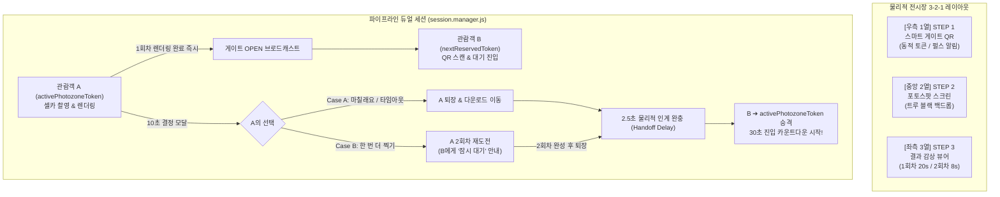
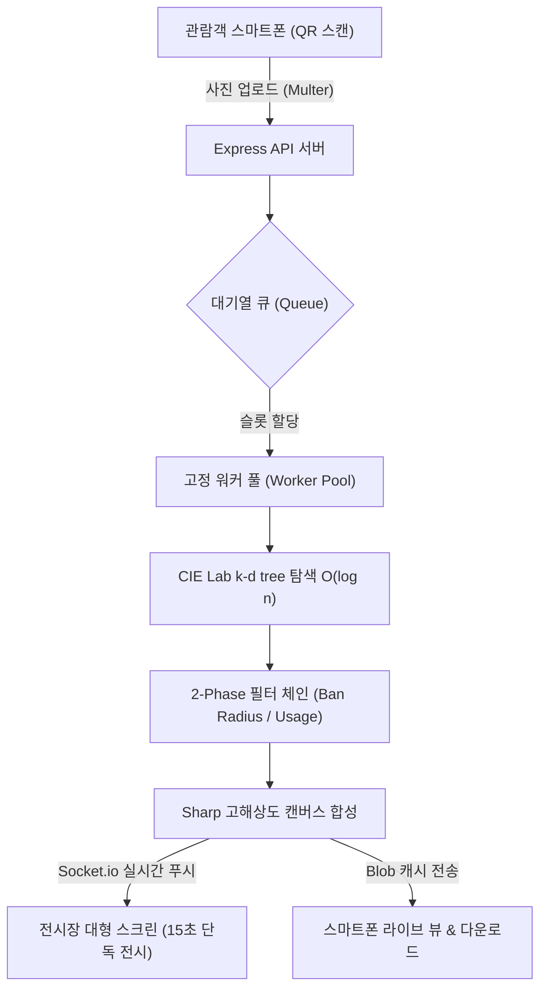
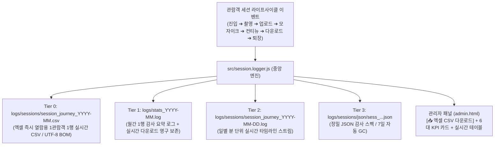

# 🌌 Reverse Cosmos Mosaic (V8.12 Google Sheets Remote Monitoring Edition)
> **로비 스크린 및 미디어아트 전시를 위한 인생네컷형 인터랙티브 스마트 모자이크 시스템**
> *(Interactive Smart Photo Mosaic System for Kiosk Screens & Exhibitions)*


**최종 업데이트**: 2026-09-15  
**개요**: 관람객이 전시장 키오스크의 스마트 게이트 QR을 스캔하여 전면 카메라로 셀카를 촬영하면, 수천 장의 우주 타일과 결합하여 **실시간 초고화질 포토모자이크**를 완성하고, **대형 스크린(3-2-1 역방향 동선)에 실시간 단독 전시**하는 전시장 전용 무인 인터랙티브 엔진입니다.  
고령 관람객(70대 이상)도 즉시 적응하는 **3단계 직관 UI**, 1회차 완료 즉시 다음 관람객 입장을 허용하는 **파이프라인 듀얼 세션(`activeExperience` + `nextReserved`)**, 그리고 저장을 깜빡하고 다음으로 넘어가는 사고를 원천 방지하는 **"결정 후 다운로드(Decision-First)" 2단계 컨티뉴 UX**, **Google Sheets 원격 실시간 관제 대시보드(1인 1행 실시간 갱신 & 월별 세션로그 자동 분할 & 10분 주기 시계열 스냅샷)**가 완벽 탑재되어 있습니다.

---

## 📑 목차 (Table of Contents)
1. [🌟 주요 기능 및 특징 (Key Features)](#1-주요-기능-및-특징-key-features)
2. [🚪 V8.8 스마트 게이트 & 세션 파이프라인 아키텍처](#2-v88-스마트-게이트--세션-파이프라인-아키텍처)
3. [🛡️ 14대 현장 실패 시나리오 QA 체크리스트](#3-14대-현장-실패-시나리오-qa-체크리스트)
4. [🛠️ 기술 스택 (Tech Stack)](#4-기술-스택-tech-stack)
5. [🧠 핵심 알고리즘 및 시스템 아키텍처](#5-핵심-알고리즘-및-시스템-아키텍처)
6. [🚀 설치 및 운영 가이드 (Quick Start)](#6-설치-및-운영-가이드-quick-start)
7. [🎬 3D 시네마틱 렌더링 파이프라인 (외장 GPU 전용)](#7-blender-3d-시네마틱-렌더링-파이프라인-외장-gpu-전용)
8. [🔒 개인정보 보호 및 V8.8 세션 여정 감사 로깅 체계](#8-개인정보-보호-및-v88-세션-여정-감사-로깅-체계)
9. [🎛️ 관리자 패널 (Admin Dashboard) 핵심 가이드](#9-관리자-패널-adminhtml-핵심-가이드)
10. [📜 릴리즈 노트 & 개발 역사 (Patch Notes)](#10-릴리즈-노트--개발-역사-patch-notes)

---

## 1. 🌟 주요 기능 및 특징 (Key Features)

### 🎨 완벽한 전시장 인터랙티브 경험 (V7.0 Display Overhaul)
- **단색 OLED 순수 블랙 (`#000000`) 고대비 테마**: 전시장 대형 스크린에서 관람객의 시각적 피로를 방지하고 모자이크와 QR의 가독성 및 선명도를 극대화합니다.
- **직관적 3열 전시장 동선 (`STEP 1 · 2 · 3`)**:
  - **`[우측 1열] STEP 1` (참여 시작)**: 초대형 참여 QR 코드 및 3단계 직관적 이용 가이드 상시 노출.
  - **`[중앙 2열] STEP 2` (셀카 촬영)**: 방해 요소를 100% 제거한 깨끗한 인물 셀카 스튜디오 백드롭.
  - **`[좌측 3열] STEP 3` (결과 감상)**: 1,024조각 마블 시네마틱 지수 가속 결합 연출 및 15초 단독 전시 뷰어.
- **초상권 및 개인정보 100% 안심 보호 시스템**:
  - **유휴(Idle) 시**: 관람객 사진을 일절 롤링하지 않고, 사전에 준비된 안전한 데모 모자이크(`public/output_guides/`)만 부드러운 페이드로 순환.
  - **제출 시**: 15초간 카운트다운 단독 전시 후 즉시 화면에서 소멸되고 데모 모드로 복귀.
  - **동시 다발 제출 시**: FIFO `showcaseQueue`에 안전하게 적재되어 모든 참여자에게 15초의 단독 전시 시간을 공평하게 보장.
  - **서버 재부팅 시**: `public/outputs/` 내 모든 임시 결과물 이미지 및 오래된 로그 자동 파기.

### 📱 모바일 웹 60fps 렌더링 & UX 극대화 (V8.1)
- **초경량 모바일 파티클 조립 애니메이션**: 모바일 환경에서 14,000px급 초고해상도 렌더링 시 브라우저 크래시를 방지하기 위해, 오프스크린 캔버스 저해상도 소스로 1,024개 조각 비행 애니메이션을 부드럽게 재생한 뒤 원본 고해상도 이미지를 페이드인하는 최적화 기법 적용.
- **이미지 사전 적재(Pre-load) 동기화**: 연산 완료 후 기기 다운로드 중 발생하는 어색한 검은 화면을 차단하고 100% 적재 완료 시점에 전환.
- **스마트폰 다이렉트 다운로드 & 카카오톡 인앱 브라우저 호환**: iOS Safari Blob 다운로드 Fallback 및 카카오톡 롱프레스(Long-press) 저장 오버레이 완벽 지원.

### ⚙️ 극한의 최적화 및 안정적인 멀티스레드 코어
- **3차원 k-d tree 기반 초고속 타일 매칭**: O(n) 브루트포스 탐색을 CIE Lab 색공간 k-d tree 인덱스 조회로 교체하여 O(log n) 수준으로 렌더링 지연 최소화.
- **터보 모드 (Turbo Mode)**: 대규모 인파 몰림 시 0.1초 만에 렌더링을 끝내는 O(1) 랜덤 매칭 모드 지원 (관리자 패널 실시간 토글).
- **고정 워커 풀 (Worker Pool) + EMA 대기열**: CPU 코어 기반 고정 워커 풀을 상시 유지하고, 지수이동평균(EMA) 공식으로 정확한 예상 대기시간을 관람객 폰에 실시간 안내.
- **멀티 테마 스위칭 (Multi-Theme)**: 우주(NASA), 자연 풍경, 박물관 소장품 등 테마별 독립 빌드 및 원클릭 무중단 핫리로드 지원.
- **Windows 안전 원자적 쓰기 (Atomic Write)**: `write-file-atomic`을 적용하여 멀티스레드 환경에서 설정 파일(`config.json`)의 파손을 원천 방지.
- **100% 로컬 & 원클릭 무설치 구동**: 외부 클라우드 비용 없이 로컬 노드 서버 기반으로 동작하며, `start.bat` 하나로 자동 환경 구성 및 실행.

---

## 2. 🚪 V8.8 스마트 게이트 & 세션 파이프라인 아키텍처

V8.8은 전시 현장의 물리적 병목을 해소하고 관람객 회전율을 최대 70%까지 압축하면서도, 단 1곳뿐인 셀카 포토존에서 관람객 간 신체적 충돌을 원천 차단하는 **스마트 게이트 및 파이프라인 듀얼 세션 엔진**을 탑재했습니다.



### 2-1. 3 ➔ 2 ➔ 1 전시장 물리 동선 (우측에서 좌측으로의 자연스러운 흐름)
전시장 키오스크 대형 스크린(`display.html`)은 우측에서 좌측으로 시선과 이동 동선이 일치하도록 **3 ➔ 2 ➔ 1 역방향 레이아웃**으로 전면 최적화되었습니다:
1. **`[우측 1열] STEP 1` (상하 배치 반전 스마트 게이트)**:
   - **상단 (Row 1) 3단계 이용 안내**: 전시장 진입 시 시선이 가장 먼저 닿는 상단에 "1. QR ➔ 2. 셀카 ➔ 3. 모자이크 완성" 3단계 전체 흐름을 한눈에 파악할 수 있는 대형 안내 카드를 배치합니다.
   - **하단 (Row 2) 스마트 게이트 QR**: 상단 안내를 인지한 뒤 바로 아래 편안한 시선/팔 높이에 위치한 초대형 동적 QR 코드를 스마트폰으로 즉시 스캔합니다.
   - 포토존이 사용 중일 때(`isGateOpen: false`)는 QR 위에 오해를 부르는 카운트다운 숫자 대신 **부드러운 펄스 애니메이션(`#gateBusyBox`)**과 함께 `"앞 관람객 촬영 중 잠시만 기다려주세요"` 메시지를 띄워 줄 서 있는 관람객의 불안감을 해소합니다.
2. **`[중앙 2열] STEP 2` (3.5초 스마트 인체 실루엣 가이드 & 트루 블랙 포토스팟)**:
   - **초기 3.5초 인체 실루엣 안내**: 관람객이 QR을 스캔하고 스마트폰을 본 뒤 중앙 대형 스크린을 쳐다보는 찰나(약 3.5초) 동안, 중앙 화면에 섬세한 네온 인체 실루엣과 `"가운데에 서서 셀카를 준비해주세요"` 명판이 부드럽게 나타나 최적의 포토스팟 중앙 자리를 직관적으로 잡아줍니다.
   - **셀카 시점 100% 트루블랙 완전 소멸**: 관람객이 위치를 잡고 스마트폰을 들어 셔터를 누르는 시점에 맞춰 실루엣이 0.8초간 부드럽게 페이드아웃되어 **100% 무반사 순수 트루 블랙(`#000000`) 백드롭**으로 완전 소멸합니다. 얼굴 빛 반사와 눈부심은 0%로 완벽 차단하면서도 초기 위치 잡기 편의성은 극대화됩니다.
3. **`[좌측 3열] STEP 3` (단독 전시 뷰어)**:
   - 촬영을 마친 관람객이 좌측으로 자연스럽게 이동하여 본인의 모자이크를 감상할 수 있는 독립 뷰어 구역입니다.
   - 모든 텍스트에 CSS `clamp()` 반응형 폰트가 적용되어 70대 이상 어르신도 안경 없이 먼 거리에서 시원하게 판독할 수 있습니다.

---

### 2-2. 파이프라인 듀얼 세션 구조 (`activePhotozoneToken` + `nextReservedToken`)
기존 방식은 앞사람의 1회차, 2회차, 감상, 다운로드가 모두 끝날 때까지 뒷사람이 멍하니 대기해야 했습니다. V8.8은 **역할 슬롯 포인터**와 **중앙 세션 저장소**를 분리하여 다음과 같이 파이프라인으로 관람객을 처리합니다:

| 역할 슬롯 | 상태 및 설명 |
|---|---|
| **`activePhotozoneToken`** | 현재 물리적 포토존을 점유하여 셀카를 촬영 중인 활성 관람객. |
| **`nextReservedToken`** | 1회차 렌더링 완료 즉시 열린 게이트를 통해 진입한 사전 예약 관람객 (포토존 대기열). |
| **`isGateOpen`** | 게이트 개폐 여부. 대기 슬롯이 비어있고 포토존 촬영 단계가 아닐 때 `true`. |

- **Case A (1회차 만족 후 종료 시)**:
  1. A의 1회차 모자이크 렌더링이 완료되는 즉시 서버가 `isGateOpen = true`를 선언하고 게이트를 엽니다.
  2. 대기 중이던 B가 QR을 스캔하여 `nextReservedToken`을 부여받습니다.
  3. A가 모바일에서 [여기서 마칠래요]를 누르면(또는 20초 타임아웃), A는 포토존에서 비켜나며 다운로드 페이지로 이동합니다.
  4. 서버는 **2.5초 물리적 인계 완충 딜레이**를 거친 뒤 B를 `activePhotozoneToken`으로 승격시키고, B의 폰에 **"촬영 준비 중... (30초)"** 카운트다운을 시작합니다.
- **Case B (1회차 후 2회차 재도전 선택 시)**:
  1. 게이트는 이미 열려 B가 `nextReservedToken`으로 대기열에 진입한 상태입니다.
  2. A가 [한 번 더 찍기]를 선택하면, B의 화면에는 **"앞 관람객이 추가 촬영 중입니다. 잠시만 대기해주세요"** 안내 화면이 안전하게 표시됩니다.
  3. A가 2회차 샷(8초 전시)을 마치고 퇴장하면 2.5초 완충 후 B가 포토존으로 입장합니다. 물리적 동선 겹침이 0%로 완벽 차단됩니다.

---

### 2-3. 2.5초 물리적 인계 완충 딜레이 (`handoffDelay: 2500ms`)
앞 관람객(A)이 촬영을 마치고 짐을 챙겨 비켜서는 시간과, 뒷 관람객(B)이 발걸음을 옮겨 포토스팟 중앙에 자리 잡는 물리적 소요 시간을 고려하여 **서버 차원에서 2.5초의 완충 유예**를 강제합니다:
- A 퇴장 이벤트 수신 ➔ 2.5초간 게이트를 일시 정지(HOLD) 상태로 유지 ➔ 2.5초 경과 즉시 B의 모바일 소켓으로 `photozone_ready` 이벤트 발송.
- **B의 30초 카운트다운은 B가 QR을 스캔한 시점이 아니라, 이 2.5초 완충이 끝난 순간부터 정확히 작동**하여 억울하게 시간이 차감되는 현상을 방지합니다.

---

### 2-4. 세션 중앙 저장소 (`sessions: Map`)와 403 차단 아키텍처
기존 세션 관리 방식의 치명적 결함은 A의 슬롯이 해제되면 A의 세션 토큰까지 만료되어, 관람객이 스마트폰에서 고화질 사진을 다운로드하려 할 때 `403 Forbidden` 에러가 터지는 것이었습니다.

```javascript
// src/session.manager.js 설계
const sessions = new Map(); // 중앙 세션 저장소 (모든 완료 세션 5분 보존)
let activePhotozoneToken = null; // 포토스팟 점유 포인터
let nextReservedToken = null;    // 사전 예약 포인터
```
- A가 포토존 권한을 B에게 넘겨주고 `activePhotozoneToken`에서 물러나더라도, A의 세션 객체는 `sessions` Map에 5분간 온전히 유지됩니다.
- A는 전시장 밖으로 걸어 나가면서도 안심하고 1회차/2회차 사진을 스마트폰에 고화질로 저장할 수 있습니다.

---

### 2-5. "결정 후 다운로드(Decision-First)" 2단계 컨티뉴 UX
관람객이 사진을 저장하느라 포토존에서 비켜서지 않거나, 반대로 재도전 버튼을 누르느라 1회차 사진 저장을 깜빡하는 현장 사고를 원천 방지하기 위해 2단계 흐름을 도입했습니다:

```
1회차 완성 즉시
      ↓
┌───────────────────────────────────────────────┐
│  [1단계: 20초 결정 집중 모달]                │
│  - 다운로드 버튼 숨김 (인지 부하 최소화)      │
│  - ⏱️ 20초 카운트다운 (사진 로딩 배려 2배)   │
│  - [🔁 한 번 더 찍기]  vs  [✅ 여기서 마칠래요] │
└───────────────────────────────────────────────┘
      ↓                                ↓
[한 번 더 찍기 선택]           [마칠래요 선택 / 20초 만료]
      ↓                                ↓
2회차 촬영 & 렌더링 직행         ┌───────────────────────────────────────────┐
      ↓                         │  [2단계: 안전 다운로드 페이지]            │
┌─────────────────────────┐     │  - 포토존 권한 즉시 반납 (B 입장 개시)    │
│ [초대형 듀얼 탭 뷰]     │     │  - 내 사진 최우선 초대형 56vh 전면 배치   │
│ 1회차/2회차 탭 전환     │     │  - OS 공유창 없는 원클릭 다이렉트 저장    │
│ 개별 & 일괄 다운로드    │     └───────────────────────────────────────────┘
└─────────────────────────┘
```
- **2회차 에러 시 비상구**: 2회차 촬영/업로드 중 네트워크 오류나 카메라 에러가 발생하더라도 **"1회차 사진 보러가기"** 비상구 버튼이 즉시 활성화되어, 1회차 결과물을 잃어버리는 사고가 0%입니다.

---

### 2-6. 1회차/2회차 독립 전시 시간 정책
- **1회차 (`displayShowcaseDuration`)**: 기본 **20초** (관리자 설정 범위: 10초 ~ 60초 클램핑).
  - 첫 모자이크 완성의 감동과 6.0배 시네마틱 딥-줌 연출을 충분히 즐길 수 있도록 넉넉한 시간 보장.
- **2회차 (`displayRetryDuration`)**: 기본 **8초** (관리자 설정 범위: 5초 ~ 20초 클램핑).
  - 재도전 사진은 확인 위주로 짧게 노출하여 대기 관람객의 대기 시간을 대폭 압축.

---

### 2-7. 🏛️ 전시품 특화 황금빛 프레임(Gold Frame) & 키오스크 전체화면(F11) 무인 체계
전시장 키오스크 환경과 모바일 관람객 화면에서 "내가 미디어아트 작품의 주인공이 되었다"는 가치를 즉각 각인시키기 위한 통합 프레임 및 자동 기동 체계입니다:
1. **화면 전체 아우르는 황금빛 앰비언트 프레임 (`.exhibition-gold-frame`)**:
   - 화면 전체 외곽 컨테이너에 고급 샴페인 골드 테두리(`border: 2.5px solid #f59e0b`)와 앰버 백라이트 글로우(`box-shadow: 0 0 35px rgba(245, 158, 11, 0.35)`), 그리고 사방 모서리에 정밀한 골드 메탈릭 코너 브래킷을 배치하여 미디어아트 전시품 고유의 권위와 아우라를 부여합니다.
   - 상단 중앙에 `🏛️ REVERSE COSMOS EXHIBITION` 공식 전시 배지와 `⛶ F11` 전체화면 전환 토글을 탑재.
2. **모자이크 완성작 전용 박물관 더블 골드 액자 매트 (`artwork-gold-matte`)**:
   - 1회차 결정 미리보기 및 최종 다운로드 뷰의 사진 영역에 더블 골드 액자 테두리(`border: 2.5px solid #fbbf24`)와 하단 골드 전시 명판 배지(`[ 🏛️ EXHIBITION PIECE 2026 ]`)를 결합하여 한 장의 소장용 명화처럼 연출.
3. **윈도우 시작프로그램(`shell:startup`) 무인 F11 자동 기동**:
   - `start.bat`을 시작 프로그램에 등록해두면, PC 부팅 시 Chrome/Edge가 `--start-fullscreen` 옵션으로 실행되어 1번 탭(`display.html`: 메인 관람객 전시장 전면 화면)과 2번 탭(`admin.html`: 백그라운드 관리자 패널)을 동시에 띄우며, 1번 탭(`display.html`)이 전면에 전체화면(F11)으로 즉각 활성화되어 별도 조작 없이 즉시 전시가 시작됩니다.
4. **키오스크 무인 연속 촬영 & 60초 자동 리셋**:
   - URL에 QR 토큰이 없어도 `/api/upload/gate-state`에서 열려있는 게이트 토큰을 자동 취득하여 즉시 셀카 촬영 대기 화면으로 직행.
   - 로컬 키오스크(`localhost`)에서는 15분 다운로드 락을 해제하고, 다운로드 화면에 **[다음 관람객 촬영 시작 (새 세션)]** 버튼 및 60초 무응답 자동 초기화 타이머를 가동하여 다음 관람객을 끊김 없이 맞이합니다.
5. **디스플레이 최외곽 샴페인 골드 프레임 & 하이브리드 갤러리 스튜디오 테마 (`display.html`)**:
   - 대형 스크린 최외곽 전체에 고급 샴페인 골드 보더(`border: 3.5px solid #d97706`), 앰버 백라이트 글로우, 4개 코너 메탈릭 브래킷을 둘러 미디어아트 액자 아우라 완성.
   - **하이브리드 갤러리 스튜디오**: 외곽 벽면과 좌/우 패널(결과 감상·이용안내·QR)은 정갈하고 밝은 화이트 큐브 갤러리 톤으로 화사하게 연출하고, **중앙 포토존(STEP 2)만 100% 무반사 트루 블랙(`#000000`) 암실 스튜디오**로 배치하여 관람객 얼굴 눈부심/그림자 0% 방어와 갤러리 명화 액자의 세련미를 완벽히 결합.
   - 상단 `[ 🏛️ 갤러리 모드 ]` 토글 버튼 및 `T` 단축키로 다크 코즈믹 모드와 실시간 스위칭 지원.

---

## 3. 🛡️ 14대 현장 실패 시나리오 QA 체크리스트

전시 현장의 극한 환경(어르신 오작동, 네트워크 순시 순단, 장시간 방치, 악의적 다중 접속)에서 무인으로 100% 자가 복구할 수 있도록 수립된 14대 QA 대응 명세입니다.

> [!IMPORTANT]
> ### 👑 V8.8 절대 원칙 (The Golden Rule)
> **"어떤 에러, 취소, 타임아웃, 접속 끊김이 발생하더라도 디스크 저장 및 COMPLETED 확정 전까지 관람객의 촬영 기회(`shotCount`)는 절대 차감되지 않는다 (차감 0)."**

| # | 실패 시나리오 | 현장 발생 원인 | 사용자 화면 (UX) | 횟수 차감 | 시스템 방어 및 복구 로직 |
|:---:|---|---|---|:---:|---|
| **1** | **카메라 권한 거부 / 접근 실패** | 모바일 브라우저 권한 팝업 차단 | "카메라 권한을 허용해주세요" 안내 & [다시 시도] 버튼 | **❌ 0회** | 카운트다운 타이머 일시정지, 권한 허용 전까지 촬영 진입 차단. |
| **2** | **30초 입장 제한시간 만료** | QR 찍고 멍하니 서 있거나 딴짓 | "입장 시간이 초과되었습니다" 안내 후 게이트 복귀 | **❌ 0회** | 세션 자동 만료, 점유 슬롯 즉시 반납 및 다음 대기자 인계. |
| **3** | **촬영 중 브라우저 새로고침/이탈** | 뒤로가기 실수, 홈 화면 전환 | 20초 이내 재접속 시 "세션 복구 중..." 재진입 | **❌ 0회** | `DISCONNECTED_GRACE`(20초) 상태 전환, 토큰 일치 시 이전 단계 복원. |
| **4** | **네트워크 끊김 / 재연결 초과** | 전시장 Wi-Fi 음영 지역, 폰 꺼짐 | 세션 종료 안내 화면 | **❌ 0회** | 20초 경과 시 좀비 방지를 위해 세션 파기 및 포토존 권한 자동 회수. |
| **5** | **1단계 컨티뉴 모달 20초 무반응** | 관람객이 고민하다 가만히 있음 | 20초 만료 즉시 2단계(다운로드) 화면으로 자동 전환 | **1회차만** | 암묵적 [마칠래요] 처리로 간주하여 포토존을 즉시 B에게 인계. |
| **6** | **모바일 화면에서 "그만할래요"** | 촬영 도중 관람객이 자진 포기 | "정말 취소하시겠습니까?" 확인 후 메인 복귀 | **❌ 0회** | 즉시 세션 정리 및 슬롯 해제, 게이트 재개방. |
| **7** | **2회차 촬영 중 네트워크 실패** | 2회차 업로드 중 통신 두절 | "2회차 업로드 실패" + [1회차 사진 보러가기] 비상구 | **1회차 유지** | 1회차 결과물은 Map에 100% 안전 보존, 2회차 실패 건만 롤백. |
| **8** | **포토존 물리적 자리싸움 (A vs B)** | A가 안 비켰는데 B가 포토존 난입 | B 폰: "포토존 이동 준비 중..." (2.5초 대기) | **❌ 0회** | 2.5초 완충 딜레이(`handoffDelay`)로 물리적 거리 분리 보장. |
| **9** | **QR 코드 원격 스캔 / 어뷰징** | QR 사진을 찍어가 집에서 원격 업로드 | "유효하지 않거나 만료된 QR 코드입니다" | **-** | 동적 6자리 `gateToken` 탑재 및 15분 로컬스토리지 다중 진입 잠금. |
| **10** | **업로드 버튼 광클 / 연타** | 네트워크 지연 시 조급증으로 연타 | 첫 클릭 즉시 버튼 비활성화 & 스피너 표시 | **정상 1회** | 백엔드 `shotRecord` 멱등성 키 캐시로 중복 렌더링 원천 차단. |
| **11** | **서버 렌더링 중 워커 크래시** | 이미지 파손 또는 메모리 급증 | "일시적 오류가 발생했습니다. 다시 촬영해주세요" | **❌ 0회** | 500 에러 처리 시 `shotCount` 원복 및 재촬영 슬롯 유지. |
| **12** | **전시장 디스플레이 F5 새로고침** | 관리자 실수로 키오스크 브라우저 리로드 | 0.1초 만에 현재 게이트 및 쇼케이스 상태 100% 복원 | **-** | 소켓 연결 즉시 `request_gate_state` 핸드셰이크로 상태 재동기화. |
| **13** | **세션 메모리 누수 / 좀비 세션** | 비정상 종료 후 잔존하는 메모리 | 백그라운드 무인 청소 | **-** | 5분 경과한 비활성 세션 Map에서 자동 영구 삭제(GC). |
| **14** | **1회차 완료 후 다운로드창 방치** | 사진 저장 화면을 켠 채로 로비 활보 | 다운로드 화면 영구 유지 | **1회차 완료** | 포토존 권한은 이미 B에게 인계 완료되었으므로 전시장 정체 0%. |

---

## 4. 🛠️ 기술 스택 (Tech Stack)

### 4-1. Backend & Pipeline
| 기술 (Tech) | 버전 / 용도 | 링크 (Link) |
|---|---|---|
| **Node.js** | v20.15.1 LTS 기반 비동기 I/O 및 Worker Threads | [Node.js](https://nodejs.org) |
| **Express.js** | v5.x 고성능 REST API 웹 서버 | [Express](https://github.com/expressjs/express) |
| **Socket.io** | v4.x 실시간 양방향 통신 (모바일 ↔ 서버 ↔ 전시장 스크린) | [Socket.io](https://github.com/socketio/socket.io) |
| **Sharp** | C++ libvips 기반 서버사이드 초고속 이미지 리사이즈 및 합성 | [Sharp](https://github.com/lovell/sharp) |
| **Multer** | 안정적인 Multipart 모바일 사진 업로드 처리 | [Multer](https://github.com/expressjs/multer) |
| **write-file-atomic** | 동시성 환경에서의 원자적(Atomic) 파일 쓰기 보장 | [write-file-atomic](https://github.com/npm/write-file-atomic) |
| **Cloudflare Tunnel** | 포트포워딩 없이 로컬 서버를 외부 모바일 도메인으로 안전하게 노출 | [Cloudflared](https://github.com/cloudflare/cloudflared) |

### 4-2. Frontend & UI
| 기술 (Tech) | 용도 (Purpose) | 링크 (Link) |
|---|---|---|
| **Tailwind CSS** | 반응형 모바일 업로드 페이지 및 관리자 UI 스타일링 | [Tailwind CSS](https://tailwindcss.com) |
| **Material Design 3** | 관리자 패널의 직관적인 컴포넌트 및 대시보드 레이아웃 | [Material 3](https://m3.material.io) |
| **HTML5 Canvas 2D** | 수학적 행렬 변환(`setTransform`) 기반 60fps 파티클 조립 애니메이션 | [HTML5 Canvas](https://developer.mozilla.org) |
| **Cropper.js** | 모바일 터치 친화적 인물 사진 자유 비율 크롭 엔진 | [Cropper.js](https://fengyuanchen.github.io/cropperjs/) |

### 4-3. 3D 시네마틱 렌더링 & GPU 가속 (외장 GPU 전용)
| 기술 (Tech) | 버전 / 용도 (Purpose) | 링크 (Link) |
|---|---|---|
| **Blender 5.2 LTS** | 18초(1,080 Frames) Hero-Chase 3D 지수 가속 결합 연출 씬 빌더 | [Blender](https://www.blender.org/) |
| **EEVEE Next / Cycles** | NVIDIA OptiX / CUDA 외장 GPU 하드웨어 가속 렌더링 | [Blender Render](https://docs.blender.org/) |
| **FFmpeg (H.264/MP4)** | 1920×1080 60fps 무손실 비디오 고속 자동 인코딩 파이프라인 | [FFmpeg](https://ffmpeg.org/) |

### 4-4. 모자이크 알고리즘 레퍼런스
| 프로젝트 (Repository) | 벤치마킹 사항 | 링크 |
|---|---|---|
| **sausheong/mosaic** | 타일 평균색 DB 구축 및 유클리드 최근접 매칭 개념 차용 | [GitHub](https://github.com/sausheong/mosaic) |
| **worldveil/photomosaic** | `opacity` 파라미터 기반 원본-타일 블렌딩 비율 제어 | [GitHub](https://github.com/worldveil/photomosaic) |
| **DavideA/photomosaic** | 소스 이미지 인덱싱 개념 (본 시스템은 Sharp & k-d tree로 완전 대체) | [GitHub](https://github.com/DavideA/photomosaic) |

---

## 5. 🧠 핵심 알고리즘 및 시스템 아키텍처



### 5-1. k-d tree 기반 2-Phase 타일 매칭
1. **[3차원 k-d tree 인덱싱]**: `scripts/build.db.js`가 테마별 타일의 CIE Lab 평균 색상값을 3차원 공간 트리(`tileIndex.kdtree.json`)로 구성합니다.
2. **[Phase 1 — 후보 추출]**: 관람객 사진의 각 그리드 칸 색상에 대해 k-d tree에서 상위 후보군(`candidatePoolSize`, 기본 150개)을 **O(log n)** 시간으로 빠르게 추출합니다.
3. **[Phase 2 — 정밀 필터 체인]**: 후보군에 대해 **누적 사용 횟수 페널티**, **공간 방어 반경(Ban Radius)**, **시각적 유사도 가중치**를 적용하여 최적의 타일을 확정합니다.
4. **[자동 폴백]**: k-d tree 인덱스가 손상되었거나 없을 경우 브루트포스(Brute-force) 모드로 자동 폴백되어 무중단 서비스를 유지합니다.

### 5-2. 전시장 디스플레이 상태 머신 (4-State Machine)
- **Idle (유휴)**: 대기 중인 사용자가 없을 때, 안전한 사전 제작 데모 모자이크를 7초 주기로 페이드 순환하며 참여를 유도합니다.
- **Processing (연산 중)**: 워커가 이미지를 합성하는 동안 진행률(%)을 실시간 표시합니다.
- **Showcase (단독 전시)**: 모자이크 완성 즉시 1,024개 타일이 마블 가속 비행으로 조립되며, **정확히 15초간 카운트다운 단독 전시**됩니다.
- **Overloaded (과부하 방어)**: 접속자가 폭주하여 워커 용량을 초과할 경우 안내 메시지와 함께 대기열을 순차 처리합니다.

### 5-3. 멀티 테마 격리 아키텍처
- 원본 이미지(`public/raw_tiles/{theme}/`), 썸네일 타일(`public/tiles/{theme}/`), DB 인덱스(`data/themes/{theme}/`)가 테마별로 완벽히 격리되어 충돌 없이 관리됩니다.
- 관리자 패널에서 테마를 변경하면 워커 풀에 즉시 브로드캐스트되어 서버 재부팅 없이 실시간 적용됩니다.

---

## 6. 🚀 설치 및 운영 가이드 (Quick Start)

### ⚡ 3초 퀵 스타트 (Fast Track for Windows)
아무런 사전 프로그램(Node.js 등)이 설치되어 있지 않은 **완전 깡통 윈도우 PC**에서도 2단계만 거치면 모든 것이 전자동으로 세팅되고 서버가 켜집니다.

#### 1단계: 소스코드 다운로드 (PowerShell 또는 Git Bash)
PowerShell을 열고 아래 명령어로 저장소를 복제합니다:
```powershell
git clone https://github.com/Buvi-kr/mosaic.git
```
*(Git이 없다면 GitHub 상단 **Code ➔ Download ZIP**으로 다운받아 압축을 푸셔도 됩니다)*

#### 2단계: `start.bat` 더블 클릭 실행 (추천 🚀)
생성된 `mosaic` 폴더로 들어가서 **`start.bat`을 더블 클릭**하세요!
* 독립된 전용 명령 프롬프트(CMD) 창이 열리며 **Node.js, 의존성 라이브러리(`npm install`), Cloudflared 준비 및 메인 서버 구동**까지 알아서 100% 전자동으로 완료됩니다.

---

> [!TIP]
> ### 💡 Q. 진짜 아무것도 안 깔려있는데 `start.bat`만 실행하면 되나요?
> **네, 100% 전자동으로 알아서 완성됩니다!**
> `start.bat`을 실행하는 순간 백그라운드에서 다음 작업들이 순차적으로 자동 처리됩니다:
> 1. ✔ **Node.js 자동 감지 & 설치**: PC에 Node.js가 없으면 공식 최신 LTS 인스톨러를 자동 다운로드하여 설치를 진행합니다.
> 2. ✔ **Cloudflare 터널 바이너리 자동 다운로드**: 외부 모바일 스마트폰 접속을 위한 `cloudflared.exe`를 GitHub 릴리즈에서 자동 확보합니다.
> 3. ✔ **라이브러리 자동 설치 (`npm install`)**: `node_modules`가 없으면 알아서 패키지들을 1초 만에 설치합니다.
> 4. ✔ **포트 3000 충돌 자동 청소**: 이전에 켜져 있던 잔여 프로세스나 좀비 포트를 안전하게 정리하고 포트 해제를 검증합니다.
> 5. ✔ **서버 자동 기동**: 콘솔창에 디스플레이 화면 및 관리자 화면 접속 링크가 뜨며 즉시 운영 준비가 끝납니다!

---

### 6-1. 🪄 One-Click 자동 런처 (`start.bat`) 세부 동작
`start.bat` 스크립트는 현장 무인 운영을 위해 다음과 같은 5단계 보호 프로세스를 거칩니다:
1. `Node.js` 설치 여부 자동 확인 (미설치 시 웹 다운로드 & 설치창 자동 실행)
2. `cloudflared.exe` 바이너리 유무 점검 및 무인 다운로드
3. 이전 실행 시 남아있는 포트 3000 `LISTENING` 프로세스 정밀 정리 및 포트 해제 검증(최대 10회)
4. `node_modules` 의존성 자동 점검 및 `npm install`
5. 메인 서버 시작 (`node src/app.js`)

### 6-2. npm 스크립트 실행 (수동 개발자 모드)
개발 및 수동 운영 시 다음 명령어를 사용할 수 있습니다:

```bash
# 메인 서버 구동
npm start

# NASA 공식 100% 퍼블릭 도메인 대규모 고화질 아카이브 자동 수집 (7,000+ 타일)
npm run fetch:nasa

# 현재 테마 DB 및 k-d tree 인덱스 빌드
npm run build:db

# 중복 타일 물리적 픽셀 비교 제거
npm run dedup

# 전시장 디스플레이용 기본 가이드 샘플 이미지 생성
npm run guides:create

# 포터블 배포용 단일 ZIP 패키징
npm run build:release
```

### 6-3. 접속 URL (Endpoints)
| 화면 | URL 경로 | 설명 |
|---|---|---|
| **전시장 대형 스크린** | `http://localhost:3000/display.html` | 3열 레이아웃, 6배 딥-줌 & 15초 단독 전시 뷰어 |
| **관리자 관제 패널** | `http://localhost:3000/admin.html` | 테마 스위칭, 파라미터 조절, 하드웨어 및 렌더 모드 모니터링 |
| **관람객 스마트폰 업로드** | `http://localhost:3000/upload.html` | Cloudflare 터널을 통해 외부 접속용 QR 주소와 자동 연동 |

---

## 7. 🎬 Blender 3D 시네마틱 렌더링 파이프라인 (외장 GPU 전용)

> ⚠️ **하드웨어 요구사항**: 3D 시네마틱 비디오 렌더링 파이프라인은 **외장 GPU (NVIDIA GeForce RTX 3060 / 4060급 이상, VRAM 6GB+ 권장)** 환경 전용입니다.

모자이크 데이터를 기반으로 수천 개의 타일 조각이 3차원 공간에서 역동적으로 비행하여 결합되는 **Blender 5.2 LTS 기반 영화급 3D 시네마틱 애니메이션 및 102초 마스터 풀버전 비디오** 렌더링 시스템입니다.

```
[scenes/{씬}/mosaic_data.json] ──► [generate_mosaic_scene.py] ──► [Blender 5.2 LTS] ──► [renders/cinematic_*.mp4]
(타일 좌표 및 메타데이터)              (3D 씬/카메라/궤적 빌드)         (NVIDIA OptiX GPU 렌더)     (개별 씬 또는 102초 마스터 영상)
```

### 🌟 4대 핵심 퀄리티 업그레이드
1. **🌌 12K 초고해상도 모자이크 아틀라스 (`mosaic_atlas.jpg`)**:
   * 수천 장(4,416~5,280개)의 고해상도 타일(128×128px)과 마스터 사진을 12,288px 크기로 정밀 합성하여 극초근접 줌인 시에도 칼같은 텍스처 퀄리티 보장.
2. **🧊 입체 6개 면 완벽 UV 매핑**:
   * 3D 도미노 타일의 앞면(Top), 뒷면(Bottom), 4개 옆면(Rim) 전체에 정밀 UV 루프를 할당하여 회전/비행 중에도 왜곡 없이 완벽한 텍스처 유지.
3. **🌈 True-Color sRGB 색상 매니지먼트 (`Standard` View Transform)**:
   * AgX/Filmic 뷰 트랜스폼의 색상 왜곡(탈색, 어두워짐)을 방지하고 `Emission 1.0`을 통해 100% 원본 색감을 생생하게 구현.
4. **🔤 3D 시네마틱 한글 타이포그래피 (Frame 800 등장)**:
   * 모자이크 조립이 완성되는 Frame 800에 부드럽게 솟아올라 Frame 825에 안착하는 3D 타이틀.
   * 사진별 배경 특성에 맞춘 맞춤형 컬러(24K 골드 / 선셋 골드 / 옐로우 / 순백색)와 **2D 균일 검은색 외곽선(Stroke Outline)**을 적용하여 어떤 배경에서도 완벽한 가독성 제공.

---

### 🎨 5대 테마 씬 & 카메라 연출 레지스트리

| 씬 폴더 | 테마 명칭 | 3D 타이틀 | 타이틀 스타일 | 3D 비행 궤적 & 카메라 동선 연출 |
| :--- | :--- | :--- | :--- | :--- |
| **`1번사진`** | **천주호 (야간)** | **`천주호 (야간)`** | 24K 앰버 골드 (`#FFAE19`) | **🌌 Cosmic Spiral Galaxy**<br>피보나치 황금 나선 궤적 & 360° 오비탈 선회 상승 |
| **`2번사진`** | **조각공원 (일몰)** | **`조각공원 (일몰)`** | 노을빛 선셋 골드 (`#FFB31F`) | **🌪️ Seamless 360° Harmonic Orbit**<br>은하수 폭포 & 360° 일체화 나선 상승 ➔ 정방향 수직 탑뷰 락인 |
| **`3번사진`** | **천주호 (겨울)** | **`천주호 (겨울)`** | 쨍한 옐로우 골드 (`#FFE014`) | **☄️ Zero-Spin Linear Breakthrough**<br>수천 장 앞면을 뚫고 솟구쳐 F550 즉시 바닥 턴 & 공허 0% 관람 |
| **`4번사진`** | **매표소 앞 (가을)** | **`매표소 앞 (가을)`** | 샴페인 순백색 (`#FFFFFF`) | **🎴 Kinetic Domino Cascade**<br>75° 기립 전경 ➔ 가로/세로 대각선 대확산 & 2D 격자 스냅 |
| **`5번사진`** | **천문과학관** | **`과학관`** | 샴페인 순백색 (`#FFFFFF`) | **🎢 Compact Framed Spiral**<br>2.6회전 나선 선로 1인칭 질주 ➔ 중앙 상공 룩다운 다이브 완성 |

---

### 🚀 사용 및 렌더링 방법 (3가지 방식)

#### 방식 1. 1클릭 자동 비디오 렌더러 (가장 추천 ⭐)
`blender_workspace/render_video.bat`을 더블 클릭하여 인터랙티브 콘솔 메뉴를 엽니다:
```text
===========================================================================
🎬 [Blender 5.2] 3D 모자이크 시네마틱 비디오 렌더러
===========================================================================
  [1] 1번사진 - 천주호 (야간)   | 🌌 Cosmic Spiral Galaxy
  [2] 2번사진 - 조각공원 (일몰) | 🌪️ Seamless 360° Harmonic Orbit
  [3] 3번사진 - 천주호 (겨울)   | ☄️ Zero-Spin Linear Breakthrough
  [4] 4번사진 - 매표소 앞 (가을) | 🎴 Kinetic Domino Cascade
  [5] 5번사진 - 과학관         | 🎢 Compact Framed Spiral
  -----------------------------------------------------------------------
  [B] 🚀 [추천] 1번~5번 전체 씬 순차 일괄 렌더링 (5개 MP4 비디오 자동 생성)
  [M] 🌟 1번~5번 시네마틱 페이드 마스터 합본 풀버전 영상 생성 (102초 풀버전)
===========================================================================
```
* **`1` ~ `5` 입력**: 해당 단일 씬 비디오 즉시 렌더링 (18~21초 / 60fps)
* **`B` 입력**: 1번부터 5번까지 5개 씬을 순차적으로 자동 일괄 렌더링
* **`M` 입력**: 5개 씬이 페이드로 자연스럽게 이어지는 **102초 마스터 풀버전 영상(`cinematic_마스터_풀버전_####.mp4`)** 렌더링
* 모든 렌더링 결과물은 **`blender_workspace/renders/`** 폴더에 자동 저장됩니다.

#### 방식 2. Blender GUI에서 직접 감상 & 렌더링
1. **`blender_workspace/mosaic_cinematic.blend`** 파일 실행 (Blender 5.2 LTS)
2. 상단 우측 `Scene` 드롭다운에서 원하는 씬 선택 (1번사진 ~ 5번사진 또는 `전체_통합_영상`)
3. `Numpad 0` (카메라 뷰) ➔ `Spacebar` (실시간 3D 비행 재생)
4. `Ctrl + F12` (고화질 MP4 렌더링 시작)

#### 방식 3. 마스터 스크립트로 씬 재생성/빌드
```powershell
cd blender_workspace

# 특정 씬만 빌드 (예: 3번사진)
& "C:\Program Files\Blender Foundation\Blender 5.2\blender.exe" -b --python generate_mosaic_scene.py -- --scene 3번사진

# 5개 씬 전체 빌드 & mosaic_cinematic.blend 통합 갱신
& "C:\Program Files\Blender Foundation\Blender 5.2\blender.exe" -b --python generate_mosaic_scene.py -- --all
```

---

## 8. 🔒 개인정보 보호 및 V8.8 세션 여정 감사 로깅 체계

본 프로젝트는 전시장에서 불특정 다수의 관람객이 참여하는 미디어아트 엔진이므로, **초상권 및 개인정보 유출 방지**와 **클린 깃허브 오픈소스 배포**를 위해 엄격한 보안 규칙을 준수함과 동시에, 전시장 관람객 흐름 및 전환율 분석을 위한 **7대 세션 여정 감사 로깅 엔진**을 내장하고 있습니다.

### 8-1. 🛡️ 3대 보안 원칙
1. **관람객 사진 및 결과물 자동 파기**:
   * 생성된 모자이크 결과물(`public/outputs/`)은 전시 종료 후 서버 재부팅(`start.bat`) 시 자동으로 완전 삭제됩니다.
2. **Git 추적 100% 원천 차단 (`.gitignore`)**:
   * **로그 파일 일체 (`logs/`, `*.log`, `*.log.json`)**: 참가자 IP, 시간, 통계 정보가 깃에 커밋되지 않도록 완전 무시.
   * **업로드 사진 및 임시 캔버스 (`public/outputs/`, `public/raw_tiles/`, `public/guides/`)**: 개인 얼굴 사진 유출 차단.
   * **개인 커스텀 테마 (`data/themes/*/`, `public/tiles/*/`)**: 기본 오픈 테마(`default_nasa`) 외 개인 사진 테마 커밋 방지.
   * **3D 렌더링 비디오 및 백업 (`*.mp4`, `*.blend1`, `blender_workspace/scenes/`)**: 대용량 바이너리 방지.
3. **환경변수 및 인증키 보안**:
   * `.env`, `*.key`, `*.pem` 등 모든 민감한 인증 파일 자동 무시.

---

### 8-2. 🗂️ 프로젝트 디렉토리 구조

```text
/mosaic_ver2
├── data/                         # [1.34 MB] 핵심 데이터베이스 및 시스템 설정 (초경량)
│   ├── config.json               # 코어 엔진 파라미터 (원자적 쓰기 지원)
│   └── themes/                   # 테마별 색상 DB 및 k-d tree 인덱스 격리 보관소
│       └── default_nasa/
│           ├── tileDB.json       # CIE Lab 평균 색상 매핑 인덱스
│           └── tileIndex.kdtree.json # 3차원 공간 탐색 k-d tree 인덱스
├── logs/                         # 📊 서버 상태 및 세션 여정 통계 로깅 허브
│   ├── history/                  # 개별 모자이크 렌더링 상세 로그 (3일 후 자동 정리)
│   ├── sessions/                 # [V8.8 NEW] 세션 여정 감사 로그 전용 스토리지
│   │   ├── json/                 # 세션별 구조화 감사 JSON (7일 후 자동 정리)
│   │   └── session_journey_YYYY-MM-DD.log # 일별 실시간 세션 여정 타임라인 스트림
│   ├── stats_YYYY-MM.log         # 월간 누적 참여자 통계 & 세션 여정 단일행 감사 로그
│   ├── dedup.log.json            # 이미지 중복 제거 리포트
│   ├── pipeline.log              # 테마 데이터 빌드 이력
│   └── server.error.log          # 서버 오류 트래킹 로그
├── public/                       # 프론트엔드 정적 웹 리소스
│   ├── guides/                   # 전시장 동선 안내용 가이드 그래픽
│   ├── output_guides/            # 초상권 보호용 유휴(Idle) 순환 데모 모자이크
│   ├── outputs/                  # 관람객 완성 모자이크 (재부팅 시 자동 파기)
│   ├── raw_tiles/                # 테마별 원본 타일 소스
│   ├── tiles/                    # 렌더링 전용 최적화 썸네일 (200px WebP)
│   ├── admin.html                # M3 기반 통합 관리자 대시보드 (실시간 여정 KPI 탑재)
│   ├── display.html              # 3-2-1 역방향 OLED 고대비 전시장 디스플레이 UI
│   └── upload.html               # 모바일 최적화 업로드, 크롭, Decision-First 2단계 모달 UI
├── src/                          # 백엔드 코어 비즈니스 로직
│   ├── app.js                    # Express 서버 진입점 및 프로세스/터널 생명주기 관리
│   ├── config.js                 # 시스템 전역 설정 로드 및 동적 갱신 모듈
│   ├── session.manager.js        # [V8.8] 스마트 게이트 & 듀얼 세션 파이프라인 매니저
│   ├── session.logger.js         # [V8.8 NEW] 7대 지표 세션 여정 감사 로깅 엔진
│   ├── kdtree.js                 # 순수 JavaScript 3차원 CIE Lab k-d tree 구현체
│   ├── admin.route.js            # 관리자 API (세션 여정 KPI 조회, 테마 빌드, 서버 종료)
│   ├── upload.route.js           # 모바일 게이트/업로드 API 및 다운로드 감사 트래킹
│   ├── mosaic.queue.js           # 고정 워커 풀 관리 및 EMA 기반 대기열 큐 시스템
│   ├── socket.manager.js         # Socket.io 실시간 이벤트 및 게이트/세션 라이프사이클 중계
│   └── matcher.worker.js         # 멀티스레드 타일 매칭 및 Sharp 이미지 합성 워커
├── blender_workspace/          # 🎬 Blender 5.2 LTS 3D 시네마틱 렌더링 파이프라인
│   ├── mosaic_cinematic.blend    # [통합 마스터 3D 프로젝트] 5개 씬 전체 포함
│   ├── generate_mosaic_scene.py  # [통합 마스터 빌더] 5개 씬 선택/일괄 빌드 엔진
│   ├── render_video.bat          # 🎥 [1클릭 MP4 렌더러] 개별 씬 & 102초 마스터 영상 렌더링 배치
│   ├── render_video.py           # 비디오 렌더링 인터랙티브 CLI 파이썬 스크립트
│   ├── export_mosaic_data.js     # 새 모자이크 이미지 ➔ 씬 자동 추출기
│   ├── README.md                 # 블렌더 전용 상세 매뉴얼
│   └── scenes/                   # 5개 씬별 데이터 및 독립 스크립트 보관소
├── scripts/                      # 자동화 빌더 스크립트
│   ├── build.db.js               # 테마 빌더 (이미지 압축 + DB 생성 + Tree 인덱싱)
│   └── blender_cinematic.py      # 블렌더 파이프라인 포워더
├── old/                          # 레거시 아카이브 (이전 기획서, 구버전 코드, 과거 실험 스크립트)
├── cloudflared.exe               # Cloudflare Tunnel 실행 바이너리
├── package.json                  # 프로젝트 메타데이터 및 실행 스크립트 정의
├── start.bat                     # Windows 원클릭 종합 구동 런처 (Node.js 무인 자동 설치 내장)
└── README.md                     # 프로젝트 마스터 문서
```

---

### 8-3. 📊 V8.8 전시장 관람객 세션 여정 감사 로깅 (Advanced Session Journey & Audit Engine)

전시 현장에서 관람객이 QR을 스캔한 순간부터 촬영, 업로드, 모자이크 합성, 재도전 선택, 최종 다운로드에 이르기까지 **전체 관람객 퍼널(Funnel)을 오차 없이 추적**할 수 있도록 진화된 감사 로깅 시스템(`src/session.logger.js`)이 탑재되었습니다.

#### 🎯 7대 핵심 감사 지표 (Audit Metrics)

| 번호 | 지표명 | 수집 항목 및 설명 | 기록 예시 |
|:---:|:---|:---|:---|
| **1** | **세션 ID (`sessionId`)** | QR 스캔 시 게이트에서 발급된 관람객 고유 식별자 | `sess_1773474720993_493x` |
| **2** | **접근 일시 (`accessTime`)** | KST(한국 표준시) 기준 QR 스캔 접근 일시, 클라이언트 IP 및 User-Agent 기기 정보 | `2026-09-14 16:32:01`, `127.0.0.1` |
| **3** | **촬영 성공 여부 (`captureSuccess`)** | 1차/2차 촬영 진입 시점, 촬영 소요시간(초), 카메라 권한 거부/타임아웃 여부 | `1차: 성공 (소요: 12.3s)` |
| **4** | **업로드 성공 여부 (`uploadSuccess`)** | 모바일 브라우저에서 크롭 이미지 수신 성공 여부 및 업로드 파일 크기 | `성공 (182.4 KB)` |
| **5** | **모자이크 성공 여부 (`mosaicSuccess`)** | 백엔드 합성 성공 여부, 렌더링 소요시간, 타일 수, 해상도, 테마명 | `성공 (소요: 3.42s, 타일: 1024개, 1920x1080)` |
| **6** | **추가 촬영 여부 (`retryChoice`)** | 1회차 완료 후 관람객의 선택 (`RETRY`: 재도전, `FINISH`: 마침, `TIMEOUT`: 미선택) 및 2차 결과 | `선택: RETRY (2회차 성공, 소요: 2.91s)` |
| **7** | **다운로드 성공 여부 (`downloadSuccess`)** | 모바일 기기 갤러리로의 이미지 저장/다운로드 클릭 성공 여부, 다운로드 회차 및 총 횟수 | `성공 (1회차, 총 2회 저장)` |

#### 🏛️ 4계층 스토리지 아키텍처 (4-Tier Logging & CSV Analytics)



1. **Tier 0: 📊 엑셀 실시간 감사 CSV (`logs/sessions/session_journey_YYYY-MM.csv`) — [강력 추천]**
   - **QR 유입 관람객 실시간 추적**: 관람객이 QR을 찍고 진입하는 순간 즉시 1행이 생성되며, 촬영/모자이크/다운로드 시 실시간으로 해당 행의 수치와 상태가 갱신됩니다.
   - **1관람객 = 1행(Row) 완벽 보장**: 중복 행이 생기지 않으며, 전시 총괄 기획자나 큐레이터가 더블클릭만으로 **Microsoft Excel이나 Google Sheets에서 즉시 열람**할 수 있습니다.
   - **한국어 깨짐 0%**: 파일 서두에 **UTF-8 BOM (`\uFEFF`)**을 적용하여 윈도우 엑셀에서 바로 열어도 한글 폰트가 깨지지 않습니다.
   - **관리자 패널 1클릭 다운로드**: `admin.html` 패널 상단의 **[📥 엑셀 CSV 다운로드]** 버튼을 누르면 브라우저에서 즉시 파일로 내려받을 수 있습니다.

2. **Tier 1: 월간 텍스트 감사 요약 로그 (`logs/stats_YYYY-MM.log`)**
   - 관람객 세션이 종료되는 즉시(또는 타임아웃 퇴장 시) 관람객 1명당 단 1줄의 정밀한 한글 요약 로그를 영구 기록합니다.
   ```text
   [2026-09-14 16:32:05] [세션 여정 완료] 세션ID: sess_1773474720993_493x | 체류: 45.2s | 촬영1: O | 업로드1: O | 모자이크1: O(3.42s) | 추가촬영: O(재도전) | 모자이크2: O(2.91s) | 다운로드: O(1차+2차) | 최종상태: COMPLETED_DUAL
   ```

3. **Tier 2: 일별 실시간 스트림 로그 (`logs/sessions/session_journey_YYYY-MM-DD.log`)**
   - 전시장 운영 당일 분/초 단위로 발생하는 세부 상태 전이(진입, 촬영 시작, 업로드 수신, 모자이크 완료, 결정, 다운로드, 종료)를 한눈에 볼 수 있는 타임라인 형식의 일별 로그입니다.

4. **Tier 3: 세션별 정밀 JSON 감사 로그 (`logs/sessions/json/sess_...json`)**
   - 세션의 모든 이벤트 타임스탬프, 클라이언트 환경, 파일 용량, 모자이크 세부 파라미터가 구조화된 JSON으로 저장되며, 디스크 보호를 위해 7일 경과 시 백그라운드 자동 파기(GC)됩니다.

---

### 8-4. 💾 로컬스토리지 기반 사진 다운로드 영구 보존 & 포토존 점유 방어

"서버의 5분 세션이 만료되더라도 관람객의 완성작은 로컬스토리지에 안전하게 보존하여 다운로드는 언제든 가능하도록 보장하고, 촬영 및 슬롯 재진입만 원천 차단하여 포토존 회전율을 지킨다"는 원칙을 구현했습니다:

1. **완성 사진 영구 보존 (`public/upload.html`)**:
   - 1회차 또는 2회차 모자이크가 완성되면 이미지 경로와 세션 식별자가 `localStorage('mosaic_saved_records')`에 즉시 저장됩니다.
   - 관람객이 브라우저 창을 실수로 닫거나 새로고침하더라도, 5분 또는 수 시간이 지난 뒤 접속해도 **완성된 모자이크 다운로드 화면이 그대로 복원**됩니다.
2. **포토존 재진입 원천 차단 ("더 이상 뭘 못하게 방어")**:
   - 복원된 화면에서는 카메라 촬영(`photoInput`) 및 게이트 슬롯 예약(`claimSlot`) 함수 호출이 완전히 차단됩니다.
   - 상단에 `"🔒 이번 체험이 완료되었습니다. 완성된 사진을 기기에 저장해주세요."` 배지가 표시되어 다음 관람객의 물리적 포토존 이용을 방해하지 않습니다.
3. **15분 쿨다운 후 새로운 참여 지원**:
   - 15분의 포토존 보호 쿨다운 시간이 지나면 화면 하단에 `[✨ 새로운 셀카 체험 시작하기]` 버튼이 활성화되어, 기존 사진 저장을 마친 관람객에 한해 로컬 스토리지를 초기화하고 재참여할 수 있습니다.

---

## 9. 🎛️ 관리자 패널 (`admin.html`) 핵심 가이드

Material Design 3 기반 대시보드에서 전시장 상황에 맞춰 실시간으로 파라미터를 제어합니다.

| 기능 항목 | 설정 파라미터 | 세부 설명 |
|---|---|---|
| **🎨 테마 스위칭** | `currentTheme` | 라디오 버튼 클릭으로 활성 테마 즉시 전환 (미빌드 테마 선택 시 백그라운드 자동 빌드). |
| **💎 풀 퀄리티 기본 렌더** | `renderTileSize` (200px) | 기본 상태에서 강제 하향(Safety Cap) 일체 없이 1:1 풀 퀄리티 원본 해상도 렌더링. |
| **🛡️ 저사양 안전 모드** | `lowMemoryMode` | RAM 8GB 이하 저사양 PC에서 캔버스 과대 확장 시 서버 OOM 크래시 방지 다운스케일 지원 (토글 ON/OFF). |
| **⚡ 터보 모드 토글** | `turboMode` | 대규모 관람객 몰림 시 O(1) 랜덤 매칭으로 0.1초 렌더링 지원. |
| **⏱️ 1회차 전시 시간** | `displayShowcaseDuration` | 1회차 완성작 대형 스크린 단독 전시 시간 (기본 20초, 10~60초 조절). |
| **⏱️ 2회차 전시 시간** | `displayRetryDuration` | 2회차 재도전작 대형 스크린 단독 전시 시간 (기본 8초, 5~20초 조절). |
| **🚧 타일 중복 제한** | `maxTileUsage` | 한 장의 타일이 완성본 내에서 최대 몇 번까지 반복 사용될지 결정 (1~20회). |
| **🛡️ Ban Radius** | `banRadius` | 동일 타일이 근처에 연속 배치되지 않도록 방어하는 반경 슬라이더 (0~5칸). |
| **👻 원본 투명도** | `opacity` / `secondOpacity` | 모자이크 위에 덧씌워지는 인물 윤곽선 투명도 정밀 조절. |
| **✨ 그래픽 블렌딩** | `blendMode` | Multiply, Overlay, Soft-Light 등 텍스처 합성 공식 선택. |
| **📐 가상 그리드 밀도** | `tileSize` / `maxResolution` | 타일 밀도(칸수)를 조절하며 실시간 캔버스 해상도 및 메모리 부하 계산기 연동. |
| **📊 리소스 & 하드웨어 진단** | 실시간 대시보드 | CPU 코어 수, RAM 용량(가용량), 8GB 이하 저사양 감지 배너, 큐 대기열 실시간 확인. |
| **🛑 원격 서버 종료** | 브라우저 버튼 | Node.js 서버 및 Cloudflare 터널 프로세스를 안전하게 일괄 종료. |

---

## 10. 📜 릴리즈 노트 & 개발 역사 (Patch Notes)

### 📦 V8.12 Google Sheets Remote Monitoring & Monthly Partitioning (2026-09-15)
#### 📊 Google Apps Script (Web App) 기반 무인 원격 관제 및 월간 분할 세션로그 엔진
- **구글 시트 실시간 원격 관제 엔진 구축 (`scripts/Code.gs`, `src/sheets.sync.js`)**:
  - 외부 클라우드 과금이나 GCP 서비스 계정 설치 없이, 구글 시트의 Apps Script(Web App) 배포 URL을 통해 HTTP POST 방식으로 전시장 관람객 여정을 원격 동기화.
  - Node.js (v24) 내장 `fetch`와 `AbortSignal.timeout(10000)`을 적용하여 추가 npm 패키지 없이 0.001초의 서버 부하도 없는 완전한 **Fire-and-Forget 비동기** 전송 구현.
  - 인터넷이 불안정하거나 끊겨도 로컬 CSV/JSON 저장은 100% 정상 작동하며, 네트워크 복구 시 subsequent 이벤트가 매끄럽게 동기화.
- **첫 페이지 대시보드 (`대시보드` 탭 자동 렌더링)**:
  - 구글 시트를 열었을 때 언제나 맨 첫 번째 탭(index 0)에 위치하도록 자동 고정.
  - 상단 6대 핵심 KPI 카드 (총 참여자, 모자이크 완주, 완주율, 촬영 성공율, 추가촬영률, 다운로드율, 평균 체류시간) 다크 테마 볼드 렌더링.
  - **기간별 참여 & 완주 현황 표 (오늘 Today / 이번 달 This Month / 전체 누적 All-Time)**를 자동 집계하여 운영자에게 한눈에 제공.
- **월간 분할 세션로그 자동 파티셔닝 (`세션로그_YYYY-MM`)**:
  - 수천~수만 명의 관람객 로그가 단일 시트에 무한정 쌓여 시트가 무거워지는 현상을 원천 방지하기 위해 `세션로그_2026-09`, `세션로그_2026-10` 등 월별 탭으로 자동 분할 생성.
  - 1인 관람객 = 1행 실시간 갱신(Upsert) 원칙을 유지하여 입장 ➔ 촬영 ➔ 모자이크 ➔ 다운로드 진행 상황이 같은 행에 실시간 반영.
- **10분 주기 시계열 스냅샷 이력 누적 (`스냅샷_이력`)**:
  - 서버 부팅 5초 후 최초 1회 및 이후 10분마다 KPI 집계 통계를 1행씩 누적.
  - 구글 시트 상단 메뉴 [삽입] > [차트]를 통해 일간/주간/월간 관람객 유입 추이 꺾은선/막대 그래프의 원천 데이터로 즉시 활용 가능.

### 📦 V8.11 Exhibition Giant Arrow & Hybrid Gallery Update (2026-09-15)
#### 🎯 2단계 포토존 10배 확대 네온 하향 화살표 가이드 및 모던 하이브리드 갤러리 테마
- **2단계 포토존 10배 확대 네온 하향 화살표 (글자 일체 배제) (`display.html`)**:
  - 기존의 작은 텍스트 뱃지("HERE ⬇ 여기에 서세요")를 전면 제거하고 오직 화살표 그래픽만 남김.
  - 기존 28px 대비 **10배 확대한 약 280px급 초대형 네온 로즈 하향 화살표(`↓`, `w-48 h-64 md:w-56 md:h-76 lg:w-64 lg:h-84`)**를 중앙 공간에 전면 배치.
  - 리드미컬한 수직 바운스 애니메이션(`animate-bounce`, 1.6s)과 강렬한 듀얼 글로우 드롭 섀도우를 결합하여 전시장 원거리에서도 "바로 이 자리에서 촬영해야 함"을 한눈에 즉시 직관적으로 인지하도록 가이드 강화.
- **클린 앰비언트 골드 외곽 프레임 (4개 코너 브래킷 정리)**:
  - 4개 코너의 금속 브래킷을 정리하여 전시장 대형 스크린의 개방감과 세련된 순수 샴페인 골드 앰비언트 보더 라인을 완성.
- **모던 하이브리드 갤러리 테마 지원 (`display.html`)**:
  - 밝은 미술관 로비와 전시장 조명 환경에 최적화된 **화이트 갤러리 모드(외곽 부드러운 오프화이트/슬레이트 톤 + 중앙 100% 트루 블랙 셀카 스튜디오)** 지원.
  - 우측 상단 실시간 테마 토글 버튼(`[🏛️ 갤러리 모드]` ↔ `[🌌 다크 코즈믹]`) 및 키보드 `T` 단축키 제공.
  - 모든 텍스트의 폰트 웨이트(Bold/Black) 및 고대비 색상을 보강하여 전 연령대의 시인성 완벽 확보.

### 📦 V8.10 Exhibition Kiosk & Golden Frame Overhaul (2026-09-15)
#### 🏛️ 키오스크 무인 F11 다중 탭 자동 기동, 골드 프레임, 디스플레이 상하 반전 & 3.5초 스마트 실루엣 가이드
- **전시장 디스플레이 전체화면(F11) 다중 탭 자동 기동 (`src/app.js`, `start.bat`)**:
  - `start.bat`을 Windows 시작 프로그램(`shell:startup`)에 등록 시, PC 부팅과 동시에 Chrome/Edge를 감지하여 `--start-fullscreen` 모드로 1번 탭(`display.html`: 전시장 메인 전면 화면)과 2번 탭(`admin.html`: 백그라운드 관리자 패널)을 동시 기동.
  - 1번 탭인 `display.html`이 전면에 활성화된 상태(F11 전체화면)로 즉시 나타나 관람객 맞이(3-2-1 전시, QR 스캔 안내, 모자이크 쇼케이스)를 즉시 개시.
  - 전용 브라우저 미발견 시 순차 탭 실행 폴백 제공.
- **전시품 특화 황금빛 프레임 & 박물관 골드 액자 매트 (`upload.html`)**:
  - 메인 컨테이너에 미디어아트 갤러리 감성의 **샴페인 골드 앰비언트 프레임(`.exhibition-gold-frame`)** 및 사방 코너 메탈릭 브래킷, `🏛️ REVERSE COSMOS EXHIBITION` 배지, `⛶ F11` 전체화면 토글 버튼 적용.
  - 1회차 미리보기 및 최종 완성작에 **박물관 더블 골드 액자 매트(`border-[2.5px] border-amber-400`)**와 하단 전시 명판 배지(`[ 🏛️ EXHIBITION PIECE 2026 ]`)를 결합하여 한 장의 소장용 명화처럼 연출.
- **대형 디스플레이 우측 열 상하 배치 반전 (`display.html`)**:
  - **상단 (Row 1)**: `[이용 방법 안내]` (1. QR 스캔 ➔ 2. 셀카 촬영 ➔ 3. 모자이크 완성 3단계 순서)
  - **하단 (Row 2)**: `[1. QR 찍기]` (스마트 게이트 QR 코드)
  - 관람객이 상단에서 전체 진행 흐름을 먼저 한눈에 파악한 후 바로 아래의 QR 코드를 편안하게 스캔할 수 있도록 시선 흐름 자연화.
- **화면 꽉 채우는 대형 인체 실루엣 가이드 (`guide_sample_1.png` 1:1 매칭 & 100% 무반사 트루블랙 완전 소멸) (`display.html`, `session.manager.js`)**:
  - QR 스캔 직후(또는 키오스크 슬롯 점유 시) 관람객이 폰을 확인하고 중앙을 쳐다보는 찰나(약 4.5초) 동안, 중앙 2단계 화면에 `guide_sample_1.png`와 1:1로 일치하는 **초대형 인체 실루엣(대형 원형 두상 + 화면 꽉 채우는 상반신 돔 + 'BEST 1: 상반신 가득' 네온 텍스트)**이 부드럽게 노출되어 최고의 모자이크 결과물이 나오는 셀카 구도를 직관적으로 안내.
  - 관람객이 위치를 잡고 셔터를 누르는 순간에 맞춰 0.8초간 부드럽게 페이드아웃되어 **100% 무반사 트루 블랙(`#000000`)**으로 완전 소멸 ➔ 얼굴 빛 반사/눈부심 0% 방어와 최적의 셀카 구도 가이드 동시 달성. 포토존 화면 클릭 시에도 즉시 프리뷰 지원.
- **키오스크 무인 연속 촬영 & 60초 자동 리셋 (`upload.html`)**:
  - URL에 QR 토큰이 없어도 `/api/upload/gate-state`에서 열려있는 게이트 토큰을 자동 취득하여 즉시 셀카 촬영 준비 모드로 직행.
  - 로컬 환경(`localhost`)에서는 15분 다운로드 락을 해제하고, 다운로드 화면에 **[다음 관람객 촬영 시작 (새 세션)]** 버튼 및 60초 무응답 자동 초기화 타이머를 가동하여 다음 관람객을 끊김 없이 맞이함.

---

### 📦 V8.9 Field-Proven & Zero-Defect UX Update (2026-09-15)
#### 🎯 현장 피드백 7대 이슈 완벽 조치 및 조작성·다운로드 UX 대혁신
- **크롭(Cropper) 조작성 전면 개편 (배경 완전 고정 & 8방향 24px 핸들)**:
  - 기존 배경 이미지가 미끄러져 조작이 어렵던 문제를 `viewMode: 1`, `dragMode: 'none'` 적용으로 해결하여 **배경 사진을 화면에 꽉 찬 상태로 완벽 고정**.
  - 크롭 영역 중앙(`cropBoxMovable: true`)을 드래그하여 얼굴 위치로 자유롭게 이동.
  - 8개 모서리/변 리사이즈 핸들을 **24px 대형 화이트 볼 + 10px 투명 터치 패딩(`::after`)**으로 강화하여 모바일 터치 오조작 0% 달성.
  - 상단 `[🔍+ 확대]`, `[🔍- 축소]`, `[🔄 회전]`, `[⟲ 초기화]` 직관 툴바 추가 및 두 손가락 핀치 줌(`zoomOnTouch`) 동시 지원.
- **다운로드 UX 대혁신 (OS 공유창 배제 & 내 사진 최우선 초대형 UI)**:
  - 모바일 OS 공유 시트(`navigator.share`) 호출을 전면 제거하고 **Blob 직접 다운로드(`<a> download`)**를 적용하여 카카오톡/메시지 팝업 없이 기기(사진/갤러리 앱)로 즉시 저장.
  - 불필요한 대형 헤더("모자이크 완성!", "사진 저장이 진행되었습니다")를 걷어내고, **화면의 56vh 이상을 차지하는 초대형 고해상도 모자이크 뷰어**를 중앙에 전면 배치.
  - 2회차 보너스 사진 완료 시 **상단 1회차 / 2회차 탭 전환**을 통해 두 장 모두 초대형 크기를 유지한 채 개별 또는 1클릭 일괄 동시 다운로드 지원.
  - "다운로드 안 됐는데 다운됐다고 뜨는" 정적 가짜 성공 배너 제거 ➔ 다운로드 버튼 자체 실시간 상태 전환(`[✅ 다운로드 완료!]`) 피드백 적용.
  - 다운로드 뷰 내 잘못된 "새로운 셀카 체험 시작하기" 버튼을 전면 제거하고 "촬영 완료 안내"로 대체하여 권한 오류 및 오인 원천 차단.
- **전시장 디스플레이 2단계 포토존 스크린 100% 트루 블랙화 (`display.html`)**:
  - 셀카 촬영 관람객의 얼굴에 비치던 중앙 `[ STAND HERE ]` 문구 완전 삭제.
  - 네 모서리의 흰색 뷰파인더 코너 브래킷 및 네온 테두리/그림자 전면 제거.
  - 포토존 스크린 전체를 **100% 완전 무결한 순수 트루 블랙(`#000000`) 빈 공간**으로 도배하여 빔프로젝터/모니터 빛 반사 및 눈부심 원천 제로화.
- **20초 컨티뉴 결정 타이머 (10초 ➔ 20초 확대)**:
  - 고해상도 모자이크 렌더링 로딩 시간 및 어르신 관람객의 사진 감상 시간을 고려하여 서버/클라이언트 타이머를 2배 연장 (`20000ms`).
- **관리자 대시보드 2차 전시 시간 제어 및 UI 복원 (`admin.html`)**:
  - `3×2 전시 디스플레이 제어` 패널에 **2회차 재도전 보장 전시 시간(기본 8초, 5~20초)** 슬라이더 추가 및 Socket.io 실시간 동기화.
  - 세션 감사 헤더의 미닫힌 `<div>` 태그를 닫아 하단 감사 분석 테이블 및 KPI 레이아웃 붕괴 완벽 해결.

---

### 📦 V8.8 Smart Gate & Pipeline Session Overhaul (2026-09-14)
#### 🚪 전시장 스마트 게이트 & 파이프라인 듀얼 세션 엔진 탑재
- **3 ➔ 2 ➔ 1 전시장 물리 동선 최적화 (`display.html`)**:
  - `[우측 1열] STEP 1`: 동적 `gateToken` 탑재 참여 QR 코드 및 펄스 점멸 대기 박스(`Gate Busy Box`). 혼란을 야기하는 불필요한 카운트다운 숫자를 배제하고 100% 직관적인 한글 안내 제공.
  - `[중앙 2열] STEP 2`: 100% 트루 블랙(`#000000`) 백드롭과 SF 뷰파인더 코너 브래킷을 갖춘 셀카 단일 촬영 스팟.
  - `[좌측 3열] STEP 3`: 결과 감상 뷰어 (1회차 20초 / 2회차 8초 독립 쇼케이스 뷰어 및 6.0배 딥-줌 연출).
  - 전시장 스크린의 모든 텍스트에 CSS `clamp()` 가변 폰트 적용하여 어르신 시인성 극대화.
- **파이프라인 듀얼 세션 아키텍처 (`src/session.manager.js`)**:
  - 역할 슬롯 포인터(`activePhotozoneToken`, `nextReservedToken`)와 중앙 세션 저장소(`sessions: Map`)를 분리하여 단일 포토존 물리적 충돌 차단 및 회전율 70% 압축.
  - 1회차 렌더링 완료 즉시 게이트를 개방하여 대기자 B의 QR 스캔을 허용. A가 재도전 선택 시 B에게 "추가 촬영 중 대기" 상태 안내.
- **2.5초 물리적 인계 완충 딜레이 (`handoffDelay: 2500ms`)**:
  - 앞 관람객 퇴장과 뒷 관람객 입장 간 2.5초의 서버 완충 처리를 적용하여 신체적 동선 충돌 0% 보장.
  - 대기자 B의 30초 진입 타이머는 인계 완료 이벤트(`photozone_ready`) 수신 시점부터 정확히 작동.
- **"결정 후 다운로드(Decision-First)" 2단계 컨티뉴 UX (`public/upload.html`)**:
  - 1단계: 1회차 완성 즉시 10초 카운트다운 모달로 [한 번 더 찍기] vs [여기서 마칠래요] 양자택일 유도 (다운로드 버튼 숨김으로 인지 부하 제로 및 초고속 회전율).
  - 2단계: 결정 완료 후 비로소 안전한 다운로드 화면으로 전환하여 포토존 점유 방지.
  - 2회차 완료 시 1회차와 2회차 사진을 나란히 제공하는 듀얼 다운로드 뷰 지원.
  - 2회차 실패 시 "1회차 사진 보러가기" 비상구 버튼을 통해 1회차 추억 100% 구제.
- **1회차/2회차 독립 전시 시간 정책 (`src/config.js`)**:
  - 1회차 `displayShowcaseDuration` (기본 20초, 10~60초 클램핑)과 2회차 `displayRetryDuration` (기본 8초, 5~20초 클램핑)을 분리 제어.
- **14대 현장 실패 시나리오 방어 & 황금률(Golden Rule) 준수**:
  - "디스크 저장 및 COMPLETED 확정 전까지 관람객의 촬영 기회(shotCount)는 절대 차감되지 않는다 (차감 0)" 원칙 엄격 구현.
  - `shotRecord` 멱등성 캐시, 20초 `DISCONNECTED_GRACE`, 5분 세션 GC, F5 복구용 `request_gate_state` 핸드셰이크 지원.
- **전시장 관람객 세션 여정 & 감사 로깅 엔진 구축 (`src/session.logger.js`)**:
  - 세션 ID, 접근 일시, 촬영 성공 여부 및 소요시간, 업로드 성공 여부 및 파일 크기, 모자이크 성공 여부 및 상세 스펙, 추가 촬영 여부 및 선택 사유, 다운로드 성공 여부 및 횟수의 7대 핵심 감사 지표 수집.
  - Tier 1(월간 1행 감사 요약 + 실시간 다운로드 영구 보존), Tier 2(일별 분단위 스트림 타임라인), Tier 3(세션별 정밀 JSON 및 7일 자동 파기) 3계층 스토리지 완성.
  - 관람객 다운로드 버튼 클릭 시 비동기 추적 API (`POST /api/upload/record-download`) 구현.
  - 관리자 패널(`admin.html`)에 6대 전환율 KPI 카드 및 실시간 최근 세션 여정 감사 테이블(`GET /api/admin/session-stats`) 탑재.

---

### 📦 V7.5 Shadow-Free Cosmic Photozone & 5-Scene Master 3D Cinematic (2026-08-25)
#### 📸 전시장 빔프로젝터 마스킹 (Shadow-Free) & SF 뷰파인더 코너 브래킷
- **[트루 블랙 (`#000000`) 빔 차단 구역 (그림자/눈부심 0%)]**:
  - 빔프로젝터 투사 환경에서 관람객이 화면 앞에 서서 셀카를 촬영할 때, 프로젝터 광선이 눈에 직접 닿아 생기는 눈부심(Glare)과 스크린에 그림자가 드리워지는 현상을 방지하기 위해 중앙 포토존(`STEP 2`)을 100% 완전 무결한 트루 블랙(`background: #000000 !important`)으로 마스킹.
- **[SF 뷰파인더 코너 브래킷 (카메라 프레이밍 디자인)]**:
  - 네 모서리에 정밀한 SF 카메라 뷰파인더 코너 브래킷(`.viewfinder-corner`, 로즈 레드 네온 보더)을 배치하여 스크린 안에서 관람객이 서서 촬영해야 할 위치를 감각적이고 직관적으로 안내.
- **[SHADOW-FREE 배지 및 헤더 위치 상향 재배치]**:
  - 중앙의 자잘한 방해 요소를 완전히 비우고, 헤더 타이틀과 `SHADOW-FREE` 네온 배지를 관람객 머리 위 최상단으로 올려 인물 셀카 촬영 시 텍스트 가림을 100% 원천 차단.

#### 🎬 Blender 5.2 LTS 포천 아트밸리 5대 테마 씬 & 102초 마스터 영상 파이프라인
- **[포천 아트밸리 5대 테마 씬 정립]**:
  - `1번사진` (천주호 야간 - 피보나치 나선 오비탈), `2번사진` (조각공원 일몰 - 360° 나선 & 수직 탑뷰 락인), `3번사진` (천주호 겨울 - Zero-Spin 바닥 턴), `4번사진` (매표소 가을 - 키네틱 도미노), `5번사진` (과학관 - 나선 질주 & 룩다운) 5개 씬 구축.
- **[12K 초고해상도 아틀라스 & 6면 정밀 UV 매핑]**:
  - 12,288px 크기의 `mosaic_atlas.jpg`를 합성하고, 도미노 타일 앞/뒤/옆 6면에 정밀 UV 루프를 할당하여 왜곡 0%의 무결점 텍스처 구현.
- **[외곽선 3D 한글 타이포그래피 (Frame 800)]**:
  - Frame 800에 솟아오르는 테마별 맞춤형 3D 한글 타이틀에 2D 균일 검은색 외곽선(Stroke Outline)을 적용하여 고대비 가독성 확보.
- **[1클릭 자동 렌더러 (`render_video.bat`)]**:
  - 인터랙티브 CLI 메뉴를 통해 `1`~`5` 단일 씬 렌더링은 물론, 5개 씬이 페이드로 자연스럽게 이어지는 **102초 풀버전 마스터 영상(`cinematic_마스터_풀버전_####.mp4`)** 원스톱 렌더링 지원.

---

### 📦 V7.4 Full-Quality Native Render & 3D GPU Cinematic Engine (2026-08-20)
#### 💎 100% 원본 풀 퀄리티 렌더링 & 스마트 하드웨어 감지
- **[기본 풀 퀄리티 보장 (강제 하향 제거)]**:
  - 기존 캔버스 15,000px 초과 시 일괄 강제 적용되던 타일 다운스케일을 해제하여, 기본 설정(`lowMemoryMode: false`)에서 **100% 원본 해상도로 고화질 렌더링** 수행.
- **[저사양 안전 모드 (Low-Memory Safe Mode) 역발상 옵션화]**:
  - 시스템 RAM 8GB 이하 환경 또는 저사양 서버를 위해 Admin 패널에 `[저사양 안전 모드]` 토글 추가. 필요 시에만 선택적으로 OOM 방지 다운스케일 적용.
  - 시스템 총 메모리(`os.totalmem()`) 자동 감지: 8GB 이하 환경 감지 시 상단에 친절한 노란색 안내 배너 자동 노출.
- **[CMD 콘솔 하드웨어 상태 리포트]**:
  - `start.bat` 기동 시 콘솔에 CPU 코어, 총 RAM, 가용 RAM, 현재 모자이크 렌더 모드(💎 FULL-QUALITY vs 🛡️ SAFE-MODE)를 명확하게 컬러풀 출력.

#### 🎬 Blender 5.2 LTS 외장 GPU 3D 시네마틱 파이프라인 (`render_cinematic.bat`)
- **[18.0초 (1,080 Frames @ 60fps) 마스터피스 3D 렌더러 탑재]**:
  - **Phase 1 (Hero Chase)**: 공중에서 날아오는 첫 대표 타일(Hero Tile) 초밀착(1.2m) 추적 오프닝.
  - **Phase 2 (지수 가속 결합)**: 1장, 3장, 10장에서 시작해 2,916개 타일이 물결치듯 360° 선회 도킹.
  - **Phase 3 (골드 플래시 피크)**: 전 조각 결합 순간 샴페인 골드 글로우 폭발 연출.
  - **Phase 4 (풀스크린 쇼케이스)**: 1920×1080 화면을 100% 꽉 채운 수직 탑뷰 감상.
- **[외장 GPU 하드웨어 가속 자동 감지]**:
  - NVIDIA OptiX / CUDA 장치를 자동 스캔하여 외장 GPU 가속 활성화 (외장 GPU 미감지 시 CPU 멀티스레드 안전 폴백).
- **[초상권 & 로그 보안 대폭 강화 (`.gitignore`)]**:
  - 사용자 업로드 사진, 렌더링된 결과물, 비디오 파일, 런타임 로그(`logs/*.log`)가 깃허브에 일절 커밋되지 않도록 철저히 차단.

---

### 📦 V7.3 Display Cinematic Deep-Zoom & Header Refinement (2026-08-17)
#### 🎬 6.0배 초고화질 딥-줌, 좌우 시네마틱 패닝 & 100% 클린 뷰포트
- **[뷰포트 방해 배지 제거 & 헤더 통합]**:
  - 모자이크 사진 위를 가리던 상단 플로팅 배지를 전면 제거하여 관람객 얼굴과 머리 상단 디테일이 100% 깨끗하게 노출되도록 개선.
  - `단독 전시 15s` 네온 카운트다운 배지를 상단 헤더 우측(`STEP 3` 대형 뱃지 바로 좌측)으로 이동 및 규격 동기화하여 시각적 안정감 극대화.
- **[6.0배 웅장한 딥-줌 & 좌우 글라이딩 패닝 (10초)]**:
  - **Phase 1 (6.0배 딥-줌, 3.0s)**: 인물 중심(50% 38%)으로 6배 확대되어 개별 우주 사진(성운/은하)의 손바닥만 한 디테일을 시원하게 클로즈업.
  - **Phase 2 (좌우 시네마틱 패닝, 4.2s)**: 카메라가 좌측(-3.5%)에서 우측(+3.5%)으로 부드럽게 글라이딩하며 다양한 우주 타일들을 훑어보는 감탄 연출.
  - **Phase 3 (풀아웃 줌아웃, 2.8s)**: 전체 모자이크로 자연스럽게 복귀.
- **[25초 황금 전시 타임라인 확립]**:
  - **시네마틱 디테일 탐험(10초) + 풀스크린 단독 전시 & STEP 2 포토존 인증샷(15초) = 총 25초** 완벽한 현장 회전율 및 몰입도 완성.

---
#### 🧹 4.9GB 저장공간 확보 및 클린 디렉토리 아키텍처 확립
- **[4.88GB 더미 원본 아카이브 영구 제거]**:
  - 과거 타일 제작 시 크롤링했던 1995~2024년 NASA APOD 원본 미가공 파일 더미(`data/apod_originals/`, 4.88GB)를 완전 삭제하여 디스크 용량 4.9GB 확보.
  - 서버 런타임에 필요한 실데이터(`data/themes/`, `data/config.json`)만 남겨 `data/` 디렉토리를 **1.34 MB로 초경량화**.
- **[클린 스크립트 아키텍처]**:
  - 단발성 크롤링/실험 스크립트들을 `old/scripts/`로 격리 보관하고, 런타임 빌더인 `scripts/build.db.js`만 유지하여 코드베이스 복잡도 제거.
- **[Node.js 무인 자동 설치 표준화]**:
  - 로컬에 남아있던 무거운 설치 바이너리(`.msi`)를 정리하고, `start.bat`의 공식 웹(`nodejs.org`) 무인 다운로드/설치 파이프라인으로 완전 일원화.

---

### 📦 V7.1 Zero-Lag CSS Hardware Deep-Zoom & Clean Architecture (2026-08-15)
#### 🚀 대형 스크린 시네마틱 딥-줌(Deep-Zoom) & 단일 레이어 클린 아키텍처
- **[구조 혁신] 단일 이미지 뷰포트 레이어 일원화 (`display.html`)**:
  - 메모리 누수와 잔상 겹침(OOM 위험)의 주범이었던 다중 캔버스 연산을 전면 제거하고, **단 1개의 고해상도 이미지 레이어(`#mosaicImage`)**로 단일화.
  - 15초 만료 후 데모 모자이크로 복귀할 때 발생하던 이전 사진 겹침 버그를 `resetViewportState` 상태 머신으로 100% 완벽 차단.
- **[초경량 전환] 순수 CSS 무지연 페이드인/아웃 (0.8s)**:
  - 무거운 CSS 필터(`blur/brightness`)를 걷어내고, 데모 전환과 동일한 순수 `opacity` 페이드로 통일하여 CPU/GPU 부하 0% 달성.
- **[60fps 무지연 딥-줌] 브라우저 GPU 전용 스레드 네이티브 하드웨어 가속**:
  - **Phase A (3.6배 딥 줌인, 2.4s)**: 새 모자이크 등장 즉시 인물 눈/얼굴 중심(50% 38%)으로 `transition: transform 2.4s cubic-bezier(0.25, 1, 0.5, 1)` 적용.
  - **Phase B (타일 디테일 탐색, 1.8s)**: 3.6배 확대 상태에서 개별 우주 사진(성운/은하)의 고해상도 디테일을 선명하게 감상.
  - **Phase C (시네마틱 풀아웃, 2.6s)**: 우주 궤도를 빠져나오듯 서서히 뒤로 물러나며 전체 모자이크 완성본으로 복귀.
  - **Phase D (15초 단독 전시)**: 전체 완성본과 함께 15초 카운트다운 타이머 진행 후 안전하게 데모 갤러리로 복귀.
- **[8GB RAM 최적화]**:
  - 메인 스레드 렌더링 부하 0% & 추가 RAM 0MB로 저사양 PC에서도 렉 없는 완벽한 60fps 시네마틱 보장.

---

### 📦 V8.1 Advanced Canvas Rendering Optimization (2026-08-08)
#### 🚀 모바일 웹 60fps 렌더링 한계 돌파 및 다운로드 UX 개선
- **[문제 발견] 1초 검은 화면 대기 현상**: 서버 연산 완료 후 모바일 화면이 넘어갈 때, 완성된 초대형 고해상도 이미지가 기기에 다운로드(1~3초 소요)되는 동안 캔버스가 비어 있어 검은 화면이 노출되는 문제 발견.
- **[원인 분석 및 해결] 이미지 사전 적재(Pre-load) 동기화**: `img.src` 할당 즉시 화면을 넘기던 기존 로직을 수정하여, `img.onload` 이벤트가 발생할 때까지 기존 로딩 화면(Step 3)을 유지하고 터미널 로그에 `> 최종 이미지 다운로드 중...` 안내 문구를 띄우도록 개선. 이미지가 기기 캐시에 완벽히 적재된 찰나의 순간에 화면 전환 및 애니메이션을 시작하여 어색한 검은 화면을 원천 차단함.
- **[문제 발견] 특정 기기에서 파티클 애니메이션 렉 발생**: 1,296개의 조각이 회전하며 날아오는 이펙트를 적용했으나, 모바일 Canvas 2D 환경에서 심각한 프레임 드랍(Jank) 발생.
- **[원인 분석 및 퍼플(AI) 리서치]**: 최신 HTML5 Canvas 최적화 기법을 리서치한 결과, 1) 매 프레임 발생하는 `ctx.save() / restore()`의 상태 머신 오버헤드, 2) 소수점 픽셀 렌더링(Sub-pixel)으로 인한 안티앨리어싱 연산, 3) 투명도(`globalAlpha`) 잦은 변경이 3대 병목 원인으로 지목됨.
- **[해결] 극한의 Bleeding-edge 렌더링 최적화 적용**:
  - `ctx.save()/restore()`를 전면 제거하고 수학적 행렬 변환 공식을 `ctx.setTransform()`에 직접 주입하여 회전(Rotation) 이펙트의 연산량을 10배 감소.
  - 비트 연산(`| 0`)을 도입하여 모든 렌더링 좌표의 소수점을 버림으로써 서브픽셀 렌더링 부하 완벽 제거.
  - `globalAlpha` 상태 변경을 0.1 단위로 캐싱(Grouping)하여 브라우저 내부 Context 리셋 오버헤드 최소화.
  - 연산량 다이어트 성공에 힘입어 파티클 조각을 1,024개(32x32)로 다시 상향 조정하고 비행 시간을 4.5초로 늘려 가장 아름답고 쾌적한 60fps 우주 파티클 조립 이펙트 구현 완료.
- **[UX 확인] 다이렉트 다운로드 버튼 유지**: "자동 다운로드가 2번 부하를 주지 않느냐"는 우려에 대해, 이미 캐시된 Blob 데이터를 활용하기 때문에 서버 부하가 0임을 증명하고 사용자 UX를 위해 버튼을 유지하는 것으로 확정.

---

### 📦 V8.0 Full Overhaul & NASA Archive Pipeline (2026-08-15)
#### 🚀 NASA 공식 대규모 아카이브 수집 파이프라인 & 워커 통합
- **🌌 NASA 공식 100% 퍼블릭 도메인 대규모 아카이브 수집기 (`scripts/fetch_massive_nasa_archive.js`)**:
  - NASA Images API를 통해 제임스 웹(JWST), 허블(Hubble), 찬드라(Chandra), 스피처(Spitzer) 등 250개 이상의 전방위 천체 딥 쿼리를 순회하여 **7,100여 장의 고화질 천체 이미지**를 자동으로 대량 수집합니다.
  - 인물, 장비, 도표, 텍스트가 섞인 비천체 이미지를 원천 배제하고 256×256 정방형 무왜곡 WebP 타일로 정규화하여 `public/raw_tiles/nasa/`에 자동 배치합니다.
  - 수집 완료 후 테마별 CIE Lab 3차원 KD-Tree 색상 인덱스(`data/themes/nasa/`)를 원스톱으로 자동 빌드합니다.
- **🌌 V8.0 Pure Cosmic Mosaic Engine (`scripts/build_pure_cosmos_v8.js`)**:
  - 엄격한 35개 이상 인물/장비/도표 블랙리스트 키워드 필터링 및 톤 밸런싱을 적용한 순수 천체 전용 모자이크 빌더 지원.
- **완전 비동기 워커 파이프라인 (`matcher.worker.js`)**: 메인 스레드에서 수행하던 타일 이미지 로딩, 캔버스 합성, 원본 블렌딩 등 모든 무거운 작업을 Worker Thread로 완전히 분리하여 병렬 처리 구조를 완성했습니다. 이제 수십 명이 동시에 업로드해도 메인 서버(Event Loop)가 멈추지 않습니다.
- **슬롯 대기열 및 과부하 보호 (`mosaic.queue.js`)**: 고정 워커 풀과 연동되는 슬롯(Slot) 시스템을 도입했습니다. 접속자가 워커 한계를 초과하면 'overloaded' 상태로 전환되어 시스템 다운을 방지하며, 지수이동평균(EMA) 알고리즘으로 대기시간을 계산합니다.
- **디스플레이 4-State 머신 (`display.html`)**: 전시 화면을 Idle(대기), Processing(연산 중), Showcase(완성작 전시), Overloaded(과부하 대기) 4가지 상태로 개편했습니다. 작업 중에는 안내 화면이 뜨고, 모자이크 완성 시 QR코드가 사라지며 풀스크린으로 전시되어 관람객의 집중도를 높입니다.
- **실시간 프로그레스 바 (`upload.html`)**: 메인 스레드가 멈추지 않게 됨에 따라 워커가 10% 단위로 전송하는 진행 상황을 Socket.io를 통해 실시간으로 클라이언트에 표시합니다 (매칭 → 캐싱 → 합성 → 블렌딩).
- **크로퍼 터치 영역(Hitbox) 및 조작 UX 개편**: 모바일 환경에서 모서리 터치가 어렵던 문제를 해결함과 동시에, 사진 전체를 보여주고 그 위에서 투명한 크롭 박스를 자유롭게 이동/크기 조절(cropBoxMovable)하는 방식으로 전면 수정하여 반응형 기기 대응을 완벽히 마쳤습니다.
- **[이슈 해결] 사이니지 전용 디스플레이 로직 개편**: 기존에는 누군가 사진을 업로드하면 QR코드가 사라져 다른 사람이 큐에 대기할 수 없는 문제가 발생했습니다. 다중 접속(Queue) 시스템의 이점을 100% 살리기 위해, `display.html`은 철저하게 '사이니지' 형태로 분리하여 과부하(Overloaded) 상태가 아닌 이상 항상 QR코드를 노출하도록 상태 머신을 수정했습니다. 완료 후 불필요한 대기 시간도 삭제하여 0.1초 만에 즉각 대기(IDLE) 상태로 복귀합니다.
- **[이슈 해결] 초경량 모바일 모자이크 합체 애니메이션 도입**: `upload.html`에서 14,000픽셀 급 초대형 결과물을 144조각 내어 캔버스 애니메이션으로 돌릴 경우 모바일 브라우저(특히 Safari)가 뻗어버리는 치명적 메모리/CPU 부하 문제가 있었습니다. 이를 해결하기 위해 백그라운드에서 단 한 번 저해상도(1000px) 오프스크린 캔버스로 리사이즈한 뒤 그 저용량 소스로 조각(Chunk) 애니메이션을 가동시키고, 애니메이션 종료 찰나에 고해상도 원본 ``를 페이드인하는 '꼼수(변태적 최적화)'를 적용했습니다. 이제 어떤 구형 폰에서도 60fps로 부드러운 우주 파티클 조립 이펙트 뽕맛을 즐길 수 있습니다.
- **[이슈 해결] 카카오톡 인앱 브라우저 다운로드 블록 우회**: 카카오톡 내장 브라우저가 Blob URL 다이렉트 다운로드를 보안상 강제 차단하여 버튼이 먹통이 되는 문제를 확인했습니다. 이를 우회하기 위해 User-Agent를 자동 감지하여, 카톡 환경일 경우 "완성된 사진을 꾹 눌러 저장하세요"라는 직관적인 안내 팝업과 함께 롱프레스(Long-press) 저장이 가능한 `` 태그를 최상단 레이어에 투명하게 오버레이 배치해 문제를 깔끔하게 해결했습니다.

---

### 📦 V7.0 Display Overhaul & Privacy Architecture (2026-08-14)
#### 📺 전시장 디스플레이(display.html) 대대적 개편 및 개인정보·초상권 완벽 보호 시스템

#### 1. 🚨 발생했던 문제 (Problems Encountered)
1. **복잡한 배경 및 시각적 피로도**:
   - 복잡한 성운 캔버스 애니메이션과 그라데이션 광원으로 인해 대형 전시장 스크린에서 텍스트와 모자이크 결과물의 시인성이 떨어지고 눈에 피로감이 가중됨.
2. **참여 동선 인지의 모호성 (좌/우 배치 혼선)**:
   - QR 코드(시작점), 포토존(촬영), 완성 모자이크(결과)의 배치가 뒤섞여 관람객이 어느 순서로 참여해야 하는지 직관적으로 인지하기 어려움.
3. **초상권 및 개인정보 침해 리스크 (무한 순환 갤러리)**:
   - 관람객이 생성한 얼굴 모자이크가 `public/outputs/`에 쌓여 화면에 무한 롤링됨에 따라, 전시 종료 후에도 타인의 얼굴이 계속 노출되는 심각한 초상권 및 개인정보 이슈 발생.
4. **모자이크 애니메이션 템포 및 화면 튐(Jitter) 현상**:
   - 조립 애니메이션이 순식간에 끝나버려 시각적 쾌감이 부족했고, 애니메이션 종료 후 캔버스와 이미지 태그 간 크기/위치 불일치로 화면이 한 번 더 튀는 버그 존재.
5. **포토스팟 중앙 가이드의 방해**:
   - 화면 중앙에 원형 가이드 및 텍스트가 배치되어 있어, 실제 관람객이 화면 앞에 서서 셀카를 찍을 때 화면 자체가 깔끔한 백드롭 역할을 하지 못하고 사진을 가림.
6. **고령층 및 전 연령 대상 가독성 부족**:
   - 영문 혼용(`PHOTO ZONE`, `LATEST MOSAIC`, `GUIDE`) 및 자잘한 설명 문구로 인해 70대 어르신이나 어린이 관람객의 참여 장벽이 높았음.

#### 2. 💡 해결 방법 및 구현 (Solutions & Implementation)
1. **단색 순수 블랙 (`#000000`) OLED 고대비 테마 전면 전환**:
   - 배경의 과도한 파티클과 광원을 모두 걷어내고, 딥 블랙(`bg-black`) 기반의 고대비 글래스모피즘 카드로 재구성하여 모자이크와 QR의 선명도를 극대화.
2. **직관적 3열 레이아웃 & `STEP 1 · 2 · 3` 초대형 뱃지 체계 수립**:
   - **`[우측 1열] STEP 1` (참여 시작)**: 초대형 참여 QR 코드 및 3단계 이용 가이드 연동 (`w-52`급 초대형 QR).
   - **`[중앙 2열] STEP 2` (셀카 촬영)**: 중앙 방해 요소를 100% 제거한 깨끗한 인물 셀카 스튜디오 백드롭.
   - **`[좌측 3열] STEP 3` (결과 감상)**: 1,024개 조각 마블 가속 비행 결합 및 15초 단독 전시 뷰어.
3. **초상권 완벽 보호 & 15초 단독 전시 보장 큐(Queue) 상태 머신**:
   - **유휴(Idle) 시**: 관람객 사진을 일절 노출하지 않고, 사전에 준비된 안전한 데모 모자이크(`public/output_guides/`)만 7초 주기로 부드러운 페이드 순환.
   - **사용자 제출 시**: 즉시 결합 애니메이션 재생 후 **정확히 15초간 카운트다운 단독 전시** (`⏱️ 단독 전시: 15s` ➔ 0s). 15초 종료 즉시 화면에서 완전히 소멸되고 데모 모드로 복귀.
   - **동시 다발 제출 시**: `showcaseQueue` FIFO 큐에 자동 적재되어, 모든 관람객에게 **15초의 단독 전시 시간을 100% 공평하게 보장**.
4. **마블 시네마틱 1,024조각 지수 가속 결합 (`Power 2.8`) & 캔버스 1:1 완벽 정렬**:
   - 32x32(1,024개) 타일 분할 + 지수 가속 딜레이 공식(`Math.pow(normalized, 2.8) * 3.0s`)을 적용하여, 초반에는 한두 조각이 천천히 '딱... 딱...' 붙다가 후반부로 갈수록 수백 장이 폭풍처럼 '타다다다닥!' 빨라지며 결합하는 웅장한 연출 구현.
   - 캔버스와 결과 이미지의 픽셀/컨테이너 비율을 1:1로 일치시켜 애니메이션 종료 후 0.001초의 크기 튐도 완벽 차단.
5. **포토스팟(STEP 2) 100% 클린 백드롭화**:
   - 화면 중앙의 원형 링, 아이콘, 텍스트를 완전히 삭제하고, 인물 셀카 촬영 시 최적의 조명 톤을 제공하는 무결점 다크 스튜디오 백드롭으로 정돈.
6. **100% 직관적인 한글화 & 어르신 친화적 대형 타이포그래피**:
   - 모든 영문을 직관적인 한국어로 전환하고, 복잡한 세부 설명을 걷어내어 **`1. QR 스캔` / `2. 셀카 촬영` / `3. 모자이크 완성`** 대형 32px 번호 박스와 볼드 텍스트로 시인성 극대화.

#### 3. 🎯 도출된 결과 및 효과 (Results & Impact)
- **접근성 대폭 향상**: 70대 어르신부터 어린이까지 화면만 보고 1초 만에 1번(QR) → 2번(촬영) → 3번(결과) 동선을 직관적으로 이해하고 참여 가능.
- **초상권 법적 리스크 원천 차단**: 관람객 사진의 무한 순환을 없애고 15초 단독 전시 후 자동 퇴장 처리하여 안심 운영 가능.
- **전시 퀄리티 격상**: 순수 블랙 OLED 테마와 마블 가속 결합 연출이 결합되어 전시장 전체의 시각적 웅장함과 관람객 만족도 극대화.

---

### 📦 V7.0 Turbo & Optimization Update (2026-08-07)
#### 🚀 터보 모드 도입 및 디스플레이/UX 최적화
- **터보 모드(100% 랜덤 매칭) 도입 (`matcher.worker.js`)**: 기존 k-d Tree 색상 분석 로직 대신 O(1) 시간 복잡도로 타일을 무작위 할당하는 터보 모드를 추가했습니다. 이를 통해 모자이크 렌더링 시간이 약 3초에서 0.1초 수준으로 30배 단축되었습니다. `admin.html` 관제 센터에서 터보 모드 사용 여부를 실시간으로 토글할 수 있습니다.
- **모바일 업로드 애니메이션 경량화 (`upload.html`)**: 수만 개의 파티클을 렌더링하며 구형 스마트폰에서 렉을 유발하던 무거운 JS 로직을 완전히 제거하고, CSS Transform Scale과 경량화된 DOM 스파클 효과로 교체하여 60fps의 부드러운 애니메이션을 구현했습니다.
- **디스플레이 QR 화면 개선 (`display.html`)**: 대형 디스플레이에 노출되는 QR 코드의 물리적 픽셀 크기를 256px에서 320px로 확대하여 원거리 스캔 인식률을 대폭 강화하고, 안내 텍스트를 더 직관적으로 변경했습니다.
- **타일 명도 부스트 (`build.db.js`)**: 우주/풍경 테마 타일들이 원본의 어두운 영역에서 묻히는 현상을 해결하기 위해 썸네일 생성 시 기존 곱연산(`brightness`) 대신 덧셈 연산(`.modulate({ lightness: 15 })`)을 사용하여 타일의 텍스처(성운, 별 등)가 선명하게 살아남도록 최적화했습니다.

---

### 📦 V6.3 Zero-Dependency Auto-Launcher Update (2026-08-07)
#### 🚀 완전 독립 환경(깡통 PC)을 위한 1-Click 런칭 고도화
- **Node.js 원격 다운로드 자동화**: 기존에는 PC에 Node.js 설치 파일(.msi)이 없을 경우 서버 구동이 불가능했으나, 이제는 인터넷만 연결되어 있다면 공식 홈페이지에서 알아서 설치 파일을 다운로드하고 설치 화면을 띄워줍니다.
- **npm 라이브러리 자동 설치 (`node_modules`)**: 깃허브에서 소스코드만 갓 다운로드 받아 라이브러리가 없는 상태일지라도, 스크립트가 스스로 판단하여 백그라운드에서 `npm install`을 강제로 실행하여 모든 구동 환경을 스스로 완성합니다. (설치 직후 환경변수 미갱신 문제까지 절대 경로 우회로 완벽 해결)
- **구형 윈도우 보안 채널(TLS 1.2) 강제화**: 구형 윈도우 7/10에서 PowerShell 다운로드가 실패하는 문제를 방지하기 위해, 모든 `Invoke-WebRequest` 명령어에 TLS 1.2 프로토콜을 강제 할당하여 100% 다운로드 신뢰성을 확보했습니다.

---

### 📦 V6.2.2 Admin UI & Terminology Refactoring (2026-07-31)
#### 🚀 관리자 UI 직관성 극대화 및 OOM 방어 로직 (Safety Cap)
- **가상 그리드 해상도 및 밀도 조절 패러다임 도입**: 기존의 '최대 출력 해상도', '모자이크 타일 크기'라는 명칭이 초고해상도(Ultra-HD) 렌더링 로직과 수학적 모순을 일으키던 문제를 해결했습니다. 이제 **'가상 그리드 해상도(Virtual Grid Base)'**와 **'그리드 밀도 조절(Virtual Tile Size)'**이라는 명확한 용어로 개편되어, 모자이크의 '가로/세로 칸수(Density)'를 조절한다는 개념을 직관적으로 이해할 수 있습니다.
- **실시간 예측 모자이크 스펙 미리보기**: Admin UI 슬라이더를 조작할 때마다 화면 하단에 **"가로 O장 × 세로 O장", "최종 물리적 해상도 Opx"**가 실시간으로 렌더링되어 표시됩니다. 타일 개수와 캔버스 크기 폭증을 관리자가 직접 눈으로 보며 최적의 세팅을 찾을 수 있습니다.
- **15,000px 초과 OOM(메모리 부족) 자동 방어 (Safety Cap)**: 밀도를 너무 높여 캔버스가 15,000px을 돌파하려 할 경우, Admin UI에서 **빨간색 경고**를 띄워줍니다. 또한 백엔드(`upload.route.js`)에서는 서버 크래시를 막기 위해 스스로 판단하여 개별 타일 화질(기본 200px)을 한계치 이내로 강제 스케일링 다운하는 방어 로직을 추가했습니다.
- **백엔드 주석 전면 재정립**: 혼동을 유발하던 `MAX_RES`, `TILE_SIZE`, `RENDER_TILE_SIZE` 변수 선언부 및 스케일링 로직 주석을 새 패러다임에 맞춰 완벽히 재작성했습니다.

---

### 📦 V6.2 Ultra-HD Rendering & Single-Tile Architecture (2026-07-31)
#### 🚀 단일 고해상도 타일 아키텍처 및 렌더링 최적화
- **이중 캐시 구조(60px / 200px) 통합 및 완전 제거**: 이전에는 썸네일과 고해상도 타일용 폴더(`tiles_hd`) 및 램 캐시를 이중으로 관리하여 디스크 용량과 램을 심각하게 낭비했습니다. 이제 `build.db.js`가 단일 고품질 타일(기본 200px)만 생성하고, 모든 매칭과 합성이 이 단일 풀(Pool)에서 이루어지도록 코어 아키텍처를 단순화했습니다.
- **초고해상도(Ultra-HD) 합성 캔버스**: 1440px 캔버스를 60px 타일 24개로 쪼개던 기존 방식은 확대 시 심각한 픽셀 깨짐을 유발했습니다. 이제 매칭은 60px 썸네일 그리드 기준(초고속 연산 유지)으로 하되, 캔버스에 그릴 때는 **`RENDER_TILE_SIZE`(200px) 고해상도 WebP 타일을 사용**하여 4800px 이상의 거대한 초고화질 캔버스로 출력합니다. 모자이크 완성본을 줌-인(Zoom-in) 했을 때 개별 타일의 사진이 뚜렷하게 보입니다.
- **메모리 보호형 타일 지연 로딩(Lazy Loading)**: 고해상도 타일로 전환되면서 서버 부팅 타이밍에 수천 장의 타일(`preloadTileCache`)을 한 번에 RAM에 올리면 메모리 오버플로우가 발생할 수 있습니다. 이를 막기 위해 사전 적재(Preload) 방식을 전면 폐기하고, 렌더링 시점에 **실제 사용되는 타일만 Lazy Loading하여 RAM에 얹는 동적 캐시 구조**로 변경했습니다.
- **WebP(Quality 95) 전면 도입 (용량 대폭 감소)**: 타일 저장 및 최종 모자이크 출력 포맷을 JPEG에서 WebP로 일괄 변경했습니다. 무손실에 가까운 Quality 95 세팅을 적용하여 픽셀의 깍두기 현상을 원천 제거하면서도, 프론트엔드가 다운로드받는 최종 모자이크 결과물 용량은 대폭 감소시켜 4K급 화질에서도 웹 렌더링 렉을 완벽하게 해결했습니다.

#### 📊 성능 및 구조 변화 요약표 (Before vs After)
| 항목 (Metrics) | 개선 전 (V6.1) | 개선 후 (V6.2) | 개선 효과 (Impact) |
|---|---|---|---|
| **타일 DB 구조** | 60px, 200px 이중 저장소 | **200px 단일 저장소 통일** | 디스크 낭비 방지, 로직 복잡도 단순화 |
| **저장 포맷** | JPEG (Quality 90~95) | **타일: WebP(95) / 최종출력: JPEG(95)** | 서버 용량 50% 감소 및 모바일 폰 다운로드/공유 호환성 100% 보장 |
| **서버 부팅 캐시** | 전체 타일 즉시 RAM 풀적재 | **Lazy Loading (지연 적재)** | 서버 부팅 0.1초 컷, OOM(Out of Memory) 원천 차단 |
| **최종 캔버스 해상도**| 약 1440px (가로 24칸 기준) | **약 4800px (가로 24칸 기준)** | 모자이크 확대 시 개별 타일 픽셀 깨짐 100% 해결 |
| **매칭 연산 속도** | ~3초 (60px 픽셀 기준 연산) | **~3초 (60px 픽셀 기준 연산)** | 초고화질 캔버스 출력에도 매칭 연산 속도 저하 전혀 없음 |

---

### 📦 V6.1 Startup Reliability Patch (2026-07-27)
#### 🔧 start.bat 프로세스 정리 및 서버 기동 신뢰성 전면 개선
- **포트 정리 로직 정밀화**: 기존 `findstr ":3000 "` 패턴이 `LISTENING`, `TIME_WAIT`, `ESTABLISHED` 상태를 구분하지 않고 무차별 매칭하여 Chrome 등 무관한 프로세스까지 kill 시도하던 문제를 수정했습니다. 이제 **`LISTENING` 상태의 프로세스만** 정확히 식별하여 종료합니다.
- **포트 해제 검증 루프 도입**: kill 후 고정 2초 대기만 하던 방식을 폐기하고, 포트 3000이 **실제로 해제되었는지 최대 10회(10초) 반복 검증**한 뒤에만 서버를 시작하도록 개선했습니다. 포트 미해제 시 명확한 에러 메시지와 함께 즉시 중단됩니다.
- **`EADDRINUSE` 좀비 프로세스 방지 (`app.js`)**: 포트 충돌 시 `uncaughtException` 핸들러가 에러를 로그만 찍고 프로세스를 살려두어 좀비 Node.js가 남던 문제를 수정했습니다. `server.on('error')` 핸들러를 추가하여 포트 충돌 즉시 명확한 한국어 에러 메시지를 출력하고 프로세스를 깨끗하게 종료합니다.
- **Cloudflare 서비스 충돌 해결**: 과거에 `cloudflared service install`로 등록된 Windows 서비스(`Cloudflared agent`, StartType: Automatic)가 백그라운드에서 상시 실행되어 Quick Tunnel과 충돌하던 원인을 발견 및 제거(`cloudflared service uninstall`)했습니다.
- **손상된 `cloudflared.exe` 감지 및 재다운로드**: 65MB → 14MB로 파일이 손상되어 `EFTYPE` 에러가 발생하던 문제를 확인하고 정상 바이너리(v2026.7.3)로 교체했습니다.
- **Node.js 미설치 현장 PC 지능형 자동 설치**: `start.bat` 실행 시 PC에 Node.js가 없을 경우, 동봉된 `node-v20.15.1-x64.msi` 설치 프로그램을 자동으로 호출(`start /wait`)하고 설치 완료 즉시 환경변수(PATH) 딜레이를 우회하여 즉시 서버를 구동합니다.
- **USB 현장 배포용 1-Click 패키지 (`Mosaic_V6_Release.zip`)**: `node_modules` 소형 파일 무더기 복사 지연을 방지하기 위해 MSI 설치 바이너리 및 핵심 런처가 포함된 165MB 단일 배포 압축 패키징 지원(`scripts/build_release.js`).

---

### 📦 V6.0 Stability & UX Update (2026-07-23)
#### 🚀 전시 현장 안정성 강화 및 터미널 UX 개선
- **⚠️ Cloudflare 다중 터널 제약 사항 확인 및 문서화**: 동일 공인 IP에서 Cloudflare Quick Tunnel을 2개 이상 동시 실행할 경우 `NXDOMAIN` 에러로 접속이 불가능함을 확인했습니다. 전시 현장에서 포토부스 등 다른 장비가 이미 Cloudflare 터널을 사용 중인 경우, 모자이크 컴퓨터는 **반드시 별도 인터넷 회선(스마트폰 핫스팟 또는 USB 와이파이 동글)으로 네트워크를 분리**해야 합니다.
- **터미널 URL 클릭 오류 패치**: 콘솔창에 출력된 `upload.html` 접속 주소를 Ctrl+Click 할 때 뒷부분의 안내 텍스트(`<- QR 코드 주소`)가 URL에 포함되어 접속이 실패하는 현상을 수정했습니다. 안내 문구를 별도 줄로 분리하여 모든 URL이 정확하게 클릭됩니다.
- **Cloudflare 내부 로그 숨김 처리**: 관리자가 핵심 URL 주소만 깔끔하게 확인할 수 있도록, 터널 연결 과정에서 출력되던 수십 줄의 Cloudflare 영어 디버그 로그를 숨김 처리했습니다.

---

### 📦 V5.0 Ultimate Auto-Launcher (2026-07-23)
#### 🚀 완벽한 One-Click 무설치 시스템 구축
- **지능형 `start.bat` 자동화 런처**: 1, 2, 3번 메뉴 선택조차 필요 없게끔 사용자 경험을 극도로 단순화시켰습니다. `start.bat` 더블 클릭 한 번이면 모든 복잡한 백그라운드 환경 체크가 영문 로그로 출력되며 곧바로 서버가 부팅됩니다.
- **Node.js & Cloudflared 자동 확보 로직 탑재**: 구동 환경에 프로그램이 아예 없는 극한의 PC 환경이더라도, 실행 시 1초 만에 최적화된 포터블 Node.js(v20.15.1) 및 Cloudflared를 자동으로 감지/다운로드하여 완벽한 무설치 호환성을 보장합니다.
- **다이어그램 및 매뉴얼 시각화 고도화**: 전체 작동 흐름을 한눈에 볼 수 있는 아키텍처 다이어그램(Mermaid)을 추가하고, README.md의 디자인을 전면 개편하여 완벽한 오픈소스 가이드 페이지로 격상시켰습니다.

---

### 📦 V4.4 Update (2026-07-23)
#### 🚀 포터블 빌드 시스템 최적화 및 호환성 강화 (Direct-to-Zip)
- **Direct-to-Zip 스토리지 최적화**: 포터블 릴리즈 빌드 시 임시 `dist` 폴더에 파일들을 복사한 뒤 압축하던 비효율적인 방식을 폐기했습니다. 대신 `archiver` 모듈을 도입하여 원본 파일과 다운로드되는 바이너리를 즉시 스트리밍으로 `Mosaic_V4_Portable.zip` 안에 압축해 넣도록 리팩토링했습니다. 이로써 하드디스크 낭비가 사라지고 빌드 속도가 비약적으로 상승했습니다.
- **포터블 경량화**: `data` 폴더 전체 복사 대신 구동에 필수적인 DB(`config.json`)와 썸네일/인덱스(`themes` 폴더)만 선별적으로 패키징하여 무거운 원본 이미지들이 ZIP 파일 용량을 차지하지 않도록 개선했습니다.
- **구형 OS 호환성 완벽 보장 (버전 고정)**: 배포용 `node.exe` 다운로드 시 개발자의 로컬 환경 버전을 따라가던 문제(`process.version`)를 수정했습니다. 이로 인해 최신 Node.js가 지원하지 않는 구형 윈도우(Windows 7, 8 등)를 사용하는 구형 PC에서 발생하는 즉각적인 크래시 오류를 완벽하게 차단했습니다. 이제 모든 포터블 빌드는 호환성이 가장 입증된 **LTS 버전(v20.15.1)**을 고정적으로 포함합니다.

---

### 📦 V4.3 Update (2026-07-21)
#### 🚀 1-Click 무설치 포터블 배포(Portable Release) 지원
- **완전 격리된 Node.js 환경 구축**: 사용자의 PC 환경(Node 미설치, 구버전, PATH 미설정 등)에 영향을 받지 않도록 `build_release.js` 스크립트가 도입되었습니다.
- **자동 빌드 및 패키징**: 개발자가 스크립트 하나만 실행하면, 공식 `node.exe` 바이너리를 다운로드하고, `node_modules`와 소스 코드를 모두 묶어 100% 오프라인 작동이 가능한 `Mosaic_V4_Portable.zip` 파일을 자동으로 생성합니다.
- **배포용 최적화 런처**: 포터블 ZIP 내부에 생성되는 새로운 `start.bat`은 패키지 설치나 복잡한 검증 없이 즉시 내장된 Node를 구동하여, 누구나 더블클릭 한 번으로 서버를 열 수 있게 해줍니다.

---

### 📦 V4.2 Update (2026-07-16)
#### 🚀 백그라운드 무인 실행 런처 & 완벽 포터블(Portable) 구축
- **Run_Server.vbs**: 더 이상 거추장스러운 까만색 터미널 창을 띄워둘 필요가 없습니다. 새로 제공된 VBScript 파일을 더블클릭하면 백그라운드 스레드에서 서버가 조용히 구동됩니다.
- **오토 웹 런칭**: 서버 세팅과 구동이 완료되면, 컴퓨터에 설정된 기본 브라우저(Chrome/Edge)를 자동으로 열어 `admin.html` 패널을 화면에 띄워줍니다.

#### 🛑 웹 브라우저 원격 셧다운 제어
- `admin.html` 패널에 **[서버 완전 종료]** 기능이 탑재되었습니다.
- 브라우저 버튼 클릭 한 번으로 숨어있는 Node.js 메인 서버 프로세스와 Cloudflare 통신 터널을 한 번에 깨끗하게 강제 종료(Kill)하고 메모리를 해제합니다.

#### 🎨 고유 타일 매칭 우선순위 대폭 상향
- 동일한 타일(사진)이 반복해서 붙는 현상을 차단하기 위해 알고리즘 벌점을 기존보다 4배 상향했습니다.
- KD-Tree가 조금 덜 어울리더라도 무조건 **'안 쓰인 새로운 컷'을 최우선으로 선별**하도록 튜닝되어, 가까이서 모자이크를 감상할 때 다채로운 화면이 노출됩니다.

---

### 📦 V4.1 Update (2026-07-16)
#### 🚀 신규 테마 원스톱 업로드 및 스마트 전처리 파이프라인
- **브라우저 분할(Chunk) 업로드 지원**: 관리자가 웹 브라우저에서 폴더를 통째로 선택해 업로드할 수 있습니다. 수천 장의 사진을 50장 단위 청크로 분할 전송하여 브라우저 메모리 오버플로우와 다운을 완벽히 방지합니다. (ZIP 압축 불필요)
- **Node.js(Sharp) 기반 실시간 용량 최적화**: 업로드 즉시 백엔드에서 사진 가로 폭을 1000px 이하로 리사이즈하고 WebP 80%로 압축 변환하여, 수 GB에 달하는 원본 사진 폴더를 디스크 친화적인 저용량으로 즉각 변환 저장합니다.
- **업로드 직후 자동 중복 제거**: 전송이 100% 완료되면, 백엔드가 백그라운드 자식 프로세스로 `true.dedup.js`를 자동 호출하여 시각적으로 동일한 복제 사진들을 솎아내고 완벽히 클린한 테마 폴더로 완성합니다.

#### 🧮 수학적 '최소 필요 타일 수' 실시간 계산기 도입
- **수학 공식 기반 타일 안전망**: 관리자가 설정한 **출력 해상도, 타일 크기, Max Usage(최대 중복 허용), Ban Radius(반경 내 금지)** 변수들을 연립 방정식으로 계산하여, 해당 화질을 뽑아내기 위해 '물리적으로 반드시 필요한 최소한의 고유 타일 수'를 화면에 실시간으로 표시합니다.
- **Grid vs Spatial 방어 하이브리드 로직**: 그리드를 채우기 위한 기본 필요 수량과, Ban Radius 주변을 방어하기 위한 기하학적 최소 면적을 비교하여 절대 최소값(Absolute Min)을 도출합니다.
- **동적 위험 경고**: 현재 테마가 보유한 타일 수가 이 '절대 최소값'에 미달할 경우 즉시 붉은색 경고 박스를 띄워 관리자에게 화질 저하 위험을 알립니다.

#### 🎨 이중 하이브리드 블렌딩 (Multiply-Enhanced) 
- 기존 Multiply(곱하기) 모드의 단점(밝은 영역이 칙칙해지는 현상)을 해결한 '이중 하이브리드 블렌딩' 모드 추가.
- 1차로 원본을 곱하여 어두운 윤곽선을 확실히 잡고, 2차로 원본을 낮은 투명도로 다시 Over(덮어쓰기)하여 피부톤과 눈동자의 밝은 하이라이트를 화사하게 복원합니다.
- **동적 UI 적용**: Multiply 모드 선택 시에만 '2차 복원 투명도' 슬라이더가 등장하여 세밀한 컨트롤을 제공합니다.

---

### 📦 V4 Multi-Theme (2026-07-13)
#### 🚀 [핵심] 멀티 테마 스위칭 & 동시접속 대응 아키텍처 전면 개편
- **멀티 테마 아키텍처 도입**: 기존 플랫 구조(`raw_tiles/*.webp`)를 테마별 하위 폴더(`raw_tiles/{theme}/`)로 전환. `tiles/`, `tileDB.json`, `tileIndex.kdtree.json` 모두 테마별 독립 관리.
- **마이그레이션 스크립트 (`scripts/migrate-to-theme-structure.js`)**: 기존 3,952개 raw_tiles + 5,259개 tiles를 안전하게 `default_nasa/` 하위로 이관. 복사→검증→삭제 3단계 안전 절차.
- **k-d tree 기반 초고속 매칭 엔진 (`src/kdtree.js`)**: 순수 JS로 3차원 Lab 색공간 k-d tree를 구현. max-heap 기반 kNN 검색으로 O(n) 브루트포스를 O(log n) 수준으로 개선.
- **2-Phase 매칭 구조 (`src/matcher.worker.js`)**: Phase 1에서 k-d tree로 150개 후보를 빠르게 추출 → Phase 2에서 기존 필터 체인(사용 횟수, ban radius, 시각적 유사도)을 적용. 기존 점수 공식 완전 보존.
- **고정 워커 풀 (`src/mosaic.queue.js`)**: 요청별 `new Worker()` 생성 방식을 고정 풀로 전환. 비정상 종료 시 자동 재생성, tileDB/config 변경 시 전체 워커 브로드캐스트.
- **EMA 기반 대기시간 산출**: 최근 처리 시간의 지수이동평균을 추적하여 실시간 예상 대기시간 제공.
- **비동기 빌드 큐**: FIFO job queue로 동시 빌드 충돌 방지. 빌드 실패 시 이전 테마 자동 유지 (전환 미실행 구조).
- **Windows 안전 원자적 쓰기**: `write-file-atomic` 패키지로 `config.json` EPERM 에러 원천 차단.

#### 🎛️ [관리자] admin.html UI 확장
- **테마 스위칭 패널**: 라디오 버튼으로 테마 전환, 빌드 상태(진행/완료/실패) 실시간 표시.
- **타일 중복 제한 슬라이더 (Max Usage)**: 타일당 최대 사용 횟수를 1~20회 범위로 라이브 조절.
- **Ban Radius 슬라이더**: 반경 내 중복 금지 범위를 0~5칸으로 라이브 조절.
- **타일 안전 경고**: 타일 수 부족 또는 색상 다양성 저하 시 경고 표시.

#### ⚙️ [내부] config.json 스키마 확장
- 신규 필드: `currentTheme`, `maxTileUsage`, `banRadius`, `minRequiredTiles`, `workerPoolSize`, `gridDownscaleThreshold`, `candidatePoolSize`

#### 📊 [빌드] build.db.js 전면 개편
- 테마 인자 지원 (`node scripts/build.db.js museum_theme`)
- `Promise.all` 배치 병렬화 (순차 for 루프 → 동시 30개 배치)
- k-d tree 인덱스 자동 생성 (`tileIndex.kdtree.json`)
- `--index-only` 옵션 (이미지 재처리 없이 인덱스만 생성)
- 타일 수 부족 경고 + Lab 색상 표준편차 기반 다양성 경고

---

### 📦 V3 Ultimate (2026-07-06)
#### 🚀 [강화] 실시간 시각화 & 시네마틱 애니메이션 및 iOS 호환성 확보
- **업로드 대기 중 실시간 타일 조립 시각화**: `upload.html`에서 막연한 스피너 대신 미니 캔버스를 띄우고, 서버와 Socket.io room 단위로 통신하며 100개 배치 단위의 스냅샷을 실시간 수신하여 눈앞에서 모자이크가 완성되어 가는 시각적 즐거움을 제공합니다.
- **대형 스크린 시네마틱 애니메이션(display.html)**: 
  - 방사형 웨이브 딜레이 (중앙에서 외곽으로 타일 비행)
  - 글로우(Glow) 블렌딩 및 스파클(반짝이) 파티클 방출
  - 회전(Rotation) 및 스케일 바운스 (저사양 PC 대비 타일 3,000개 이하시 활성화)
  - 70% 완성 시 충격파(Shockwave), 100% 안착 시 전체 피니시 플래시(White Flash) 발동
- **iOS Safari 다운로드 호환성**: `fetch -> Blob -> ObjectURL` 방식으로 강제 다운로드를 시도하고 차단될 경우 새 탭으로 띄워 꾹 눌러 저장하도록 Fallback 기능을 구현했습니다.
- **크롭 영역(Cropper) 사용성 개편**: 아이폰 환경에서 CSS `max-height`를 `65vh`로 확대하고 `flex-start` 상단 정렬을 도입해 크롭 가용 영역을 극대화했습니다.
- **관리자 기능 및 로깅 고도화**: `admin.html` 패널 내 핵심 옵션에 "상세 설명 접기/펼치기" 토글 추가. 터미널 완료 로그에 통계 지표 출력.

#### 🔒 [보안 & 운영] 개인정보 자동 파기 및 통계 로그 최적화
- **완벽한 개인정보 보호 로직(Startup Cleaner)**: 서버 기동 시 `public/outputs/` 과거 결과물 자동 삭제.
- **개인정보 동의 웰컴 스크린(Step 0)**: 업로드 전 안내문과 [시작하기 (동의)] 버튼 거치도록 UX 개선.
- **월간 통계용 텍스트 로그**: `logs/stats_YYYY-MM.log` 형식의 가벼운 참여자 통계 누적.
- **JSON 상세 로그 3일 자동 파기**: `logs/history/` 내 3일 경과 파일 자동 삭제.

---

### 📦 V3 (2026-07-04)
#### ⚡ [추가] Extreme Performance Optimization (초고속 렌더링)
- 대형 해상도(1440x1440)에서 16초 이상 걸리던 렌더링 시간을 **2~4초 수준으로 단축**.
- **연산 압축 및 GC 최적화**: `Math.sqrt` 제거, 조기 종료(Early Exit), GC 렉 제거.
- **핵심 로직 100% 보존**: 연산 순서만 최적화, 사용자 고유의 점수 공식 완전 보존.
- **서버 부팅 시 RAM 풀장전 (Pre-load)**: 타일을 미리 RAM에 올려 첫 렌더링 딜레이 제거.

#### 🚀 아키텍처 리팩토링
- **타일 제한 완전 해제**: 강제 오토 밸런싱 제한 해제, 수집된 전체 타일 100% 활용.
- **True Deduplication**: 8x8 픽셀 단위 물리적 이미지 비교로 진짜 중복만 삭제.
- **폴더 구조 전면 평탄화**: `server` → `src`, `frontend` → `public`, `pipeline` → `scripts`.
- **다운로드 QR 동선 최적화**: 업로드했던 스마트폰 화면에 직접 다운로드 버튼 표시.

---

### 📦 V2 (2026-07-03)
- NASA APOD 대량 수집 및 톤 밸런싱 파이프라인 구축
- `--skip-fetch` 옵션 도입 (1초 만에 밸런싱 및 DB 빌드 직행)
- CIE Lab 인덱싱 정상화 (`color-convert` 버그 패치)
- 스토리지 디렉토리 구조 리팩토링
- 글로벌 로깅 시스템 적용
