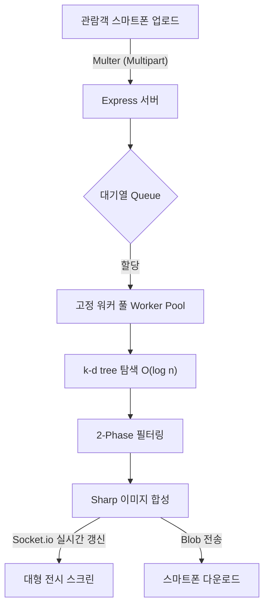

# 🌌 Reverse Cosmos Mosaic (V6 Ultimate Auto-Launcher)
> **Interactive Photo Mosaic System for Lobby Screens & Exhibitions**


**최종 업데이트**: 2026-07-27

**개요**: 방문객이 스마트폰으로 QR 코드를 스캔하여 자신의 사진을 업로드하면, 사전에 확보된 수천 장의 타일(우주사진, 풍경 등)을 조합해 방문객의 사진을 **실시간 포토모자이크**로 렌더링하여 대형 스크린에 전시하는 고성능 인터랙티브 미디어아트 프로젝트입니다.

---

## 📑 목차 (Table of Contents)
1. [🌟 주요 기능 및 특징 (Key Features)](#1-주요-기능-및-특징-key-features)
2. [🛠️ 기술 스택 (Tech Stack)](#2-기술-스택-tech-stack)
3. [🧠 핵심 알고리즘 및 아키텍처](#3-핵심-알고리즘-및-아키텍처)
4. [🚀 설치 및 운영 가이드](#4-설치-및-운영-가이드)
5. [🗂️ 프로젝트 디렉토리 구조](#5-프로젝트-디렉토리-구조)
6. [🎛️ 관리자 패널 (Admin Dashboard)](#6-관리자-패널-admin-dashboard)
7. [📜 릴리즈 노트 (Patch Notes)](#7-릴리즈-노트-patch-notes)

---

## 1. 🌟 주요 기능 및 특징 (Key Features)

### 🎨 완벽한 전시 경험 제공
- **시네마틱 디스플레이 애니메이션**: 대형 스크린에 새 모자이크가 표시될 때 방사형 웨이브, 글로우/스파클, 충격파(Shockwave), 피니시 플래시 등 6가지 시각 효과가 순차적으로 발동합니다.
- **실시간 모자이크 조립 시각화**: 업로드 대기 중 서버에서 100개 타일마다 저해상도 스냅샷을 푸시하여, 사용자의 스마트폰 캔버스에서 모자이크가 조립되는 과정을 라이브로 감상할 수 있습니다.
- **스마트폰 다이렉트 다운로드 (UX 최적화)**: 렌더링 완료 즉시, 업로드를 진행했던 브라우저 화면에 다운로드 버튼이 표시됩니다. iOS Safari의 Blob 다운로드 제약까지 완벽히 대응한 Fallback을 지원합니다.
- **원터치 무인 운영**: 관리자의 개입 없이, 관람객이 QR을 찍고 업로드만 하면 자동으로 그리드가 합성되고 스크린 화면이 갱신됩니다.

### ⚙️ 극한의 최적화 및 안정성
- **k-d tree 기반 초고속 타일 매칭**: O(n) 브루트포스 탐색을 3차원 k-d tree 인덱스 조회로 교체하여 단일 요청 처리 시간을 대폭 단축했습니다.
- **멀티 테마 스위칭 (Multi-Theme)**: 관리자 패널에서 클릭 한 번으로 타일 사진 팩(우주사진, 자연 풍경 등)을 무중단 교체합니다. 테마별 독립 빌드 및 캐시 관리가 지원됩니다.
- **고정 워커 풀 + EMA 기반 대기열 관리**: 요청마다 워커를 생성하는 대신 고정 풀을 유지하며, 지수이동평균(EMA)을 기반으로 정확한 예상 대기시간을 산출합니다.
- **CIE Lab 색공간 2-Phase 매칭**: k-d tree에서 1차 후보를 빠르게 추출한 뒤, 사용 횟수·공간 반경 제한(Ban Radius)·시각적 유사도 필터를 적용하는 정교한 2단계 구조입니다.
- **Windows 안전 원자적 쓰기 (Atomic Write)**: `write-file-atomic` 패키지를 활용해 설정 파일(`config.json`) 파손 위험을 원천 차단합니다.
- **완전 자동화 수집 및 전처리 파이프라인**: 대량의 이미지 수집부터 다운로드, 해상도 최적화, 자동 명도 분류 및 밸런싱까지 단일 파이프라인으로 처리합니다.
- **제로 예산, 100% 로컬 아키텍처**: 외부 클라우드 서버나 과금 없이, 100% 로컬 노드 서버 기반으로 작동하여 유지비가 전혀 들지 않습니다.

---

## 2. 🛠️ 기술 스택 (Tech Stack)

### 2-1. Backend & Tunneling
| 기술 (Tech) | 용도 (Purpose) | 링크 (Link) |
|---|---|---|
| **Node.js** | 코어 런타임 환경 (최적화된 LTS v20.15.1 사용) | [Node.js](https://nodejs.org) |
| **Express.js** | 빠르고 유연한 웹 서버 프레임워크 | [Express](https://github.com/expressjs/express) |
| **Socket.io** | 실시간 양방향 통신 (모바일 업로드 → 처리 → 전시 갱신) | [Socket.io](https://github.com/socketio/socket.io) |
| **Sharp** | C++ 기반 서버사이드 이미지 고속 리사이즈 및 픽셀 합성 | [Sharp](https://github.com/lovell/sharp) |
| **Multer** | 안정적인 Multipart 파일 업로드 처리 | [Multer](https://github.com/expressjs/multer) |
| **write-file-atomic** | 멀티 스레드 환경에서 안전한 원자적 파일 쓰기 보장 | [write-file-atomic](https://github.com/npm/write-file-atomic) |
| **Cloudflare Tunnel** | 로컬 서버를 외부(QR 접속용)로 빠르고 안전하게 노출 | [Cloudflared](https://github.com/cloudflare/cloudflared) |

### 2-2. Frontend & UI
| 기술 (Tech) | 용도 (Purpose) | 링크 (Link) |
|---|---|---|
| **Tailwind CSS** | 모바일 업로드 페이지 및 관리자 UI의 유연한 스타일링 | [Tailwind CSS](https://tailwindcss.com) |
| **Material Design 3** | 직관적이고 세련된 모바일 UI/UX 디자인 가이드라인 | [Material 3](https://m3.material.io) |
| **Material Symbols** | 고품질 구글 공식 웹 아이콘 시스템 | [Material Icons](https://fonts.google.com/icons) |

### 2-3. 모자이크 알고리즘 레퍼런스
| 프로젝트 (Repository) | 벤치마킹 사항 | 링크 |
|---|---|---|
| **sausheong/mosaic** | 타일 평균색 DB 구축 및 유클리드 최근접 매칭 개념 차용 | [Link](https://github.com/sausheong/mosaic) |
| **worldveil/photomosaic** | `opacity` 파라미터로 원본-타일 블렌딩 비율을 세밀하게 조절 | [Link](https://github.com/worldveil/photomosaic) |
| **DavideA/photomosaic** | OpenCV 기반 소스 인덱싱 (본 프로젝트는 성능을 위해 Sharp로 완전 대체) | [Link](https://github.com/DavideA/photomosaic) |

---

## 3. 🧠 핵심 알고리즘 및 아키텍처



### 3-1. k-d tree 기반 2-Phase 타일 매칭 (V4)
1. **[k-d tree 인덱스 빌드]**: `scripts/build.db.js` 스크립트가 테마별 모든 타일의 CIE Lab 평균 색상을 기반으로 3차원 k-d tree를 쾌속 구축합니다. (`tileIndex.kdtree.json`)
2. **[Phase 1 — 후보 추출]**: 사용자의 사진이 들어오면 k-d tree에서 `candidatePoolSize`(기본 150개)개의 최근접 타일 후보군을 **O(log n) 알고리즘**으로 번개처럼 추출합니다.
3. **[Phase 2 — 필터 적용]**: 추출된 후보 풀(Pool)에 자체 제작한 강력한 필터 체인(사용 횟수 제한, 공간 방어 반경, 시각적 유사도 페널티)을 순차적으로 통과시켜 최적의 타일을 확정합니다.
4. **[자동 폴백]**: 만약 k-d tree 인덱스가 파손되었거나 부재할 경우, 기존의 브루트포스(Brute-force) 방식으로 우회하여 시스템 장애를 방지합니다.

### 3-2. 상용 포토모자이크 수준의 중복 방지 (다채로움 극대화)
- **공간 방어 (Ban Radius)**: 동일한 타일이 뭉치는 현상을 막기 위해, 타일을 배치할 칸을 중심으로 N칸 반경을 스캔하여 유사한 타일의 진입을 무자비하게 차단합니다. (관리자가 실시간 제어 가능)
- **Top-K 확률 샘플링 (Jitter Sampling)**: `(색상 오차 × 0.3) + (누적 사용 횟수 페널티 × 10) + 난수(Jitter)` 점수를 합산하여, 너무 똑같은 패턴만 반복되지 않도록 유기적인 다채로움을 부여합니다.
- **최대 사용 횟수 제한 (Max Usage)**: 전체 모자이크에서 한 타일이 사용될 수 있는 절대 횟수를 관리자 패널에서 실시간으로 조이고 풀 수 있습니다.

### 3-3. 고정 워커 풀 기반 무중단 동시접속 대응
- **Worker Pool Architecture**: 요청마다 자원을 소모하며 워커를 생성/파괴하는 대신, CPU 코어에 맞춘 `workerPoolSize` 크기의 고정 워커 풀을 상시 유지하여 컨텍스트 스위칭(Context Switching) 오버헤드를 0으로 만들었습니다.
- **핫 리로드 (Hot-Reload)**: 관리자가 환경 설정이나 테마를 바꾸면, MessageChannel을 통해 풀 내의 모든 워커에게 실시간 브로드캐스트하여 서버 재부팅 없이 즉시 반영됩니다.
- **수학적 대기시간 예측 (EMA)**: 최근 처리 시간의 지수이동평균(EMA) 알고리즘을 도입하여, 큐에서 대기 중인 방문객의 스마트폰에 `예상 대기시간 = EMA × 대기 순번 / 워커 수`를 밀리초 단위로 안내합니다.

### 3-4. 멀티 테마 아키텍처
- **독립 격리 구조**: 테마별 원본(`raw_tiles/{theme}/`)과 최적화 타일(`tiles/{theme}/`), 그리고 DB 파일(`data/themes/{theme}/`)이 완벽하게 독립적으로 격리되어 관리됩니다.
- **비동기 빌드 큐 (FIFO)**: 관리자가 여러 테마를 동시에 빌드하더라도 단일 큐에서 직렬화되어 데이터 충돌이 절대 발생하지 않습니다.
- **안전 롤백 (Safe Rollback)**: 새 테마 빌드가 성공적으로 완료될 때만 RAM 캐시 플러시와 DB 적재가 이루어지며, 도중 실패 시 방문객 스크린은 1ms의 끊김도 없이 기존 테마를 계속 서빙합니다.

---

## 4. 🚀 설치 및 운영 가이드 (One-Click 런처)

이 프로젝트는 터미널(CMD) 명령어를 직접 칠 필요 없이, 최상위 경로의 **`start.bat`** 파일 하나로 즉시 실행할 수 있도록 설계되었습니다.

1. **`start.bat` 더블 클릭**
2. 실행 시 시스템이 알아서 `Node.js`와 `Cloudflared` 의존성을 확인하고 없다면 즉시 백그라운드로 다운로드(1~2초)합니다.
3. 포트와 좀비 프로세스를 모두 초기화한 뒤 서버가 완벽하게 구동됩니다.
4. 모든 관리 작업(새 테마 빌드, 릴리즈 포터블 패키징)은 브라우저에서 **관리자 패널(`admin.html`)**을 통해 직관적으로 진행할 수 있습니다.

### 4-1. 접속 URL (Endpoints)
- **전시용 대형 스크린**: `http://localhost:3000/display.html`
- **관리자 컨트롤 패널**: `http://localhost:3000/admin.html`
- **방문객 스마트폰 업로드**: `http://localhost:3000/upload.html` (Cloudflare Tunnel을 통해 모바일용 외부 도메인과 자동 연결됩니다)

---

## 5. 🗂️ 프로젝트 디렉토리 구조 (V6 Ultimate)

```text
/mosaic_ver2
├── data/                    # 핵심 데이터베이스 및 설정 저장소
│   ├── apod_originals/        # 수집된 원본 고화질 이미지 보관소
│   ├── config.json            # 코어 엔진 파라미터 (원자적 쓰기 지원)
│   └── themes/                # 테마별 DB 결과물 격리 폴더
│       └── default_nasa/
│           ├── tileDB.json        # CIE Lab 평균 색상 매핑 인덱스
│           └── tileIndex.kdtree.json  # 3차원 공간 탐색 k-d tree
├── logs/                    # 서버 상태 및 통계 로깅 허브
│   ├── history/               # 개별 모자이크 렌더링 상세 로그 (3일 후 자동 파기)
│   ├── stats_YYYY-MM.log      # 누적 참여자 수 등 영구 보존 월간 통계
│   ├── dedup.log.json         # 중복 이미지 제거 파이프라인 리포트
│   ├── pipeline.log           # 데이터 빌드 처리 이력
│   └── server.error.log       # 치명적 서버 오류 트래킹
├── public/                  # 프론트엔드 정적 웹 리소스 (HTML/CSS/JS)
│   ├── raw_tiles/             # 테마별 원본 타일 소스
│   ├── tiles/                 # 렌더링용 초고속 리사이즈 썸네일
│   ├── outputs/               # 렌더링 완성 모자이크 (서버 재부팅 시 보안 자동 파기)
│   ├── admin.html             # 종합 관리자 대시보드
│   ├── display.html           # 로비 스크린 전용 시네마틱 디스플레이 UI
│   └── upload.html            # 모바일 최적화 업로드 및 라이브 뷰 UI
├── src/                     # 백엔드 코어 비즈니스 로직
│   ├── app.js                 # Express 메인 서버 진입점
│   ├── config.js              # 시스템 전역 상태 및 동적 환경 설정 모듈
│   ├── kdtree.js              # 순수 JavaScript k-d tree 인덱싱 엔진
│   ├── admin.route.js         # 관리자 API (테마 컨트롤, 설정 저장)
│   ├── upload.route.js        # 업로드 API (Blob 수신, 프로세스 큐잉)
│   ├── mosaic.queue.js        # Worker Pool 제어 및 EMA 기반 큐잉 시스템
│   ├── socket.manager.js      # WebSocket(Socket.io) 실시간 이벤트 통제소
│   └── matcher.worker.js      # 타일 합성 전담 Multi-thread Worker 로직
├── scripts/                 # 강력한 자동화 유틸리티 스크립트
│   ├── build.db.js            # 테마 빌더 (이미지 압축 + DB 생성 + Tree 인덱싱)
│   ├── build_release.js       # [🔥핵심] 포터블 무설치 배포용 Direct-to-Zip 압축기
│   ├── migrate-to-theme-structure.js # 구버전(V3) → V4 구조 마이그레이터
│   └── true.dedup.js          # 물리적 픽셀 비교 방식의 완벽한 썸네일 중복 제거기
├── old/                     # 레거시 과거 코드 및 파이프라인 잔해
├── 멀티테마_동시접속대응_기획서.md  # 시스템 고도화 설계 마스터 문서
├── start.bat                # Windows 더블클릭 구동 런처
└── README.md                # 바로 이 문서!
```

---

## 6. 🎛️ 관리자 패널 (`admin.html`) 핵심 컨트롤 가이드

직관적인 M3(Material 3) 기반 대시보드에서 모든 모자이크 매개변수를 라이브로 제어합니다.

| 기능 세션 | 세부 설명 (기능) |
|---|---|
| **🎨 테마 스위칭 (Theme)** | 라디오 버튼 클릭 한 번으로 활성 테마 즉각 전환. (미빌드 상태의 테마를 선택하면 백그라운드 자동 빌드 큐 진입) |
| **🔄 빌드 상태 라이브 모니터링** | 서버의 백그라운드 빌드 진행률, 완료, 실패 여부를 UI에 실시간 프로그래스바로 중계. 에러 시 이전 테마 무손실 롤백 기능 포함. |
| **🚧 타일 중복 제한 (Max Usage)** | 한 개의 소스 사진이 완성본 안에서 최대 몇 번까지 반복 사용될지 결정하는 슬라이더. (1회~20회) |
| **🛡️ Ban Radius (공간 방어)** | 동일 타일이 근처에 배치되지 않도록 방어하는 반경 슬라이더. (0칸~5칸). 숫자가 클수록 다채롭지만 매칭 난이도 상승. |
| **👻 원본 투명도 (Opacity)** | 모자이크 위에 덧씌워지는 사용자 원본 사진의 투명도를 정밀하게 제어하여 인물 윤곽의 뚜렷함을 결정. |
| **✨ 렌더링 블렌딩 모드** | Multiply(곱하기), Overlay, Soft-Light, Over 등 사진의 채도와 질감을 결정짓는 그래픽 블렌딩 공식 선택. |
| **📐 타일 크기 제어** | 모자이크 한 칸의 크기를 10px에서 60px까지 조절하여 점묘법의 디테일 수준을 컨트롤. |
| **🖥️ 최대 해상도 제한** | 대형 스크린의 사양에 맞춰 최종 출력물의 화질 상한선(1080px ~ 2560px) 캡을 씌워 메모리 터짐 방지. |
| **📊 리소스 라이브 모니터링** | 서버 RAM 사용률, 큐(Queue) 대기열 길이, 활성화된 워커 스레드 갯수를 초 단위로 대시보드에 리포팅. |
| **⚡ 인덱스 강제 리빌드** | 데이터가 오염되었거나 새 사진이 추가되었을 때 클릭하여 현재 테마의 k-d tree 인덱스를 비동기 핫-리로드. |

---

## 7. 📜 릴리즈 노트 (Patch Notes)

### 📦 V6.1 Startup Reliability Patch (2026-07-27)
#### 🔧 start.bat 프로세스 정리 및 서버 기동 신뢰성 전면 개선
- **포트 정리 로직 정밀화**: 기존 `findstr ":3000 "` 패턴이 `LISTENING`, `TIME_WAIT`, `ESTABLISHED` 상태를 구분하지 않고 무차별 매칭하여 Chrome 등 무관한 프로세스까지 kill 시도하던 문제를 수정했습니다. 이제 **`LISTENING` 상태의 프로세스만** 정확히 식별하여 종료합니다.
- **포트 해제 검증 루프 도입**: kill 후 고정 2초 대기만 하던 방식을 폐기하고, 포트 3000이 **실제로 해제되었는지 최대 10회(10초) 반복 검증**한 뒤에만 서버를 시작하도록 개선했습니다. 포트 미해제 시 명확한 에러 메시지와 함께 즉시 중단됩니다.
- **`EADDRINUSE` 좀비 프로세스 방지 (`app.js`)**: 포트 충돌 시 `uncaughtException` 핸들러가 에러를 로그만 찍고 프로세스를 살려두어 좀비 Node.js가 남던 문제를 수정했습니다. `server.on('error')` 핸들러를 추가하여 포트 충돌 즉시 명확한 한국어 에러 메시지를 출력하고 프로세스를 깨끗하게 종료합니다.
- **Cloudflare 서비스 충돌 해결**: 과거에 `cloudflared service install`로 등록된 Windows 서비스(`Cloudflared agent`, StartType: Automatic)가 백그라운드에서 상시 실행되어 Quick Tunnel과 충돌하던 원인을 발견 및 제거(`cloudflared service uninstall`)했습니다.
- **손상된 `cloudflared.exe` 감지 및 재다운로드**: 65MB → 14MB로 파일이 손상되어 `EFTYPE` 에러가 발생하던 문제를 확인하고 정상 바이너리(v2026.7.3)로 교체했습니다.
- **Node.js 미설치 현장 PC 지능형 자동 설치**: `start.bat` 실행 시 PC에 Node.js가 없을 경우, 동봉된 `node-v20.15.1-x64.msi` 설치 프로그램을 자동으로 호출(`start /wait`)하고 설치 완료 즉시 환경변수(PATH) 딜레이를 우회하여 즉시 서버를 구동합니다.
- **USB 현장 배포용 1-Click 패키지 (`Mosaic_V6_Release.zip`)**: `node_modules` 소형 파일 무더기 복사 지연을 방지하기 위해 MSI 설치 바이너리 및 핵심 런처가 포함된 165MB 단일 배포 압축 패키징 지원(`scripts/build_release.js`).

---

### 📦 V6.0 Stability & UX Update (2026-07-23)
#### 🚀 전시 현장 안정성 강화 및 터미널 UX 개선
- **⚠️ Cloudflare 다중 터널 제약 사항 확인 및 문서화**: 동일 공인 IP에서 Cloudflare Quick Tunnel을 2개 이상 동시 실행할 경우 `NXDOMAIN` 에러로 접속이 불가능함을 확인했습니다. 전시 현장에서 포토부스 등 다른 장비가 이미 Cloudflare 터널을 사용 중인 경우, 모자이크 컴퓨터는 **반드시 별도 인터넷 회선(스마트폰 핫스팟 또는 USB 와이파이 동글)으로 네트워크를 분리**해야 합니다.
- **터미널 URL 클릭 오류 패치**: 콘솔창에 출력된 `upload.html` 접속 주소를 Ctrl+Click 할 때 뒷부분의 안내 텍스트(`<- QR 코드 주소`)가 URL에 포함되어 접속이 실패하는 현상을 수정했습니다. 안내 문구를 별도 줄로 분리하여 모든 URL이 정확하게 클릭됩니다.
- **Cloudflare 내부 로그 숨김 처리**: 관리자가 핵심 URL 주소만 깔끔하게 확인할 수 있도록, 터널 연결 과정에서 출력되던 수십 줄의 Cloudflare 영어 디버그 로그를 숨김 처리했습니다.

### 📦 V5.0 Ultimate Auto-Launcher (2026-07-23)
#### 🚀 완벽한 One-Click 무설치 시스템 구축
- **지능형 `start.bat` 자동화 런처**: 1, 2, 3번 메뉴 선택조차 필요 없게끔 사용자 경험을 극도로 단순화시켰습니다. `start.bat` 더블 클릭 한 번이면 모든 복잡한 백그라운드 환경 체크가 영문 로그로 출력되며 곧바로 서버가 부팅됩니다.
- **Node.js & Cloudflared 자동 확보 로직 탑재**: 구동 환경에 프로그램이 아예 없는 극한의 PC 환경이더라도, 실행 시 1초 만에 최적화된 포터블 Node.js(v20.15.1) 및 Cloudflared를 자동으로 감지/다운로드하여 완벽한 무설치 호환성을 보장합니다.
- **다이어그램 및 매뉴얼 시각화 고도화**: 전체 작동 흐름을 한눈에 볼 수 있는 아키텍처 다이어그램(Mermaid)을 추가하고, README.md의 디자인을 전면 개편하여 완벽한 오픈소스 가이드 페이지로 격상시켰습니다.

---

### 📦 V4.4 Update (2026-07-23)
#### 🚀 포터블 빌드 시스템 최적화 및 호환성 강화 (Direct-to-Zip)
- **Direct-to-Zip 스토리지 최적화**: 포터블 릴리즈 빌드 시 임시 `dist` 폴더에 파일들을 복사한 뒤 압축하던 비효율적인 방식을 폐기했습니다. 대신 `archiver` 모듈을 도입하여 원본 파일과 다운로드되는 바이너리를 즉시 스트리밍으로 `Mosaic_V4_Portable.zip` 안에 압축해 넣도록 리팩토링했습니다. 이로써 하드디스크 낭비가 사라지고 빌드 속도가 비약적으로 상승했습니다.
- **포터블 경량화**: `data` 폴더 전체 복사 대신 구동에 필수적인 DB(`config.json`)와 썸네일/인덱스(`themes` 폴더)만 선별적으로 패키징하여 무거운 원본 이미지들이 ZIP 파일 용량을 차지하지 않도록 개선했습니다.
- **구형 OS 호환성 완벽 보장 (버전 고정)**: 배포용 `node.exe` 다운로드 시 개발자의 로컬 환경 버전을 따라가던 문제(`process.version`)를 수정했습니다. 이로 인해 최신 Node.js가 지원하지 않는 구형 윈도우(Windows 7, 8 등)를 사용하는 구형 PC에서 발생하는 즉각적인 크래시 오류를 완벽하게 차단했습니다. 이제 모든 포터블 빌드는 호환성이 가장 입증된 **LTS 버전(v20.15.1)**을 고정적으로 포함합니다.

---

### 📦 V4.3 Update (2026-07-21)
#### 🚀 1-Click 무설치 포터블 배포(Portable Release) 지원
- **완전 격리된 Node.js 환경 구축**: 사용자의 PC 환경(Node 미설치, 구버전, PATH 미설정 등)에 영향을 받지 않도록 `build_release.js` 스크립트가 도입되었습니다.
- **자동 빌드 및 패키징**: 개발자가 스크립트 하나만 실행하면, 공식 `node.exe` 바이너리를 다운로드하고, `node_modules`와 소스 코드를 모두 묶어 100% 오프라인 작동이 가능한 `Mosaic_V4_Portable.zip` 파일을 자동으로 생성합니다.
- **배포용 최적화 런처**: 포터블 ZIP 내부에 생성되는 새로운 `start.bat`은 패키지 설치나 복잡한 검증 없이 즉시 내장된 Node를 구동하여, 누구나 더블클릭 한 번으로 서버를 열 수 있게 해줍니다.

---

### 📦 V4.2 Update (2026-07-16)
#### 🚀 백그라운드 무인 실행 런처 & 완벽 포터블(Portable) 구축
- **Run_Server.vbs**: 더 이상 거추장스러운 까만색 터미널 창을 띄워둘 필요가 없습니다. 새로 제공된 VBScript 파일을 더블클릭하면 백그라운드 스레드에서 서버가 조용히 구동됩니다.
- **오토 웹 런칭**: 서버 세팅과 구동이 완료되면, 컴퓨터에 설정된 기본 브라우저(Chrome/Edge)를 자동으로 열어 `admin.html` 패널을 화면에 띄워줍니다.

#### 🛑 웹 브라우저 원격 셧다운 제어
- `admin.html` 패널에 **[서버 완전 종료]** 기능이 탑재되었습니다.
- 브라우저 버튼 클릭 한 번으로 숨어있는 Node.js 메인 서버 프로세스와 Cloudflare 통신 터널을 한 번에 깨끗하게 강제 종료(Kill)하고 메모리를 해제합니다.

#### 🎨 고유 타일 매칭 우선순위 대폭 상향
- 동일한 타일(사진)이 반복해서 붙는 현상을 차단하기 위해 알고리즘 벌점을 기존보다 4배 상향했습니다.
- KD-Tree가 조금 덜 어울리더라도 무조건 **'안 쓰인 새로운 컷'을 최우선으로 선별**하도록 튜닝되어, 가까이서 모자이크를 감상할 때 다채로운 화면이 노출됩니다.

---

### 📦 V4.1 Update (2026-07-16)
#### 🚀 신규 테마 원스톱 업로드 및 스마트 전처리 파이프라인
- **브라우저 분할(Chunk) 업로드 지원**: 관리자가 웹 브라우저에서 폴더를 통째로 선택해 업로드할 수 있습니다. 수천 장의 사진을 50장 단위 청크로 분할 전송하여 브라우저 메모리 오버플로우와 다운을 완벽히 방지합니다. (ZIP 압축 불필요)
- **Node.js(Sharp) 기반 실시간 용량 최적화**: 업로드 즉시 백엔드에서 사진 가로 폭을 1000px 이하로 리사이즈하고 WebP 80%로 압축 변환하여, 수 GB에 달하는 원본 사진 폴더를 디스크 친화적인 저용량으로 즉각 변환 저장합니다.
- **업로드 직후 자동 중복 제거**: 전송이 100% 완료되면, 백엔드가 백그라운드 자식 프로세스로 `true.dedup.js`를 자동 호출하여 시각적으로 동일한 복제 사진들을 솎아내고 완벽히 클린한 테마 폴더로 완성합니다.

#### 🧮 수학적 '최소 필요 타일 수' 실시간 계산기 도입
- **수학 공식 기반 타일 안전망**: 관리자가 설정한 **출력 해상도, 타일 크기, Max Usage(최대 중복 허용), Ban Radius(반경 내 금지)** 변수들을 연립 방정식으로 계산하여, 해당 화질을 뽑아내기 위해 '물리적으로 반드시 필요한 최소한의 고유 타일 수'를 화면에 실시간으로 표시합니다.
- **Grid vs Spatial 방어 하이브리드 로직**: 그리드를 채우기 위한 기본 필요 수량과, Ban Radius 주변을 방어하기 위한 기하학적 최소 면적을 비교하여 절대 최소값(Absolute Min)을 도출합니다.
- **동적 위험 경고**: 현재 테마가 보유한 타일 수가 이 '절대 최소값'에 미달할 경우 즉시 붉은색 경고 박스를 띄워 관리자에게 화질 저하 위험을 알립니다.

#### 🎨 이중 하이브리드 블렌딩 (Multiply-Enhanced) 
- 기존 Multiply(곱하기) 모드의 단점(밝은 영역이 칙칙해지는 현상)을 해결한 '이중 하이브리드 블렌딩' 모드 추가.
- 1차로 원본을 곱하여 어두운 윤곽선을 확실히 잡고, 2차로 원본을 낮은 투명도로 다시 Over(덮어쓰기)하여 피부톤과 눈동자의 밝은 하이라이트를 화사하게 복원합니다.
- **동적 UI 적용**: Multiply 모드 선택 시에만 '2차 복원 투명도' 슬라이더가 등장하여 세밀한 컨트롤을 제공합니다.

---

### 📦 V4 Multi-Theme (2026-07-13)
#### 🚀 [핵심] 멀티 테마 스위칭 & 동시접속 대응 아키텍처 전면 개편
- **멀티 테마 아키텍처 도입**: 기존 플랫 구조(`raw_tiles/*.webp`)를 테마별 하위 폴더(`raw_tiles/{theme}/`)로 전환. `tiles/`, `tileDB.json`, `tileIndex.kdtree.json` 모두 테마별 독립 관리.
- **마이그레이션 스크립트 (`scripts/migrate-to-theme-structure.js`)**: 기존 3,952개 raw_tiles + 5,259개 tiles를 안전하게 `default_nasa/` 하위로 이관. 복사→검증→삭제 3단계 안전 절차.
- **k-d tree 기반 초고속 매칭 엔진 (`src/kdtree.js`)**: 순수 JS로 3차원 Lab 색공간 k-d tree를 구현. max-heap 기반 kNN 검색으로 O(n) 브루트포스를 O(log n) 수준으로 개선.
- **2-Phase 매칭 구조 (`src/matcher.worker.js`)**: Phase 1에서 k-d tree로 150개 후보를 빠르게 추출 → Phase 2에서 기존 필터 체인(사용 횟수, ban radius, 시각적 유사도)을 적용. 기존 점수 공식 완전 보존.
- **고정 워커 풀 (`src/mosaic.queue.js`)**: 요청별 `new Worker()` 생성 방식을 고정 풀로 전환. 비정상 종료 시 자동 재생성, tileDB/config 변경 시 전체 워커 브로드캐스트.
- **EMA 기반 대기시간 산출**: 최근 처리 시간의 지수이동평균을 추적하여 실시간 예상 대기시간 제공.
- **비동기 빌드 큐**: FIFO job queue로 동시 빌드 충돌 방지. 빌드 실패 시 이전 테마 자동 유지 (전환 미실행 구조).
- **Windows 안전 원자적 쓰기**: `write-file-atomic` 패키지로 `config.json` EPERM 에러 원천 차단.

#### 🎛️ [관리자] admin.html UI 확장
- **테마 스위칭 패널**: 라디오 버튼으로 테마 전환, 빌드 상태(진행/완료/실패) 실시간 표시.
- **타일 중복 제한 슬라이더 (Max Usage)**: 타일당 최대 사용 횟수를 1~20회 범위로 라이브 조절.
- **Ban Radius 슬라이더**: 반경 내 중복 금지 범위를 0~5칸으로 라이브 조절.
- **타일 안전 경고**: 타일 수 부족 또는 색상 다양성 저하 시 경고 표시.

#### ⚙️ [내부] config.json 스키마 확장
- 신규 필드: `currentTheme`, `maxTileUsage`, `banRadius`, `minRequiredTiles`, `workerPoolSize`, `gridDownscaleThreshold`, `candidatePoolSize`

#### 📊 [빌드] build.db.js 전면 개편
- 테마 인자 지원 (`node scripts/build.db.js museum_theme`)
- `Promise.all` 배치 병렬화 (순차 for 루프 → 동시 30개 배치)
- k-d tree 인덱스 자동 생성 (`tileIndex.kdtree.json`)
- `--index-only` 옵션 (이미지 재처리 없이 인덱스만 생성)
- 타일 수 부족 경고 + Lab 색상 표준편차 기반 다양성 경고

---

### 📦 V3 Ultimate (2026-07-06)
#### 🚀 [강화] 실시간 시각화 & 시네마틱 애니메이션 및 iOS 호환성 확보
- **업로드 대기 중 실시간 타일 조립 시각화**: `upload.html`에서 막연한 스피너 대신 미니 캔버스를 띄우고, 서버와 Socket.io room 단위로 통신하며 100개 배치 단위의 스냅샷을 실시간 수신하여 눈앞에서 모자이크가 완성되어 가는 시각적 즐거움을 제공합니다.
- **대형 스크린 시네마틱 애니메이션(display.html)**: 
  - 방사형 웨이브 딜레이 (중앙에서 외곽으로 타일 비행)
  - 글로우(Glow) 블렌딩 및 스파클(반짝이) 파티클 방출
  - 회전(Rotation) 및 스케일 바운스 (저사양 PC 대비 타일 3,000개 이하시 활성화)
  - 70% 완성 시 충격파(Shockwave), 100% 안착 시 전체 피니시 플래시(White Flash) 발동
- **iOS Safari 다운로드 호환성**: `fetch -> Blob -> ObjectURL` 방식으로 강제 다운로드를 시도하고 차단될 경우 새 탭으로 띄워 꾹 눌러 저장하도록 Fallback 기능을 구현했습니다.
- **크롭 영역(Cropper) 사용성 개편**: 아이폰 환경에서 CSS `max-height`를 `65vh`로 확대하고 `flex-start` 상단 정렬을 도입해 크롭 가용 영역을 극대화했습니다.
- **관리자 기능 및 로깅 고도화**: `admin.html` 패널 내 핵심 옵션에 "상세 설명 접기/펼치기" 토글 추가. 터미널 완료 로그에 통계 지표 출력.

#### 🔒 [보안 & 운영] 개인정보 자동 파기 및 통계 로그 최적화
- **완벽한 개인정보 보호 로직(Startup Cleaner)**: 서버 기동 시 `public/outputs/` 과거 결과물 자동 삭제.
- **개인정보 동의 웰컴 스크린(Step 0)**: 업로드 전 안내문과 [시작하기 (동의)] 버튼 거치도록 UX 개선.
- **월간 통계용 텍스트 로그**: `logs/stats_YYYY-MM.log` 형식의 가벼운 참여자 통계 누적.
- **JSON 상세 로그 3일 자동 파기**: `logs/history/` 내 3일 경과 파일 자동 삭제.

---

### 📦 V3 (2026-07-04)
#### ⚡ [추가] Extreme Performance Optimization (초고속 렌더링)
- 대형 해상도(1440x1440)에서 16초 이상 걸리던 렌더링 시간을 **2~4초 수준으로 단축**.
- **연산 압축 및 GC 최적화**: `Math.sqrt` 제거, 조기 종료(Early Exit), GC 렉 제거.
- **핵심 로직 100% 보존**: 연산 순서만 최적화, 사용자 고유의 점수 공식 완전 보존.
- **서버 부팅 시 RAM 풀장전 (Pre-load)**: 타일을 미리 RAM에 올려 첫 렌더링 딜레이 제거.

#### 🚀 아키텍처 리팩토링
- **타일 제한 완전 해제**: 강제 오토 밸런싱 제한 해제, 수집된 전체 타일 100% 활용.
- **True Deduplication**: 8x8 픽셀 단위 물리적 이미지 비교로 진짜 중복만 삭제.
- **폴더 구조 전면 평탄화**: `server` → `src`, `frontend` → `public`, `pipeline` → `scripts`.
- **다운로드 QR 동선 최적화**: 업로드했던 스마트폰 화면에 직접 다운로드 버튼 표시.

---

### 📦 V2 (2026-07-03)
- NASA APOD 대량 수집 및 톤 밸런싱 파이프라인 구축
- `--skip-fetch` 옵션 도입 (1초 만에 밸런싱 및 DB 빌드 직행)
- CIE Lab 인덱싱 정상화 (`color-convert` 버그 패치)
- 스토리지 디렉토리 구조 리팩토링
- 글로벌 로깅 시스템 적용
